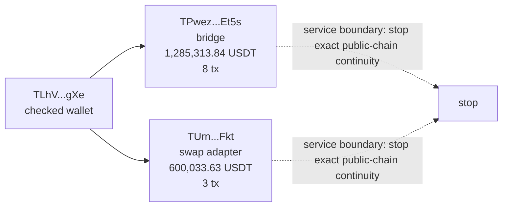
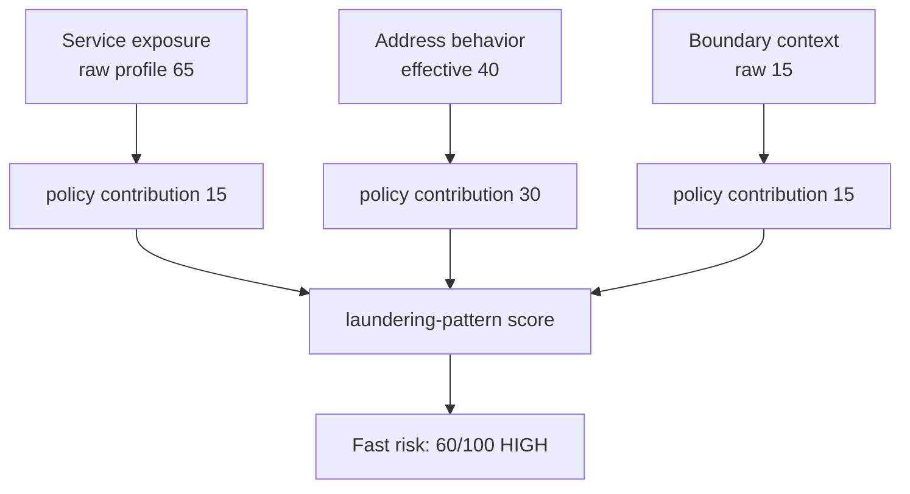
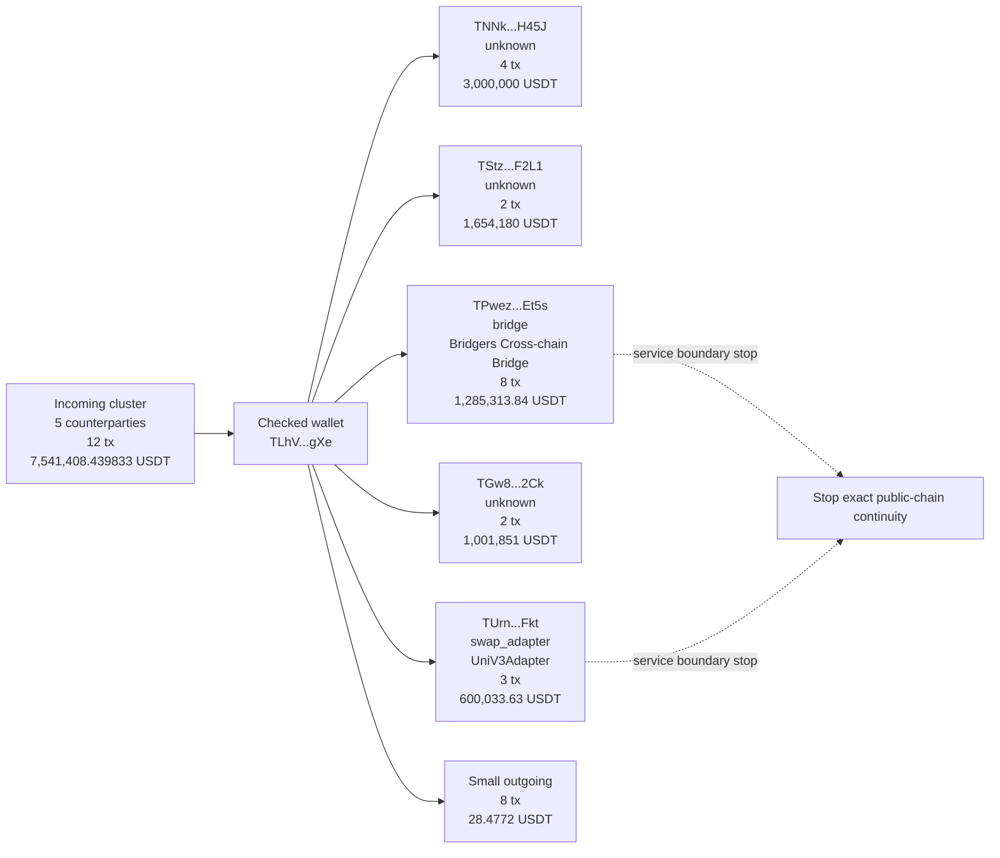
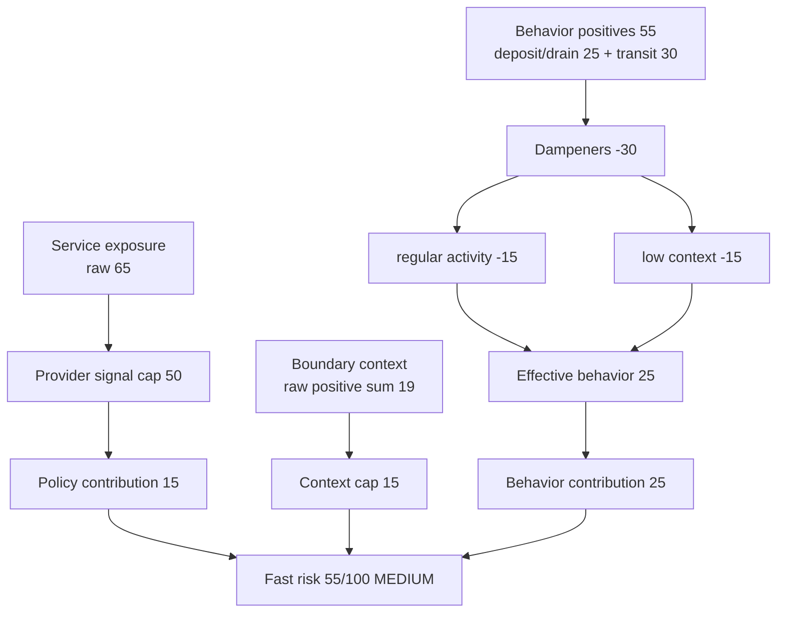
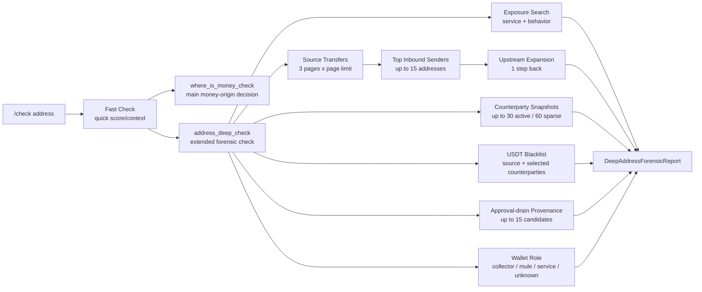
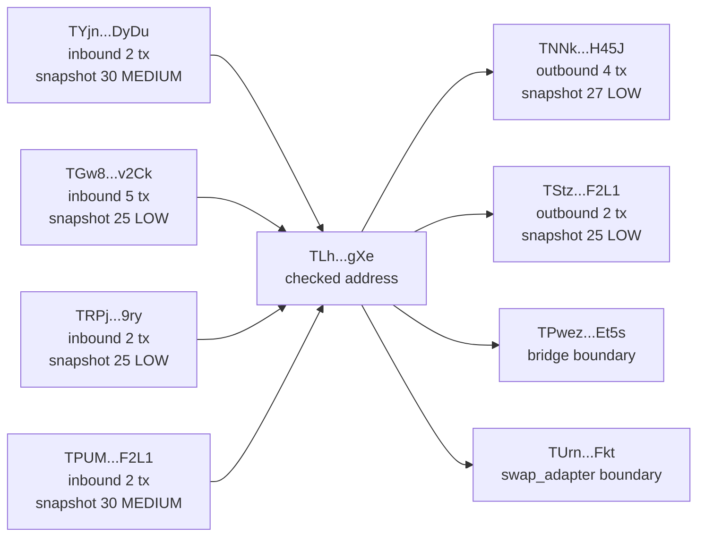

# Address Check Layers: Fast Check

## Status

This document describes the first layer of address checking: the fast/manual check used by `/check <TRON-address-or-tx-hash>` and the Telegram inline "check address / check tx" flows.

## Fact From Code And Docs

The public product requirement is that users can run `/check <address-or-tx-hash>` or equivalent inline flows without adding the address to monitoring.

Sources:

- `README.md` lists manual `/check <address-or-tx-hash>` support and says `Check address` checks without adding the address to monitoring.
- `.planning/REQUIREMENTS.md` defines manual checks as a functional requirement.
- `src/bot/createBot.ts` wires `/check` to `replyWithCheck`.
- `src/check/manualCheck.ts` implements the core fast check functions.

## Entry Points

Fast check can start from:

- `/check <TRON-address-or-tx-hash>` command.
- Inline pending action `check_address`, where the user sends a TRON address after pressing the address check button.
- Inline pending action `check_tx`, where the user sends a TRON transaction hash after pressing the tx check button.
- Plain text transaction hash in the default bot flow; the bot treats it as a tx check.

The input classifier is `classifyInput` in `src/tron/address.ts`:

- TRON address: base58 string matching `^T[1-9A-HJ-NP-Za-km-z]{33}$`.
- TRON tx hash: 64 hex characters, normalized to lowercase.
- Anything else: `unknown`.

`/check` also accepts an optional USDT amount after the target. `parseManualCheckInput` parses:

- `target`;
- optional `requestedAmountRaw`;
- `amountError`.

If there are too many tokens or the amount cannot be parsed, the bot replies with usage guidance and does not queue forensic jobs or read provider data.

## Core Address Flow

For a TRON address, `replyWithCheck` follows this order:

1. Parse target and optional amount.
2. Classify target as address/tx/unknown.
3. If `checkSmartContractAddress` is configured, run the smart-contract check first.
4. If smart-contract check returns a report, send the smart-contract report and stop.
5. If smart-contract metadata is unavailable, send an unavailable message and stop.
6. Otherwise run `checkAddress`.
7. Queue `where_is_money_check` in `wallet_profile` mode.
8. Queue `address_deep_check`.
9. Send a preliminary address-check message with a keyboard for further actions.

The address is not added to monitoring by this flow.

## `checkAddress`

Signature:

```ts
checkAddress(address: string, deps: ManualAddressCheckDeps): Promise<ManualCheckResult>
```

`checkAddress` delegates to `checkAddressWithContext`.

`checkAddressWithContext` runs two data fetches in parallel:

- `deps.getLabelsForAddress(address)`;
- optional `deps.getRiskSignalsForAddress(address)`.

Then it calls `evaluateAddressRisk` with:

- `subjectAddress`;
- optional `subjectTxHash`;
- stored labels;
- graph signals;
- behavior signals;
- AML signals.

The result is a `ManualCheckResult` containing:

- `subjectAddress`;
- `report`;
- `observations`;
- `rawEvidence`;
- service exposure profiles;
- address behavior profiles;
- inbound provenance profiles;
- counterparty risk profiles;
- direct counterparty interaction profiles;
- stablecoin restriction profiles;
- boundary exposure profiles;
- wallet role profiles;
- extended provenance profiles;
- `missingChecks`.

If `recordRiskEvaluation` is provided, fast check persists raw evidence and observations through that dependency.

## Risk Signal Provider

In production `createBot` builds the default `getAddressRiskSignalsForAddress` from `createAddressExposureRiskSignalProvider`.

That provider can add:

- stablecoin restriction signals from official TRON USDT blacklist status;
- service exposure signals from `runForensicAddressExposureSearch`;
- address metadata and contract intelligence context;
- raw evidence;
- supplemental observations;
- profile objects for downstream rendering;
- `missingChecks` when parts of the check are incomplete.

The provider has timeout handling. On timeout it can fall back to a bounded shallow address-exposure search using already captured transfer snapshots and marks the result as incomplete through `missingChecks`.

## Fast Check Inputs

The score-bearing inputs are:

- internal labels from `getLabelsForAddress`;
- `graphSignals`;
- `behaviorSignals`;
- `amlSignals`.

The non-score payload/context fields are:

- `rawEvidence`;
- `observations`;
- `serviceExposureProfiles`;
- `addressBehaviorProfiles`;
- `inboundProvenanceProfiles`;
- `counterpartyRiskProfiles`;
- `directCounterpartyInteractionProfiles`;
- `stablecoinRestrictionProfiles`;
- `boundaryExposureProfiles`;
- `walletRoleProfiles`;
- `extendedProvenanceProfiles`;
- `missingChecks`.

`checkAddressWithContext` passes only labels, `graphSignals`, `behaviorSignals`, and `amlSignals` into `evaluateAddressRisk`. The profile arrays are returned in `ManualCheckResult` for rendering, persistence/debug context, and downstream reports.

### Internal Labels

Internal labels come from `deps.getLabelsForAddress(address)`. In production this dependency is wired to `listAddressLabels(db, address)`, which reads the `address_labels` table.

Supported label values are defined by `RiskLabel`:

- exact/critical-style examples: `scam`, `reported_scam`, `stolen_funds`, `phishing`, `mixer_like`, `risky_contract`, `whitebit`, `darknet_exchange`;
- high-risk proximity examples: `darknet_exchange_proximity`, `approval_drain_proximity`;
- context/dampener examples: `victim`, `trusted`, `false_positive`;
- other labels: `mule`, `collector`, `bridge`, `exchange`, `needs_review`.

Examples:

- label `scam` becomes reason code `internal_label_scam` and produces critical risk;
- label `victim` is stored as context/raw evidence, but has score impact `0`;
- labels `trusted` and `false_positive` are dampeners for non-critical signals.

### Graph Signals

`graphSignals` are generic `RiskSignal[]` objects. They can be supplied by any `getRiskSignalsForAddress` implementation.

The production address exposure provider builds graph signals from `runForensicAddressExposureSearch`.

Current production examples:

- `forensic_service_exposure`: created when `serviceExposureProfiles[0].exposureScore > 0`; score impact is capped at `Math.min(50, exposureScore)`;
- `forensic_boundary_exposure_context`: created when `boundaryExposureProfiles[0].contextScore > 0`;
- `forensic_address_behavior`: despite the name, this production provider puts it into `graphSignals`, not `behaviorSignals`; score impact is capped at `Math.min(30, addressBehaviorEffectiveScore(profile))`.

### Behavior Signals

`behaviorSignals` are supported by the risk engine and test fixtures, but the production `createAddressExposureRiskSignalProvider` returns `behaviorSignals: []`.

Examples from tests:

- `fast_transit` with score impact `30`;
- `split_pattern` with score impact `30`;
- `forensic_address_behavior` can be used as a behavior signal by callers, but the production fast exposure provider maps its own behavior profile into `graphSignals`.

Policy treatment:

- behavior-only evidence is not hard evidence;
- `policyForReason` caps behavior-only reasons at `30`;
- composite scoring caps the behavior bucket at `25`;
- laundering-pattern scoring can use behavior together with service/provenance context.

### AML Signals

`amlSignals` are provider-style signals. The confirmed production fast-check source here is official TRON USDT restriction status.

If `tronClient.getUsdtRestrictionStatus(address)` exists, the provider checks it before route search.

If the profile is not blacklisted, no AML signal is created.

If the profile is blacklisted:

- raw evidence is created from the `StablecoinRestrictionProfile`;
- `stablecoin_usdt_blacklisted` AML signal is emitted;
- score impact is `90`;
- source is `stablecoin_contract`;
- confidence is `high`;
- severity is `critical`;
- `stablecoinRestrictionProfiles` includes the profile;
- if `blacklistEventTxHash` is missing, `missingChecks` gets `Blacklist event timeline unavailable`;
- route search is skipped.

### Service Exposure Context

Service exposure is built by `runForensicAddressExposureSearch` from TRC20 transfers, metadata, contract intelligence, and service classification.

The provider:

- fetches related TRC20 transfers in a time window;
- normalizes them into graph edges;
- classifies service/boundary addresses with metadata and contract intelligence;
- builds `ServiceExposureProfile`;
- stores detector output in `rawEvidence`;
- creates observation `forensic_service_exposure`;
- converts the profile into graph signal `forensic_service_exposure`.

Example:

- if `combinedServiceVolumeRatio` is high and `exposureScore` is `65`, the graph signal score impact becomes `50`, because the fast signal caps service exposure at `Math.min(50, exposureScore)`.

### Boundary Exposure Context

Boundary exposure is related but separate from service exposure.

If route search detects that funds touched service-boundary infrastructure, it can build `BoundaryExposureProfile` and graph signal `forensic_boundary_exposure_context`.

Policy caps this as `service_boundary_context` at `15`, because it is context rather than proof of taint.

Example missing check:

- `Expansion stopped at service boundary <address> (<category>)`.

### Address Behavior Context

Address behavior is built from the same graph edges plus optional service exposure, subject classification, metadata, and missing-check context.

Examples from code:

- deposit-then-drain behavior;
- transit-like behavior;
- dampeners for known service/treasury-like subjects;
- dampeners for old/high-activity wallets;
- dampeners for distributed regular activity.

Production fast provider turns a positive behavior profile into graph signal `forensic_address_behavior`, with score impact capped at `30`.

Example test case:

- behavior-only transit context becomes signal `forensic_address_behavior` with score impact `30`;
- the profile is also returned in `addressBehaviorProfiles`.

### Missing Checks

`missingChecks` never directly increases score.

It explains incomplete coverage or provider failures.

Examples:

- `Service exposure check incomplete: timed out after <n>ms`;
- `Stablecoin restriction check incomplete: <error>`;
- `Blacklist event timeline unavailable`;
- `Contract intelligence unavailable for <address>: <error>`;
- `Expansion stopped at service boundary <address> (<category>)`;
- sparse-wallet fallback notes from route search.

### Other Profile Fields

The `ManualRiskSignals` type also allows:

- `inboundProvenanceProfiles`;
- `counterpartyRiskProfiles`;
- `directCounterpartyInteractionProfiles`;
- `extendedProvenanceProfiles`.

In the production fast address exposure provider, `signalsFromReport` returns `extendedProvenanceProfiles`, but does not populate `inboundProvenanceProfiles`, `counterpartyRiskProfiles`, or `directCounterpartyInteractionProfiles`. Those fields are still part of the public `ManualRiskSignals` shape and are preserved by `mergeSignals` if some provider returns them.

## Scoring

`evaluateAddressRisk` creates:

- raw evidence from labels;
- a `RiskReport` through `calculateRisk`;
- `risk_signal_observations` from report reasons.

`calculateRisk` combines:

- internal labels;
- graph signals;
- behavior signals;
- AML signals.

Risk levels are score-based:

- `CRITICAL`: score >= 85;
- `HIGH`: score >= 60;
- `MEDIUM`: score >= 30;
- `LOW`: score < 30.

Important policy caps:

- exact hard evidence can score higher;
- service-boundary context is capped lower;
- behavior-only evidence is capped;
- dampening labels such as `trusted` and `false_positive` reduce score;
- victim labels are context-only and do not create positive score.

This is why fast check can show hard evidence immediately, but otherwise may wait for deeper provenance analysis before presenting final risk.

## Score Combination And Final Risk

Fast check does create a score: `RiskReport.score`.

That fast score is not the final wallet verdict by itself in the full address-check flow. The code keeps several related but separate scores:

- fast check score: quick wallet/label/snapshot risk from `evaluateAddressRisk` and `calculateRisk`;
- where-is-money score: provenance and exchange-decision score from `runWhereIsMoneyCheck` and `buildMoneyOriginOperationalAssessment`;
- deep research behavior/provenance score: additional context and hard-evidence candidates from `address_deep_check`;
- unified final score: the user-facing final address score rendered by `formatUnifiedAddressFinalReport`.

The scores are not blindly summed.

Address fast check passes only a compact `fastRiskSnapshot` into queued forensic jobs:

- `score`;
- `level`.

The queued `where_is_money_check` stores this snapshot in job progress. Later, `runWhereIsMoneyCheck` can also call `deps.getFastWalletRisk(sourceAddress)` and attach the full `fastWalletRisk` to the `WhereIsMoneyReport`.

Inside `where_is_money_check`, fast score can influence the assessment in several ways:

- for zero-balance wallet-profile reports, risk is `max(fastScore, labelScore)`;
- for fallback/review reports, risk is at least `max(65, fastScore)`;
- inside `buildMoneyOriginOperationalAssessment`, fast risk with score `>= 85` becomes hard bad evidence of kind `fast_critical`;
- below the hard-evidence threshold, fast score can still raise unknown-origin or safe-default branches through `Math.max(...)`;
- legitimate-service and service-route branches can cap or dampen the fast contribution instead of accepting it directly.

Факт из кода: финальный Telegram-отчет больше не выбирает только hard-evidence score или score из `Where Is Money`. `formatUnifiedAddressFinalReport` вызывает `calculateUnifiedWalletRisk(...)` и берет из результата `finalDecision`, `finalScore` и `finalLevel`: `src/bot/createBot.ts:2055`.

Итоговый score строится из трех слоев:

- Fast Check;
- Deep Research;
- Where Is Money.

Внутри `calculateUnifiedWalletRisk(...)` есть `weightedLayerScore`, `hardEvidenceFloor`, `patternFloor`, `dampener`, `coverageLevel`, `finalDecision` и `finalLevel`: `src/risk/unifiedWalletRisk.ts:42`, `src/risk/unifiedWalletRisk.ts:501`.

Обоснованный вывод: fast score по-прежнему не является самостоятельным финальным verdict, но теперь он участвует в единой формуле как быстрый слой, а deep behavior/provenance может поднять итог через weighted layer score или pattern floor даже без hard evidence.

### Unified Wallet Risk Formula v1

Цель: у пользователя должен быть один итоговый score.

Не три отдельных оценки:

```text
fast score
deep score
where-is-money score
```

А один результат:

```text
finalWalletRiskScore: 0..100
```

Внутри система может хранить breakdown, но наружу должна отдавать одну оценку.

#### Что Реализовано

Факт из кода:

- `calculateRisk` собирает labels, graph signals, behavior signals и AML signals в один `RiskReport`: `src/risk/riskEngine.ts:114`;
- `calculatePolicyScoreBreakdown` уже делит причины на policy-классы: provenance, approval drain, behavior, service context, provider label, dampener: `src/risk/riskPolicy.ts:172`;
- hard evidence получает высокий приоритет: blacklist, exact approval drain, scam/stolen/phishing labels: `src/risk/riskPolicy.ts:40`;
- unified final report вызывает `calculateUnifiedWalletRisk(...)`: `src/bot/createBot.ts:2055`;
- новый scorer возвращает один `finalScore`, `finalDecision`, `finalLevel` и breakdown по слоям/порогам/покрытию: `src/risk/unifiedWalletRisk.ts:42`, `src/risk/unifiedWalletRisk.ts:540`.

То есть итоговый address-check использует отдельный wallet-level scorer поверх готовых отчетов Fast Check, Deep Research и Where Is Money.

#### Где Проблема

`Where Is Money` отвечает за происхождение конкретной суммы.

Он не всегда отвечает на вопрос:

```text
Насколько рискованный этот кошелек в целом?
```

Deep Research отвечает ближе к этому вопросу, потому что смотрит:

- историю входов и выходов;
- bridge / swap / router / DEX;
- transit / drain-like behavior;
- counterparty risk;
- approval drain;
- USDT blacklist;
- service boundary;
- operational flow.

Даже если deep research не нашел hard evidence, его поведенческие и provenance-сигналы теперь участвуют в weighted layer score и pattern floor.

Это как раз закрывает кейсы вроде `TLhVzkRYUuoVuSCgVAwB8nDJPdMy7gAgXe`.

У такого кошелька может быть маленький текущий баланс, но большая история движения:

```text
получил миллионы USDT
почти все вывел
часть вывел через bridge/swap infrastructure
```

Если смотреть только текущий баланс или только происхождение остатка, оценка будет занижена.

#### Базовый Принцип Новой Формулы

Нужно считать не сумму режимов, а сумму нормализованных доказательств.

Три режима должны отдавать сигналы в общий scoring engine:

```text
Fast Check -> быстрые labels, blacklist, fast behavior/context
Deep Research -> полный профиль поведения кошелька
Where Is Money -> происхождение текущей суммы или проверяемой суммы
```

Потом единый агрегатор считает:

```text
finalWalletRiskScore =
  max(
    hardEvidenceFloor,
    patternFloor,
    weightedScore
  )
  - dampener
```

Но важное правило:

```text
dampener не должен опускать score ниже hardEvidenceFloor
```

Если есть blacklist или exact approval drain, "старый кошелек" или "похож на сервис" не должны спасать адрес.

#### Weighted Score

Реализованная базовая формула:

```text
weightedScore =
  fastLayer * 0.10
+ deepLayer * 0.60
+ whereLayer * 0.30
```

Источник: веса `FAST_LAYER_WEIGHT`, `DEEP_LAYER_WEIGHT`, `WHERE_LAYER_WEIGHT` в `src/risk/unifiedWalletRisk.ts:55`.

Почему так:

- `Deep Research` главный, потому что оценивает весь кошелек;
- `Where Is Money` важен, потому что объясняет происхождение денег;
- `Fast Check` нужен как быстрый слой, но он не должен один разгонять score без hard evidence.

Если слой отсутствует, `normalizedWeightedLayers(...)` нормализует веса между доступными слоями; вклад отсутствующего слоя становится `0`: `src/risk/unifiedWalletRisk.ts:323`.

#### Hard Evidence Floors

Это не веса. Это минимальный итоговый score, если найдено сильное доказательство.

```text
active USDT blacklist -> минимум 95
exact approval-drain provenance -> минимум 90
internal scam / stolen / phishing / risky direct label -> минимум 90
exact high-risk provenance path -> минимум 85
Where Is Money hard bad evidence -> минимум 85
```

Если один из этих сигналов найден, итоговый score не должен зависеть от того, что набрали остальные слои.

Источник: hard evidence floors собираются в `src/risk/unifiedWalletRisk.ts:149`, `src/risk/unifiedWalletRisk.ts:165`, `src/risk/unifiedWalletRisk.ts:218`, затем доминируют через `hardEvidenceFloor` в `src/risk/unifiedWalletRisk.ts:512`.

#### Pattern Floors

Это не hard evidence.

Это сильные поведенческие паттерны, которые должны поднимать итоговый score, но не делать автоматический `95`.

Примеры:

```text
большой объем + почти полный pass-through + bridge/swap/router/DEX -> floor 70..80
большой объем + risky counterparty + service exit -> floor 75..84
много выходов в unknown contracts + pass-through -> floor 65..80
только быстрый вывод без bridge/risky source -> cap 40..50
только новый кошелек -> cap 5..10
только старый кошелек -> не риск, максимум небольшой dampener
только service boundary -> cap 15..25, если нет других сигналов
```

В v1 pattern-only итог без hard evidence не должен переходить в CRITICAL: если `hardEvidenceFloor === 0`, финальный score ограничивается ниже `85`. Поэтому текущий historical transit floor capped at `84`, а route-linked approval-drain evidence остается отдельным floor `80`.

Так мы не говорим:

```text
быстро вывел деньги = скам
```

Мы говорим:

```text
быстро вывел большой объем, почти весь входящий поток, через bridge/swap/router infrastructure = сильный риск-паттерн
```

#### Deep Layer

Deep layer должен строиться из постоянного профиля кошелька.

Предлагаемая внутренняя формула:

```text
deepLayer =
  max(
    deepHardEvidenceFloor,
    historicalMovementScore,
    counterpartyScore,
    operationalFlowScore,
    serviceExposureScore
  )
  + smallCombinationBonus
  - deepDampener
```

Где:

```text
historicalMovementScore:
  входящий объем, исходящий объем, pass-through, повторяемость

serviceExposureScore:
  bridge, swap, router, DEX, unknown contract, доля и объем

operationalFlowScore:
  терминальная ликвидность, bridge/swap/router выходы, CEX/HTX/Huobi, сохранение объема

counterpartyScore:
  крупные контрагенты с высоким fast/deep risk

deepHardEvidenceFloor:
  blacklist, exact approval drain, exact bad provenance
```

`smallCombinationBonus` нужен, когда несколько средних сигналов вместе становятся сильным паттерном.

Пример:

```text
service exposure: medium
pass-through: high
counterparty risk: medium
```

По отдельности это не blacklist.

Вместе это может быть сильный operational laundering pattern.

#### Where Layer

`Where Is Money` должен оставаться важным, но не главным всегда.

Он отвечает за:

```text
откуда пришла текущая сумма
покрыта ли проверяемая сумма
есть ли путь к risky source
есть ли clean CEX origin
есть ли unresolved origin
```

Предлагаемый вклад:

```text
exact bad provenance -> hard floor
clean proven CEX origin -> снижает whereLayer
unresolved origin -> умеренный вклад
safe default -> не должен выглядеть как доказанный scam
service boundary in source path -> context contribution with cap
```

То есть `Where Is Money` может поднять итоговый score, но не должен занижать риск кошелька, если Deep Research видит сильный исторический паттерн.

#### Fast Layer

Fast Check должен:

- быстро ловить labels;
- быстро ловить blacklist, если подключено;
- давать быстрый контекст поведения;
- передавать snapshot дальше.

Но без hard evidence fast score должен иметь небольшой вес.

Текущий v1-вклад:

```text
hard fast evidence -> hard floor
fast context -> Fast weight 0.10
deep context -> Deep weight 0.60
where context -> Where weight 0.30
service exposure only -> cap
behavior only -> cap
missing checks -> не плюсовать как риск, а снижать confidence
```

Источник: `src/risk/unifiedWalletRisk.ts:55-57`.

#### Dampeners

Dampener должен снижать только контекстные и поведенческие сигналы.

Он не должен отменять hard evidence.

Примеры dampeners:

```text
trusted / false_positive label -> сильный dampener
verified service / CEX / known merchant -> снижает behavior/service context
старый активный кошелек без risky labels -> небольшой dampener
много разных контрагентов и нет концентрации -> небольшой dampener
payroll / merchant / treasury metadata -> снижает transit-like behavior
```

Возраст кошелька сам по себе не должен сильно двигать score.

Новый кошелек:

```text
сам по себе +0..5
вместе с большим pass-through и bridge/swap -> усиливает паттерн
```

Старый кошелек:

```text
сам по себе не делает кошелек чистым
может дать -5..-10, если нет hard evidence и нет сильных risky flows
```

#### Пример Для `TLhVzkRYUuoVuSCgVAwB8nDJPdMy7gAgXe`

Факт по live-проверке:

```text
current balance: about 1.49 USDT
inbound volume: about 7.54M USDT
outbound volume: about 7.54M USDT
bridge volume: about 1.285M USDT
swap_adapter volume: about 600k USDT
bridge/swap-like total: about 1.885M USDT
```

По старой логике итог мог зависеть от `Where Is Money`, то есть от происхождения текущего остатка или recent-flow.

По новой логике:

```text
hardEvidenceFloor = 0
fastLayer = medium/high context
deepLayer = high historical movement + high pass-through + high bridge/swap exposure
whereLayer = unresolved / safe-default / provenance context
patternFloor = около 75
finalWalletRiskScore = около 75
```

Это не `95`, потому что нет blacklist или exact scam proof.

Но это и не `45`, потому что кошелек уже провел большой объем и вывел значимую часть через bridge/swap infrastructure.

#### Почему Это Объективнее

Новая формула не говорит:

```text
bridge = scam
fast transaction = scam
new wallet = scam
```

Она говорит:

```text
чем больше объем, доля, повторяемость, pass-through и риск контрагентов,
тем сильнее вклад в общий score
```

И наоборот:

```text
если есть только слабый поведенческий сигнал без объема, без risky source, без blacklist и без bad counterparty,
score остается ограниченным
```

Так итоговая оценка остается одной, но становится объяснимой:

```text
Final wallet risk: 75/100

Main drivers:
- high historical movement
- high pass-through
- bridge/swap exposure
- unresolved provenance

No hard evidence:
- no blacklist
- no exact approval drain
- no exact scam provenance
```

#### Что Реализовано В Коде

1. Добавлен отдельный модуль `src/risk/unifiedWalletRisk.ts`.
2. В scorer передаются `fastReport`, `deepReport`, `whereReport`.
3. Слои нормализуются через `normalizedWeightedLayers(...)`.
4. Добавлены hard evidence floors.
5. Добавлены pattern floors.
6. Добавлен dampener, который не может стереть hard evidence.
7. `formatUnifiedAddressFinalReport` вызывает `calculateUnifiedWalletRisk(...)`.
8. Telegram-отчет показывает один score и breakdown причин.

### Как Fast Check Влияет На Итоговый Score

Fast check связан с финальным отчетом, но не является главным финальным score во всех случаях.

Модель после rollout:

```text
fast check -> быстрый риск и snapshot
where_is_money_check -> provenance score и hard/source-policy evidence
address_deep_check -> wallet-wide behavior/provenance/hard evidence
unified final report -> считает итог через calculateUnifiedWalletRisk(...)
```

Важно:

```text
final score != fast score + where-is-money score + deep score
```

Система не складывает эти числа.

#### Что Fast Check Передает Дальше

После fast check бот ставит две фоновые задачи:

- `where_is_money_check`;
- `address_deep_check`.

В обе задачи передается компактный `fastRiskSnapshot`:

```ts
{
  score: result.report.score,
  level: result.report.level
}
```

Это быстрый снимок риска. Он нужен, чтобы следующие слои знали: "по кошельку уже был быстрый риск".

#### Как Fast Check Влияет На `where_is_money_check`

`where_is_money_check` может использовать fast score, но не прибавляет его сверху.

Он использует fast score как один из факторов:

- если кошелек с нулевым балансом, риск может стать `max(fastScore, labelScore)`;
- если provenance не удалось построить и система уходит в fallback/review, риск становится минимум `max(65, fastScore)`;
- если fast score `>= 85`, он может стать hard bad evidence как `fast_critical`;
- в некоторых ветках fast score поднимает нижнюю границу риска через `Math.max(...)`;
- в легитимных service-route ветках fast contribution может быть ограничен или dampened.

Это не сумма. Это выбор максимума, порога или hard-evidence приоритета в конкретной ветке.

#### Как Deep Research Влияет На Итог

`address_deep_check` может повлиять на итог тремя способами.

Первый способ: найти hard evidence.

Примеры hard evidence:

- active TRON USDT blacklist;
- exact approval-drain provenance;
- high-risk deep provenance;
- hard bad evidence из where-is-money assessment;
- fast hard evidence, если оно передано в финальный formatter.

Если hard evidence найден, итоговый score не может упасть ниже hard floor.

Второй способ: поднять weighted layer score.

Deep layer берет максимум из сервисного exposure, behavior, operational flow, approval-drain provenance, inbound/extended provenance, counterparty risk, wallet role и direct counterparty interaction profiles: `src/risk/unifiedWalletRisk.ts:231`.

Третий способ: сработать как pattern floor.

Pattern floor сейчас включает historical transit pattern и route-linked approval pattern. Historical transit floor ограничен ниже `CRITICAL`: `src/risk/unifiedWalletRisk.ts:400`, `src/risk/unifiedWalletRisk.ts:430`.

Примеры контекста:

- behavior warning по крупному контрагенту;
- service-boundary context;
- deep behavior score без точного доказательства грязных денег.

Такой контекст может попасть в блок "Why" и одновременно повлиять на unified score через слой или pattern floor. Но сам по себе он не становится hard evidence.

#### Как Выбирается Итоговый Score

Итоговый scorer применяет правило:

```text
weightedLayerScore = normalized weighted Fast/Deep/Where score
baseScore = max(weightedLayerScore, hardEvidenceFloor, patternFloor)
finalScore = baseScore - allowedDampener
```

Потом включаются два guardrail:

```text
если coverage limited -> finalScore минимум 30
если hardEvidenceFloor = 0 -> finalScore максимум 84
```

Источники: `src/risk/unifiedWalletRisk.ts:522`, `src/risk/unifiedWalletRisk.ts:530`, `src/risk/unifiedWalletRisk.ts:531`, `src/risk/unifiedWalletRisk.ts:532`.

Fast check и deep research влияют на результат так:

- fast check может поднять риск внутри `where_is_money_check`;
- fast check может стать hard evidence, если нашел сильный факт;
- fast check имеет вес `0.10` как самостоятельный слой;
- deep research имеет вес `0.60`;
- deep research hard evidence задает hard floor;
- deep research pattern задает pattern floor.

#### Примеры

Пример 1: fast и deep нашли только контекст.

```text
fast check: 55
where_is_money: 25
deep behavior context: 80
hard evidence: нет
weighted layer score: выше 25
final score: выше 25, но ниже CRITICAL
```

Почему итог не равен простой сумме:

- deep behavior context не является hard evidence;
- fast score не суммируется;
- missing layers and available layers are normalized;
- no-hard-evidence score capped below `CRITICAL`.

Пример 2: fast check нашел hard evidence.

```text
fast check: 90
reason: stablecoin_usdt_blacklisted
where_is_money: 25
hard evidence: есть
final score: 90+
```

Почему итог высокий:

- blacklist - это hard evidence;
- hard evidence имеет приоритет над обычным where-is-money score.

Пример 3: where-is-money не смог доказать чистый источник.

```text
fast check: 45
where_is_money: fallback/review
clean source: not proven
final score: at least 65
```

Почему:

- safe-default ветка `where_is_money_check` может поднять риск до `65`;
- fast score может поднять его выше, если fast score больше `65`;
- это не сложение, а `max(65, fastScore)`.

Пример 4: clean CEX origin найден.

```text
fast check: 25
where_is_money: clean CEX funded wallet
hard evidence: нет
final score: low/acceptable branch
```

Здесь where-is-money может принять clean-source ветку. Fast score остается контекстом и нижней границей, но не делает адрес high risk сам по себе.

#### Короткая Формула

```text
Fast check отвечает: "есть ли быстрый риск?"
Where is money отвечает: "откуда пришли деньги?"
Deep research отвечает: "есть ли глубокое доказательство или дополнительный контекст?"
Final report отвечает: "какой score показать пользователю?"
```

Финальный score выбирается по приоритету:

```text
hard evidence
-> where-is-money riskScore
-> context shown in explanation
```

## Fast Check In Human Terms

Fast check is the first quick filter. It does not try to prove the full origin of money. It answers a narrower question:

```text
Do we already see something strong or suspicious enough to warn the user now?
```

The check has three product outcomes:

- strong evidence found: show the risk immediately;
- context found, but not proof: start deeper checks and explain that final risk comes after provenance analysis;
- not enough data or provider did not finish: mark this in `missingChecks` and continue with the deeper checks when possible.

### What It Checks First

Before building risk context, the bot checks the input itself:

- is it a valid TRON address;
- is it a TRON tx hash;
- is the optional amount valid;
- for an address, can it be handled by the smart-contract check first.

If the input is malformed, the bot stops early. It does not run provider calls or queue forensic jobs.

### Where The Data Comes From

Fast check can use several sources:

- internal labels stored in the database;
- TRC20 USDT transfer history from the provider;
- address and contract metadata;
- service classification for exchanges, bridges, routers, swap adapters, contracts;
- official TRON USDT restriction status when the provider supports it;
- cached or supplied transfer snapshots during fallback.

It does not read private keys, seed phrases, signed transactions, or wallet secrets.

### What Counts As Strong Evidence

Strong evidence is treated differently from context.

Examples of strong evidence:

- address is officially blacklisted in TRON USDT restriction status;
- address has a critical internal label such as scam, stolen funds, phishing;
- deep checks later prove exact approval-drain provenance.

When strong evidence exists in fast check, the bot can show a direct risk report immediately.

### What Counts As Context

Most fast-check graph findings are context, not proof.

Examples:

- money quickly enters and leaves the wallet;
- the wallet behaves like a transit wallet;
- outgoing transfers touch bridge, exchange, router, swap adapter, or other service infrastructure;
- the graph walk stops at a service boundary.

This can raise risk, but the system intentionally caps it. Service infrastructure is common in normal flows too, so the code does not treat "touched a bridge" as proof that funds are dirty.

### Why Service Boundary Is Capped

Service boundary means the public-chain path reached an infrastructure address where continuity is no longer reliable.

Example:

```text
wallet -> bridge/router/exchange -> stop
```

The system can say:

```text
The wallet interacted with service infrastructure.
```

But it should not say:

```text
We proved where the money went after the service.
```

That is why service exposure can have a high raw profile score, but the final fast risk contribution can be reduced by policy caps. In the documented `TLhV...gXe` case, raw service exposure was `65`, then signal impact was capped at `50`, then service-boundary context was capped to `15` in the fast score.

### Why The Score Is Not A Simple Sum

Fast check does not add every raw detector score directly.

The flow is:

```text
raw detector facts -> risk signals -> policy caps -> composite risk reason -> final fast score
```

This matters because the same activity can appear in several forms:

- service exposure;
- boundary context;
- behavior pattern;
- laundering-pattern composite.

The policy layer prevents weak or repeated context from becoming an exaggerated final score.

### Как Работают `caps`

`cap` - это верхняя граница вклада сигнала в риск.

Система сначала находит признаки. Потом она пропускает их через ограничения, чтобы контекст не стал доказательством.

Примерная цепочка:

```text
сырой профиль -> risk signal -> cap на уровне сигнала -> cap на уровне policy -> итоговый fast score
```

На примере service exposure:

```text
raw service exposure profile: 65
-> forensic_service_exposure signal: max 50
-> service_boundary_context policy cap: max 15
-> в итоговый fast score этот блок дает 15
```

Почему так:

- сырой профиль `65` означает, что сервисный детектор увидел заметный паттерн;
- `50` означает, что fast provider не дает service exposure войти в risk engine сильнее этого лимита;
- `15` означает, что risk policy считает service-boundary context контекстом, а не прямым доказательством грязных денег.

То есть `65` не исчезает. Он остается в профиле и объясняет, почему сигнал появился. Но в итоговый score входит ограниченный вклад, потому что сам факт выхода на bridge, exchange, router или swap adapter не доказывает преступное происхождение средств.

Та же логика применяется и к другим типам сигналов:

- behavior-only evidence режется до `30`;
- service-context bucket в composite score режется до `20`;
- behavior bucket в composite score режется до `25`;
- dampener bucket может снизить итоговый score, но тоже ограничен.

Итоговый fast score поэтому не является суммой всех сырых профилей. Это score после политики доказательности.

#### Почему Именно `15`

`15` - это ручной лимит в risk policy для класса `service_boundary_context`.

Смысл лимита:

```text
сервисная инфраструктура = важный контекст
сервисная инфраструктура != доказательство грязных денег
```

Если кошелек отправил деньги на bridge, router, exchange или swap adapter, система видит риск-контекст. Но после такого адреса публичная цепочка часто теряет точность. Деньги могли уйти дальше внутри сервиса, в пуле ликвидности, через обмен или через внутреннюю бухгалтерию сервиса.

Поэтому policy не дает этому признаку стать большим самостоятельным обвинением. Он может поднять риск, но не должен один превращать адрес в критический.

#### Что Если Raw Service Exposure Будет `100`

Такое может быть. `ServiceExposureProfile.exposureScore` считается как сумма признаков и ограничивается диапазоном `0..100`.

Но для итогового fast score путь будет таким:

```text
raw service exposure profile: 100
-> forensic_service_exposure signal: 50
-> service_boundary_context policy cap: 15
```

То есть даже raw `100` по service exposure сам по себе даст в этот policy-блок максимум `15`.

Это не значит, что общий fast score всегда будет `15`. Рядом могут сработать другие блоки:

- behavior pattern;
- boundary exposure;
- internal labels;
- AML blacklist;
- hard evidence from other checks.

Если несколько контекстных сигналов совпали, итоговый score может стать выше. В кейсе `TLhV...gXe` итог стал `60`, потому что вместе с service exposure сработали behavior и boundary context.

#### Где Тут Dampeners

`cap` и `dampener` делают разные вещи.

`cap` ограничивает верхний вклад сигнала:

```text
сигнал хотел дать 65
policy разрешила дать только 15
```

`dampener` снижает уже найденный риск:

```text
паттерны дали 55
dampener снял 15
effective score стал 40
```

В fast check dampeners есть в поведении адреса. Например, код снижает поведенческий риск, если адрес похож не на разовый подозрительный кошелек, а на более регулярную операционную активность:

- много входящих и исходящих переводов;
- несколько входящих и исходящих контрагентов;
- крупнейший входящий перевод не доминирует над всей входящей суммой;
- адрес старый и с высокой активностью;
- адрес похож на сервисный или treasury-like кошелек;
- часть данных от провайдера неполная.

Dampener не говорит: "кошелек чистый". Он говорит: "мы видим риск-паттерн, но есть причина снизить уверенность".

#### Простая Модель

У fast check нет одной таблицы, где каждый раздел честно набирает до `100`, а потом в главный score попадает фиксированный процент.

Работает иначе:

```text
1. Детекторы считают свои raw profiles.
2. Provider превращает часть profiles в risk signals.
3. Каждый signal получает первичный лимит.
4. Risk policy классифицирует signal: доказательство или контекст.
5. Context режется caps.
6. Dampeners вычитаются.
7. Финальный score берется после policy breakdown.
```

Поэтому формула для service exposure не "65 из 100 умножить на вес".

Формула ближе к такой:

```text
нашли service exposure 65
разрешили сигналу не больше 50
поняли, что это service-boundary context
разрешили этому контексту не больше 15
дальше смешали с другими сигналами и dampeners
```

#### Примеры Разных Ситуаций

`15` - это не итог для любого raw score. Это потолок одного типа контекста.

Пример 1: слабый service exposure.

```text
raw service exposure: 10
signal: 10
policy cap для service_boundary_context: до 15
итоговый вклад service exposure: 10
```

Здесь cap не поднимает score до `15`. Он только говорит: "выше 15 нельзя".

Пример 2: сильный service exposure без других сигналов.

```text
raw service exposure: 65
signal cap: 50
policy cap: 15
итоговый fast score: 15 LOW
```

Система видит заметный паттерн, но не делает сильный вывод только по сервисному контексту.

Пример 3: service exposure плюс поведение.

```text
service exposure: 15 после caps
address behavior: 30 после caps
итоговый fast score: 45 MEDIUM
```

Здесь score выше `15`, потому что есть не только сервисный контекст, но и поведение кошелька.

Пример 4: service exposure плюс boundary context плюс поведение.

```text
service exposure: 15
boundary context: 15
address behavior: 30
итоговый fast score: 60 HIGH
```

Это похоже на кейс `TLhV...gXe`: система не доказала taint, но увидела согласованный operational laundering-pattern context.

Пример 5: hard evidence.

```text
official TRON USDT blacklist: 90
итоговый fast score: 90 CRITICAL
```

Здесь нет ограничения до `15`, потому что это не service-boundary context. Это hard evidence.

#### Как Считается Сколько Снять Dampener

В fast check dampeners работают не как процент.

Код использует фиксированные вычеты за конкретные причины.

В поведении адреса:

- known service или treasury-like subject: `-25`;
- старый кошелек с высокой активностью: `-20`;
- регулярная распределенная активность: `-15`;
- неполный provider context: `-15`.

Потом считается:

```text
effective behavior = depositThenDrainScore + transitScore - dampenerScore
```

Примеры:

```text
deposit/drain 25 + transit 30 - dampener 0 = behavior 55
provider signal cap -> 30
```

```text
deposit/drain 25 + transit 30 - regular activity dampener 15 = behavior 40
provider signal cap -> 30
```

В этих двух примерах итоговый behavior signal одинаковый: `30`. Причина простая: оба результата выше provider cap `30`.

Но если dampener опустит effective behavior ниже `30`, он начнет менять итоговый вклад:

```text
deposit/drain 20 + transit 10 - dampener 15 = behavior 15
provider signal -> 15
```

То есть dampener важен не всегда одинаково. Он особенно заметен, когда снижает сигнал ниже cap.

#### Где Еще Бывают Снижения

В `riskEngine` есть отдельные dampener labels:

- `trusted`;
- `false_positive`.

Они дают `-40`, если нет критической внутренней метки. Это уже не поведенческий dampener, а ручная внутренняя метка доверия/ложного срабатывания.

Provider-сигналы с отрицательным score fast check как самостоятельные negative signals не использует: внешние сигналы проходят sanitize и не становятся отрицательными reason. Поэтому основные реальные снижения в fast check сейчас идут через:

- поведенческий `dampenerScore` внутри `AddressBehaviorProfile`;
- внутренние labels `trusted` и `false_positive`;
- policy caps, которые не вычитают score, а ограничивают максимум.

### Дамперы И Высчитывание Баллов

Этот блок объясняет scoring простым языком. Его можно использовать отдельно от технического описания fast check.

#### Главное Правило

Fast check не складывает все сырые баллы напрямую.

Он работает так:

```text
детектор нашел признаки
-> признаки превратились в risk signals
-> signals прошли caps
-> context отделился от hard evidence
-> dampeners снизили уверенность там, где есть причины
-> система собрала итоговый fast score
```

Поэтому нельзя читать score так:

```text
service exposure набрал 65 из 100
значит общий риск получил 65
```

Правильнее читать так:

```text
service exposure набрал 65
значит детектор увидел сильный сервисный паттерн
но policy разрешила этому контексту дать в итог только 15
```

#### Почему Service Exposure Режется До `15`

Service exposure показывает, что кошелек взаимодействовал с сервисной инфраструктурой:

- bridge;
- exchange;
- router;
- swap adapter;
- другой service-boundary адрес.

Это важный сигнал, но не доказательство. Через такие сервисы ходят и обычные пользователи, и торговые кошельки, и обменники, и операционные кошельки.

Поэтому service exposure проходит три ограничения:

```text
raw service exposure profile -> signal cap -> policy cap
```

Пример:

```text
raw service exposure profile: 65
-> forensic_service_exposure signal: max 50
-> service_boundary_context policy cap: max 15
-> итоговый вклад этого блока: 15
```

Если raw score будет `100`, итог для этого блока все равно будет `15`:

```text
raw service exposure profile: 100
-> forensic_service_exposure signal: 50
-> service_boundary_context policy cap: 15
```

Но если raw score ниже `15`, cap не поднимает его до `15`:

```text
raw service exposure profile: 10
-> forensic_service_exposure signal: 10
-> service_boundary_context policy cap: до 15
-> итоговый вклад этого блока: 10
```

`15` - это потолок, а не фиксированная замена любого результата.

#### Почему Общий Fast Score Может Быть Выше `15`

`15` ограничивает только один блок: service-boundary context.

Если рядом есть другие сигналы, итоговый score растет.

Примеры из текущей логики `calculateRisk`:

```text
только service exposure
service exposure: 15
итоговый fast score: 15 LOW
```

```text
service exposure + behavior
service exposure: 15
address behavior: 30
итоговый fast score: 45 MEDIUM
```

```text
service exposure + boundary context + behavior
service exposure: 15
boundary context: 15
address behavior: 30
итоговый fast score: 60 HIGH
```

Так работает кейс `TLhV...gXe`: система не доказала blacklist или scam-taint, но увидела согласованный pattern:

- сервисный выход;
- service-boundary stop;
- транзитное поведение кошелька.

Эта комбинация стала `operational laundering-pattern` risk.

#### Чем `cap` Отличается От `dampener`

`cap` ограничивает максимум.

```text
сигнал хочет дать 65
policy разрешает не больше 15
итоговый вклад: 15
```

`dampener` вычитает риск из уже найденного паттерна.

```text
deposit/drain 25
transit 30
dampener 15
effective behavior: 25 + 30 - 15 = 40
```

То есть `cap` отвечает на вопрос:

```text
сколько максимум можно учесть?
```

`dampener` отвечает на другой вопрос:

```text
насколько снизить уверенность, потому что есть нормальное объяснение?
```

#### Какие Dampeners Есть В Поведении Адреса

В `AddressBehaviorProfile` dampeners фиксированные. Это не проценты.

Текущие вычеты:

- `-25`: адрес похож на known service или treasury-like subject;
- `-20`: старый кошелек с высокой активностью;
- `-15`: регулярная распределенная активность;
- `-15`: неполный provider context.

Формула поведения:

```text
effective behavior = depositThenDrainScore + transitScore - dampenerScore
```

Пример без dampener:

```text
deposit/drain 25 + transit 30 - dampener 0 = behavior 55
provider signal cap -> 30
```

Пример с dampener:

```text
deposit/drain 25 + transit 30 - regular activity dampener 15 = behavior 40
provider signal cap -> 30
```

В обоих примерах итоговый behavior signal будет `30`, потому что оба результата выше provider cap.

Но если dampener опустит behavior ниже `30`, итог изменится:

```text
deposit/drain 20 + transit 10 - dampener 15 = behavior 15
provider signal -> 15
```

Значит dampener особенно влияет тогда, когда снижает effective behavior ниже cap.

#### Что Значит Dampener По Продукту

Dampener не говорит:

```text
кошелек чистый
```

Он говорит:

```text
мы видим риск-паттерн, но есть причина снизить уверенность
```

Пример: кошелек активно принимает и отправляет деньги, имеет много контрагентов, а крупнейший входящий перевод не доминирует над всей входящей суммой. Это может быть подозрительно, но может быть и регулярной операционной активностью.

Поэтому система снимает часть behavior score, а не обнуляет риск.

#### Где Еще Снижается Риск

Кроме behavior dampeners, есть внутренние labels:

- `trusted`;
- `false_positive`.

Они дают `-40`, если нет критической внутренней метки.

Это отдельный механизм. Он не связан с поведением кошелька. Это ручная внутренняя пометка доверия или ложного срабатывания.

#### Короткая Формула Для Объяснения

Если объяснять совсем коротко:

```text
raw scores показывают, что нашел детектор
caps решают, сколько этому типу сигнала можно дать в общий риск
dampeners снижают уверенность, если есть нормальное объяснение паттерна
hard evidence идет отдельно и может дать высокий риск сразу
```

### Недочеты Текущей Системы Dampeners И Caps

Текущая механика рабочая: она защищает систему от сильных обвинений по слабому контексту. Но у нее есть несколько ограничений.

#### Проблема 1: Числа Заданы Вручную

Сейчас `15`, `30`, `40`, `50` выглядят как policy-лимиты, выбранные вручную.

Примеры:

- service-boundary context режется до `15`;
- behavior-only evidence режется до `30`;
- dampener в policy режется до `40`;
- обычный внешний provider signal сначала режется до `50`;
- hard critical signal может дойти до `90`.

Это не плохо само по себе. Такой подход проще контролировать и объяснять.

Недочет: в коде не видно калибровки по историческому датасету. То есть система не доказывает, что `15` лучше, чем `10` или `25`. Это policy-решение, а не статистически выведенная граница.

Что улучшить:

```text
собрать набор размеченных кейсов
прогнать текущий scoring
посмотреть false positive / false negative
откалибровать caps и dampeners по реальным сценариям
```

#### Проблема 2: Dampeners Фиксированные

Сейчас dampener снимает фиксированное число баллов.

Примеры:

- known service или treasury-like subject: `-25`;
- старый активный кошелек: `-20`;
- регулярная распределенная активность: `-15`;
- неполный provider context: `-15`.

Недочет: одинаковый вычет применяется к разным ситуациям.

Например, два кошелька могут получить `regular_activity_dampener -15`:

- кошелек с 10 входящими и 10 исходящими переводами;
- кошелек с сотнями входящих и исходящих переводов.

По коду оба проходят один и тот же порог и получают один и тот же dampener.

Что улучшить:

```text
сделать dampener не фиксированным, а пропорциональным
```

Например:

- чем старше кошелек и чем больше tx history, тем сильнее operational dampener;
- чем равномернее распределены контрагенты, тем сильнее regular-activity dampener;
- чем выше доля одного подозрительного эпизода в общей активности, тем слабее dampener;
- чем хуже provider coverage, тем осторожнее behavior score.

#### Проблема 3: Dampener Иногда Не Видно В Итоге

Behavior сначала считается как:

```text
depositThenDrainScore + transitScore - dampenerScore
```

Потом fast provider режет behavior signal до `30`.

Поэтому два разных behavior-профиля могут дать одинаковый итог:

```text
25 + 30 - 0 = 55
provider cap -> 30
```

```text
25 + 30 - 15 = 40
provider cap -> 30
```

Dampener сработал, но итоговый contribution не изменился: оба результата выше cap `30`.

Недочет: пользователь или аналитик может не увидеть, что система снизила уверенность. В финальном score это может потеряться.

Что улучшить:

```text
показывать scoring breakdown
```

Минимальный формат:

```text
raw score
dampener
effective score
signal cap
policy cap
final contribution
```

Так будет видно:

```text
behavior raw: 55
dampener: -15
effective behavior: 40
provider cap: 30
final contribution: 30
```

#### Проблема 4: Caps И Dampeners Смешаны В Восприятии

Внутри системы `cap` и `dampener` разные вещи.

Но для человека оба выглядят как "система снизила score".

Пример:

```text
service exposure 65 -> 15
```

Это не dampener. Это cap.

Другой пример:

```text
behavior 55 - 15 = 40
```

Это dampener.

Недочет: если отчет показывает только итоговые reasons, человек не понимает, где система ограничила контекст, а где реально сняла уверенность.

Что улучшить:

```text
разделить в модели и отчете три поля
```

Поля:

- `rawDetectorScore`: сколько нашел детектор;
- `confidenceDampener`: сколько сняли за нормальное объяснение или неполные данные;
- `policyContribution`: сколько разрешили внести в итоговый риск.

Тогда explanation станет честнее:

```text
детектор увидел сильный паттерн
но это context, а не hard evidence
поэтому policy contribution ограничен
```

#### Проблема 5: Policy Частично Завязана На Названия Signal Code

В `riskPolicy.ts` часть классификации идет по строкам:

- code содержит `boundary`;
- code содержит `behavior`;
- code содержит `service_exposure`;
- code начинается с некоторых префиксов.

Это удобно, но хрупко.

Недочет: если добавить новый signal code с неудачным названием, он может попасть не в тот policy bucket. Например, новый behavior-сигнал без слова `behavior`, `transit`, `collector`, `fan_in` или `fan_out` может получить не ту классификацию.

Что улучшить:

```text
передавать evidence class явно
```

Например:

- `hard_evidence`;
- `service_context`;
- `behavior`;
- `provenance_context`;
- `dampener`;
- `provider_label`.

Тогда policy будет опираться не на имя сигнала, а на явный класс доказательности.

#### Проблема 6: Нет Отдельной Калибровочной Матрицы

Сейчас поведение системы можно понять из кода и тестов, но нет отдельной таблицы эталонных кейсов.

Нужны сценарии:

- обычный exchange wallet;
- merchant wallet;
- bridge user;
- старый активный кошелек;
- transit scam wallet;
- wallet с официальным blacklist;
- wallet с сильным service exposure, но без behavior;
- wallet с behavior, но без service exposure;
- wallet с неполным provider coverage.

Для каждого сценария стоит зафиксировать:

```text
ожидаемый raw score
ожидаемые dampeners
ожидаемые caps
ожидаемый final contribution
ожидаемый user-facing level
```

Это даст понятную базу для изменений. Если поменяли dampener или cap, тесты покажут, какие продуктовые сценарии сдвинулись.

#### Что Улучшить В Первую Очередь

Первый шаг: добавить scoring breakdown в fast-check report.

Без изменения самой математики можно показать:

```text
service exposure raw: 65
signal cap: 50
policy cap: 15
final contribution: 15
```

```text
behavior raw: 55
dampener: -15
effective behavior: 40
signal cap: 30
final contribution: 30
```

Это сразу решит главную проблему объяснимости.

Второй шаг: вынести signal classification из строковых названий в явное поле `evidenceClass`.

Третий шаг: сделать dampeners плавными, а не фиксированными.

Четвертый шаг: собрать калибровочные сценарии и закрепить их тестами.

Пятый шаг: добавить ограниченную blacklist-проверку для важных counterparty в fast check.

Сейчас fast check уже проверяет официальный TRON USDT blacklist для самого проверяемого адреса. Если адрес blacklisted, fast check сразу возвращает critical AML signal и не запускает transfer crawl.

Но fast check не проверяет blacklist для всех соседних адресов из графа. Это сделано не из-за отсутствия логики, а из-за bounded fast-path бюджета: если проверять каждый адрес из ребер, быстрый чек может превратиться в deep research.

Улучшение:

```text
Проверять не всех соседей, а только top N важных counterparty.
```

Пример бюджета:

```text
checked wallet: always check
top outgoing unknown counterparty #1: check
top outgoing unknown counterparty #2: check
top incoming sender #1: check
top incoming sender #2: check
known service boundary: skip or context-only
max blacklist checks: 5-10
```

Зачем:

- поймать hard evidence рядом с кошельком;
- не дергать blacklist state для десятков service/bridge/router адресов;
- сохранить fast check быстрым;
- не превращать контекст service-boundary в обвинение;
- использовать blacklist как exact contract-state evidence, если он реально есть.

Правило:

```text
Blacklist соседнего адреса должен быть hard evidence для counterparty,
но не автоматически hard evidence против checked wallet без provenance/amount context.
```

То есть если важный counterparty blacklisted, fast check должен поднять review priority и показать сильный warning. Но финальное обвинение по проверяемому адресу должно зависеть от связи: сумма, направление, время, доля потока, depth.

#### Подробный План Улучшения

Цель улучшения - не сразу сделать scoring "умнее", а сначала сделать его понятным и проверяемым.

Сейчас система отвечает только итогом:

```text
score: 60 HIGH
reason: laundering pattern
```

Этого мало. Нужно показать, как система дошла до этого числа.

##### Шаг 1: Добавить Scoring Breakdown

В отчете нужно показывать путь каждого сильного блока:

```text
raw score
signal cap
policy cap
dampener
final contribution
```

Для service exposure это выглядело бы так:

```text
Service exposure
rawDetectorScore: 65
signalCap: 50
policyCap: 15
confidenceDampener: 0
policyContribution: 15
```

Для behavior:

```text
Address behavior
depositThenDrainScore: 25
transitScore: 30
rawDetectorScore: 55
confidenceDampener: -15
effectiveScore: 40
signalCap: 30
policyContribution: 30
```

Так сразу видно:

- что нашел детектор;
- где score срезался cap;
- где сработал dampener;
- сколько реально вошло в итог.

Первый шаг можно сделать без изменения математики. Нужно только сохранить и показать уже существующие промежуточные значения.

##### Шаг 2: Разделить Три Сущности В Модели

Сейчас `scoreImpact` перегружен. В разных местах он означает разные вещи:

- сырой score детектора;
- уже обрезанный signal score;
- итоговый contribution после policy;
- отрицательный dampener.

Из-за этого сложно объяснять результат.

Лучше разделить модель:

```ts
type ScoringBreakdown = {
  detector: string;
  rawDetectorScore: number;
  confidenceDampener: number;
  effectiveScore: number;
  signalCap: number | null;
  policyCap: number | null;
  evidenceClass: string;
  policyContribution: number;
};
```

Смысл полей:

- `rawDetectorScore`: что нашел детектор до ограничений;
- `confidenceDampener`: сколько сняли за нормальное объяснение или неполные данные;
- `effectiveScore`: score после dampener;
- `signalCap`: технический лимит provider-сигнала;
- `policyCap`: лимит по классу доказательности;
- `evidenceClass`: что это такое по смыслу: hard evidence, context, behavior, dampener;
- `policyContribution`: сколько вошло в итоговый risk score.

После этого `scoreImpact` можно оставить для совместимости, но перестать использовать его как единственный источник объяснения.

##### Шаг 3: Сделать Dampeners Пропорциональными

Сейчас dampeners фиксированные:

```text
known service: -25
old high-activity wallet: -20
regular activity: -15
low context: -15
```

Это грубо. Два разных кошелька могут получить одинаковый `-15`, хотя один просто немного активный, а другой явно операционный.

Лучше считать dampener по шкале.

Пример для regular activity:

```text
base: -5
+ больше входящих и исходящих tx: до -5
+ больше уникальных контрагентов: до -5
+ крупнейший входящий перевод не доминирует: до -5
итого: от -5 до -20
```

Пример для old high-activity wallet:

```text
age >= 180 дней и tx >= 1000: -10
age >= 365 дней и tx >= 5000: -15
age >= 730 дней и tx >= 10000: -20
```

Пример для provider coverage:

```text
частичный timeout: -5
нет contract intelligence: -5
нет blacklist timeline: -5
нет metadata по ключевым адресам: -5
```

Так dampener станет не бинарным, а объяснимым:

```text
мы сняли 15 не потому что так прописано в одном if,
а потому что совпали три фактора регулярной активности
```

##### Шаг 4: Добавить Калибровочные Сценарии

Перед изменением score нужно зафиксировать эталонные кейсы.

Минимальный набор:

- обычный exchange wallet;
- merchant wallet;
- bridge user;
- старый активный кошелек;
- новый transit wallet;
- transit scam wallet;
- wallet с official USDT blacklist;
- wallet с service exposure без behavior;
- wallet с behavior без service exposure;
- wallet с неполными provider data.

Для каждого кейса нужно записать:

```text
какие данные пришли
какие raw scores ожидались
какие dampeners ожидались
какие caps применились
какой final contribution получился
какой user-facing level ожидается
```

Это не просто тесты ради тестов. Это защита от случайного сдвига продукта.

Например, если поменяли `regular_activity_dampener`, тест должен показать:

```text
merchant wallet стал безопаснее
transit scam wallet не стал слишком безопасным
bridge user не получил критический риск только за bridge
```

##### Шаг 5: Убрать Магию Из Signal Code

Сейчас policy часто понимает тип сигнала по названию:

```text
contains "boundary"
contains "behavior"
contains "service_exposure"
contains "transit"
```

Это хрупко.

Лучше передавать класс явно:

```ts
type EvidenceClass =
  | "hard_evidence"
  | "service_context"
  | "behavior"
  | "provenance_context"
  | "dampener"
  | "provider_label";
```

Тогда новый сигнал будет выглядеть так:

```ts
{
  code: "forensic_service_exposure",
  evidenceClass: "service_context",
  rawDetectorScore: 65,
  scoreImpact: 50
}
```

Policy больше не должна угадывать смысл по названию. Она читает `evidenceClass` и применяет нужный cap.

##### Шаг 6: Менять Математику Только После Breakdown

Не стоит сразу менять dampeners и caps.

Правильный порядок:

```text
1. Показать breakdown.
2. Добавить тестовые сценарии.
3. Зафиксировать текущие результаты.
4. Сделать proportional dampeners.
5. Сравнить, какие сценарии сдвинулись.
6. Только потом менять caps.
```

Иначе будет непонятно, улучшили систему или просто сдвинули score.

##### Итог Предложения

Первое улучшение - объяснимость.

Второе - разделение raw score, dampener и policy contribution.

Третье - пропорциональные dampeners.

Четвертое - калибровочные сценарии.

Пятое - явный `evidenceClass` вместо угадывания по названию `code`.

Это позволит сохранить осторожность системы, но сделать score понятнее и точнее.

#### Итог По Текущей Механике

Система сейчас скорее policy-rule based, чем статистически откалиброванная.

Сильная сторона:

```text
она осторожна и не превращает контекст в доказательство
```

Слабая сторона:

```text
она грубая и не всегда объясняет, почему итоговый score именно такой
```

Лучшее улучшение на ближайший шаг - не сразу менять scoring, а сначала сделать его видимым: raw score, caps, dampeners, final contribution.

### How Behavior Is Read

The behavior layer looks for patterns that are useful for triage:

- funds arrive and leave quickly;
- outgoing volume is close to incoming volume;
- the wallet has several incoming and outgoing counterparties;
- activity looks like transit rather than long-term holding;
- some money goes to service infrastructure soon after arrival.

Then it applies dampeners:

- old and high-activity wallets are less suspicious from a single short pattern;
- regular distributed activity reduces confidence that this is one isolated incident;
- known service-like wallets are treated more carefully.

A dampener does not mark the wallet clean. It only reduces confidence in the suspicious interpretation.

### What Happens After Fast Check

For an address check, fast check is only the first layer.

After it runs, the bot queues:

- `where_is_money_check` in `wallet_profile` mode;
- `address_deep_check`.

Fast check passes a compact snapshot to later jobs:

- score;
- level.

Later checks can use this as context, but the final user-facing verdict is not a blind sum of fast score plus where-is-money score plus deep score. The final report uses `calculateUnifiedWalletRisk(...)`: hard evidence has priority, pattern floors can raise the wallet-level result, coverage can adjust it, and Where Is Money is one weighted provenance layer rather than a fallback final score.

### Why The User May Not See The Fast Score Immediately

For address checks, the bot often sends a "check started" message instead of a full final risk report.

Reason:

- if fast check only found context, the system waits for provenance analysis;
- if fast check found hard evidence, the system can show the report immediately.

So "fast check ran" and "fast score is shown to the user" are not always the same thing.

### Address Check And Tx Check Are Different

Address fast check can use the address exposure provider.

Tx check is narrower:

- it loads the transaction;
- tries to extract the official TRC20 USDT sender;
- queues seeded provenance analysis when possible;
- runs `checkTransactionHash`.

Tx check does not run the same address-exposure provider path for the transaction hash itself.

### What `missingChecks` Means

`missingChecks` is not a risk score.

It is an explanation that part of the check was incomplete or intentionally stopped.

Examples:

- provider timed out;
- blacklist timeline was unavailable;
- contract intelligence failed;
- the configured window was sparse and fallback data was added;
- graph expansion stopped at a service boundary.

Product meaning:

```text
The system is telling the user where coverage is incomplete.
```

It is a transparency field, not a separate accusation.

### Logic That Exists But Is Not The Fast Score

There is more risk logic in the project, but it belongs to later layers or different flows:

- `where_is_money_check` analyzes provenance and operational source decisions;
- `address_deep_check` performs deeper forensic context;
- approval-drain provenance checks can become hard evidence;
- cross-chain and service-boundary policy exists in deeper forensic modules;
- admin graph rendering projects persisted forensic jobs, not the temporary fast exposure walk;
- `riskPolicyEngine.ts` has tests, but production fast check uses `riskPolicy.ts` through `calculateRisk`, not `decideRiskPolicy`.

## Case Study: `TLhVzkRYUuoVuSCgVAwB8nDJPdMy7gAgXe`

This section captures a historical pre-rollout fast-check-style run for address `TLhVzkRYUuoVuSCgVAwB8nDJPdMy7gAgXe`.

That captured run used the then-production fast provider path. These numbers explain the historical result below; they are not the current fast defaults:

- 30-day window;
- max depth 2;
- 1 page per address;
- 50 transfers per page from the then-current config;
- max 10 expanded intermediate addresses;
- 10 second fast-provider timeout.

The result was:

- fast risk: `60/100`;
- level: `HIGH`;
- dominant risk type: `laundering_pattern`;
- no direct taint score;
- no blacklist AML signal in this run.

### Visual Flow



### What The System Saw

In that historical pre-rollout run, the 30-day window had only 12 USDT transfers for the checked address, so the provider added sparse-wallet fallback context: latest 39 of the 60-transfer fallback limit.

The run then saw:

- incoming USDT: `7,541,408.439833` USDT across 12 tx;
- outgoing USDT: `7,541,406.9472` USDT across 27 tx;
- inflow/outflow preservation: `99.99%`;
- first outgoing after incoming: about 12 minutes;
- unique incoming counterparties: 5;
- unique outgoing counterparties: 7;
- direct service-boundary transfers: 11;
- direct service-boundary volume ratio: about `24.99%`;
- top service counterparties:
  - `TPwezUWpEGmFBENNWJHwXHRG1D2NCEEt5s`, category `bridge`, identity `Bridgers:Cross-chain Bridge`;
  - `TUrnbcEpndZVdgavhy4FyvfdMhyuETMFkt`, category `swap_adapter`, identity `UniV3Adapter`.

### Service Exposure Points

The raw service exposure profile scored `65/100`.

Feature points:

- `+10`: some outgoing USDT volume exits to service infrastructure; in this run about `24.99%`;
- `+20`: bridge or bridge-pool exposure preserves most of the outgoing amount; in this run best preservation was `100%`;
- `+15`: outgoing USDT reaches service infrastructure within 1 hour;
- `+10`: repeated outgoing transfers reach service infrastructure; in this run 11 tx;
- `+10`: outgoing transfers touch multiple service categories; in this run bridge and swap adapter.

Raw feature sum: `65`.

This does not enter the final fast score as `65`.

The fast provider first converts the service exposure profile into graph signal `forensic_service_exposure` and caps its `scoreImpact` at `50`. Then the risk policy treats `forensic_service_exposure` as service-boundary context and caps that reason at `15`.

So this block appears in the final fast report as a `15`-point service-context contribution, not as `65`.

### Address Behavior Points

The address behavior profile had:

- deposit/drain score: `25`;
- transit score: `30`;
- dampener score: `15`;
- effective behavior score: `40`.

Positive feature points:

- `+15`: outgoing USDT preserves most of recent incoming amount; in this run `99.99%`;
- `+10`: outgoing USDT starts within 1 hour of incoming funds; in this run about 12 minutes;
- `+10`: high-volume transit-like behavior; 12 incoming tx and 27 outgoing tx;
- `+10`: meaningful fan-in and fan-out; 5 incoming counterparties and 7 outgoing counterparties;
- `+10`: collector/transit-like turnover; inflow/outflow ratio was `99.99%`.

Dampener:

- `-15`: distributed regular activity reduces single-incident interpretation.

This dampener fired because the wallet matched the regular-activity condition:

- at least 10 incoming tx;
- at least 10 outgoing tx;
- at least 5 unique incoming counterparties;
- at least 5 unique outgoing counterparties;
- the largest incoming transfer was less than 40% of all incoming volume.

The dampener does not mean the wallet is safe. It means the system should be less confident that this is one isolated suspicious episode, because activity is spread across multiple counterparties.

The effective behavior score is:

```text
25 deposit/drain + 30 transit - 15 dampener = 40
```

The fast signal `forensic_address_behavior` is capped at `30`, so the final fast report uses `30`, not `40`.

### Boundary Exposure Points

Boundary exposure context scored `15`.

Feature points:

- `+10`: direct transfer touches service-boundary infrastructure; in this run 11 tx;
- `+5`: boundary context covers a meaningful share of subject-side volume; in this run about `24.99%`;
- `+4`: boundary context appears within one hour;
- `+0`: continuity stop note.

Raw positive feature sum would be `19`, but boundary context is capped at `15`.

### Final Fast Score

The final fast score was:



The result is not a direct claim that the wallet is blacklisted or proven scam-related. The code classifies it as operational laundering-pattern risk because service exposure, rapid transit behavior, and service-boundary context appeared together.

### Why This May Not Appear As A Big Admin Graph

Fast check performs a temporary graph walk, but it does not create a dedicated admin graph job.

The admin graph projection supports:

- `where_is_money_check`;
- `address_deep_check`;
- `incoming_deposit_check`.

The fast exposure walk is used to compute signals and evidence for the immediate check. It can persist raw evidence/observations and pass a compact `fastRiskSnapshot` to later jobs, but the temporary fast exposure graph is not projected as its own large graph in the admin UI.

### Historical Variant: Latest 100 Transfers Instead Of The Captured 30-Day Window

This section captures a pre-rollout experimental run for the same address:

```text
TLhVzkRYUuoVuSCgVAwB8nDJPdMy7gAgXe
```

The goal was to see what fast check would return if we look at the latest transfers instead of relying on the 30-day window plus sparse fallback.

This was not a production-code change. The run used the same route-search/provider mechanics, but with experimental options:

- wide time window instead of 30 days;
- `maxDepth: 2`;
- `pageLimit: 50`;
- `maxPagesPerAddress: 2`;
- up to 100 latest transfers by pagination;
- `maxExpandedIntermediates: 10`;
- sparse latest-60 fallback disabled;
- longer timeout for the experiment.

Tronscan returned 39 latest USDT transfers for the address, not 100.

Observed transfer range:

- oldest transfer in the returned set: `2026-04-20T12:46:48.000Z`;
- newest transfer in the returned set: `2026-05-05T15:00:30.000Z`;
- incoming: 12 tx, `7,541,408.439833` USDT;
- outgoing: 27 tx, `7,541,406.9472` USDT.

Result:

- fast risk: `55/100`;
- level: `MEDIUM`;
- dominant risk type: `laundering_pattern`;
- taint score: `0`;
- no AML blacklist signal.

The score became lower than the previous `60/100 HIGH` case because this run hit additional metadata coverage limits:

```text
Metadata enrichment limited to 20 of 73 candidate exposure addresses.
```

That missing check created `low_context_dampener -15` in the address behavior profile.

#### Latest-Transfers Visual Flow



#### Latest-Transfers Score Breakdown



Score components:

```text
service exposure: raw 65 -> contribution 15
boundary context: raw 19 -> contribution 15
behavior: raw 55 - dampeners 30 -> contribution 25
final: 15 + 15 + 25 = 55
```

Service exposure stayed the same as in the previous case:

- raw exposure score: `65`;
- combined service volume ratio: about `24.99%`;
- top service counterparties:
  - `TPwezUWpEGmFBENNWJHwXHRG1D2NCEEt5s`, bridge, `1,285,313.84` USDT across 8 tx;
  - `TUrnbcEpndZVdgavhy4FyvfdMhyuETMFkt`, swap adapter, `600,033.63` USDT across 3 tx.

Behavior changed because the experiment produced extra incomplete-coverage context:

- deposit/drain score: `25`;
- transit score: `30`;
- regular activity dampener: `-15`;
- low-context dampener: `-15`;
- effective behavior score: `25`.

The low-context dampener came from metadata coverage:

```text
Metadata enrichment limited to 20 of 73 candidate exposure addresses.
```

#### Current Fast Provider Defaults

Fact from code:

```text
maxDepth = 2
maxPagesPerAddress = 2
pageLimit = 100
result limit = 10
contractProfileFetchLimit = 15
maxExpandedIntermediates = 30
timeout = 30s
metadataFetchLimit = 30
recent fallback min/limit = 100/100
```

Window note:

```text
Bot-queued wallet-profile jobs use a 90-day address-profile window.
The fast provider also accepts caller-supplied window/day options.
Do not read the old TLh 30-day run as the current bot address-profile default.
```

Sources: `src/check/addressExposureSignals.ts:55-68`, `src/bot/createBot.ts:164`, `src/bot/createBot.ts:2900-2902`.

Timeout note:

```text
The current fast-provider timeout default is 30 seconds.
```

The historical latest-transfer experiment used a longer timeout than the old fast path because the provider had to fetch more pages, classify more candidate addresses, and request more metadata/contract intelligence. The current default is already wider than that old path.

Suggested product direction:

- keep the fast path bounded;
- increase timeout for richer fast checks;
- or split the UX into "fast result" and "enriched fast result";
- show `missingChecks` clearly when the system returns before enrichment is complete.

## Deep Research / Address Deep Check

`address_deep_check` - это расширенная forensic-проверка адреса после fast check.

Он не просто дает новый score. Он собирает доказательства и контекст:

- кто финансировал адрес;
- куда адрес отправлял деньги;
- какие сервисы находятся рядом с адресом;
- есть ли официальный TRON USDT blacklist;
- есть ли approval-drain следы;
- есть ли рискованные контрагенты;
- какая часть проверки не завершилась или была ограничена.

Факт из кода: итоговый deep report описан типом `DeepAddressForensicReport`. В него входят `inboundProvenanceProfiles`, `counterpartyRiskProfiles`, `approvalDrainProvenanceProfiles`, `boundaryExposureProfiles`, `walletRoleProfiles`, `coverage` и `coverageDebug` (`src/check/deepForensicCheck.ts:59`).

### Как Запускается Deep Check

После `/check` адреса бот ставит две фоновые задачи:

- `where_is_money_check` с приоритетом `120`;
- `address_deep_check` с приоритетом `100`.

Факт из кода: задачи создаются в `createQueuedAddressJob`, а затем разделяются на `queueWhereIsMoneyJob` и `queueDeepForensicJob` (`src/bot/createBot.ts:2945`, `src/bot/createBot.ts:2970`).

Fast check передает в эти задачи `fastRiskSnapshot`. Это не значит, что fast score автоматически суммируется с deep score. Это стартовый контекст, который downstream-проверки могут использовать в своих решениях (`src/bot/createBot.ts:2962`).

### Что Проверяет Deep Check

Deep check делает несколько слоев проверки.

1. Запускает расширенный `runForensicAddressExposureSearch` по самому адресу.
2. Берет переводы самого адреса за окно проверки.
3. Находит топ входящих отправителей по объему.
4. Расширяет этих отправителей на один шаг назад.
5. Ищет approval-drain provenance, если доступны `getTransaction` и `listTrc20ApprovalChanges`.
6. Проверяет сам адрес на официальный TRON USDT blacklist.
7. Делает fast snapshot по важным контрагентам.
8. Строит boundary exposure: мосты, биржи, swap adapters, hot wallets.
9. Определяет роль кошелька: например `collector`, `mule`, `service`, `unknown`.
10. Если есть локальный USDT index, запускает extended beam search.

Главный вход: `runDeepAddressForensicCheck` (`src/check/deepForensicCheck.ts:1055`).

### Лимиты Deep Check

Факт из кода:

- базовая глубина: `3` (`src/check/deepForensicCheck.ts:124`);
- страниц на адрес: `3` (`src/check/deepForensicCheck.ts:125`);
- переводов на страницу: `100` (`src/check/deepForensicCheck.ts:126`);
- result limit: `10` (`src/check/deepForensicCheck.ts:127`);
- топ входящих отправителей: `15` (`src/check/deepForensicCheck.ts:128`);
- max expanded intermediates: `30` (`src/forensics/deepForensicJob.ts:628`);
- metadata enrichment: `30` (`src/forensics/deepForensicJob.ts:629`);
- contract profile fetch limit: `15` (`src/forensics/deepForensicJob.ts:630`);
- approval-drain кандидатов: `15` (`src/forensics/deepForensicJob.ts:632`);
- approval lookup: `20` (`src/forensics/deepForensicJob.ts:633`);
- extended search: режим `always`, глубина `6`, beam width `12`, максимум `150` адресов (`src/forensics/deepForensicJob.ts:634-637`);
- production runtime sparse-wallet fallback min/limit: `150/150` (`src/runtime/deepForensicRuntimeOptions.ts:21-23`);
- counterparty fast snapshots: до `60` для sparse wallet или до `30` для active wallet (`src/check/deepForensicCheck.ts:548`, `src/check/deepForensicCheck.ts:563-564`).

Факт из кода: если для адреса в окне мало переводов, `fetchEdgesForAddress` может добавить последние переводы вне окна как sparse-wallet context (`src/check/deepForensicCheck.ts:152`).

### Лимиты, Score И Подозрительные Паттерны

Deep check не считает один большой score сам по себе.

Он собирает несколько профильных оценок, превращает их в risk signals, а затем общий risk engine может собрать из них report score. Финальный пользовательский risk не равен простой сумме:

```text
fast score + where score + deep score
```

Правильная модель:

```text
deep check собирает профили
профили превращаются в risk signals
unified scorer получает fast/deep/where reports
calculateUnifiedWalletRisk(...) возвращает finalDecision/finalScore/finalLevel
финальный отчет использует эти значения
```

#### Какие Лимиты Есть У Deep Research

Факт из кода:

- базовая глубина графа: `3`;
- страниц на адрес: `3`;
- переводов на страницу: `100`;
- max expanded intermediates: `30`;
- metadata enrichment: `30`;
- contract profile fetch limit: `15`;
- топ входящих отправителей: `15`;
- approval-drain кандидатов: `15`;
- approval lookup: `20`;
- extended local-index search: режим `always`, глубина `6`, beam width `12`, максимум `150` адресов;
- production runtime fallback: если в окне мало переводов, min/limit `150/150`;
- counterparty fast snapshots: до `60` для sparse wallet или до `30` для active wallet.

Источники:

- `src/check/deepForensicCheck.ts:124`;
- `src/forensics/deepForensicJob.ts:621-641`;
- `src/runtime/deepForensicRuntimeOptions.ts:8-25`;
- `src/check/deepForensicCheck.ts:548`;
- `src/check/deepForensicCheck.ts:563-564`.

#### Какие Score Есть Внутри Deep Check

Внутри deep check есть несколько отдельных score.

`serviceExposure.exposureScore`:

- сырой score может быть до `100`;
- в deep risk signal попадает максимум `50`;
- это service context, а не прямое доказательство скама.

`addressBehavior`:

```text
depositThenDrainScore + transitScore - dampenerScore
```

- `depositThenDrainScore` cap: `60`;
- `transitScore` cap: `60`;
- `dampenerScore` cap: `60`;
- в risk signal попадает максимум `30`.

`inboundProvenance.score`:

- прямой `darknet_exchange` или `whitebit`: `50`;
- двухшаговая связь с `darknet_exchange` или `whitebit`: `45`;
- прямой другой critical label: `40`;
- двухшаговый другой critical label: `30`;
- в risk signal попадает максимум `50`.

`counterpartyRiskProfile.score`:

- прямой рискованный контрагент дает `80`;
- score появляется только если объем значимый;
- service boundary без high-risk label дает context, но не score.

`directCounterpartyInteraction.scoreContribution`:

- берет fast snapshot контрагента;
- умножает его risk score на вес взаимодействия;
- вес зависит от доли объема, доли транзакций, направления и крупного абсолютного объема;
- cap зависит от evidence class.

`approvalDrainProvenance.score`:

- `90`: проверяемый адрес сам первый получатель после `transferFrom`;
- `80`: проверяемый адрес в `1 hop` от первого получателя;
- `70`: проверяемый адрес в `2 hops`;
- путь должен сохранить минимум `70%` суммы.

`stablecoin blacklist`:

- deep signal: `90`;
- в финальном hard evidence может стать `95`;
- это точное состояние TRON USDT contract blacklist.

`boundaryExposure.contextScore`:

- максимум `15`;
- это service-boundary context.

`operationalFlow.operationalScore`:

- максимум `85`;
- считается только когда есть локальный indexed provider и operational flow profile.

`walletRole`:

- внутри роли есть score;
- но observation по роли дает `scoreImpact: 0`;
- роль объясняет поведение, но не поднимает risk напрямую.

Источник сборки deep signals: `riskSignalsFromDeepReport` (`src/bot/createBot.ts:888`).

#### Какие Service Exposure Паттерны Считаются Подозрительными

`service exposure` смотрит, как деньги выходят в сервисную инфраструктуру: bridge, CEX, router, swap adapter, unknown contract.

Паттерны:

- большая доля исходящих денег уходит в сервисную инфраструктуру: `+30`, `+20` или `+10`;
- bridge или bridge pool сохраняет почти всю сумму: `+20`;
- деньги доходят до сервиса за `1 час`: `+15`;
- деньги доходят до сервиса за `6 часов`: `+10`;
- деньги доходят до сервиса за `24 часа`: `+5`;
- повторные выходы в сервисы: `+10`;
- несколько категорий сервисов: `+10`;
- unknown contract exposure: `+10`;
- merged flow, где несколько переводов сходятся перед выходом в сервис: дополнительные признаки merged exposure.

Источник: `src/forensics/serviceExposure.ts:75`.

#### Какие Behavior Паттерны Считаются Подозрительными

`address behavior` смотрит не на labels, а на поведение кошелька.

Паттерны:

- крупный входящий платеж быстро перераспределяется: `+10`;
- исходящий объем сохраняет большую часть входящего: `+15` или `+10`;
- первый исходящий перевод начался в течение `1 часа`: `+10`;
- первый исходящий перевод начался в течение `6 часов`: `+7`;
- первый исходящий перевод начался в течение `24 часов`: `+5`;
- деньги ушли в service infrastructure: `+15` или `+10`;
- много входящих и исходящих переводов: `+10`;
- fan-in/fan-out: `+10`;
- концентрация исходящих на одном контрагенте: `+10`;
- collector-like wallet: `+10`.

Потом система применяет dampeners:

- known service / treasury: `-25`;
- старый активный кошелек: `-20`;
- регулярная распределенная активность: `-15`;
- неполный provider context: `-15`.

Источник: `src/forensics/addressBehavior.ts:130`.

#### Как Считается Inbound Provenance

Inbound provenance отвечает на вопрос:

```text
Пришли ли деньги на проверяемый адрес от размеченного рискованного источника?
```

Система смотрит:

- прямой входящий перевод от размеченного адреса;
- двухшаговый путь: рискованный источник -> промежуточный адрес -> проверяемый адрес;
- сохранение суммы между шагами;
- service boundary, где публичная on-chain continuity становится слабой.

Баллы:

- direct `darknet_exchange` / `whitebit`: `50`;
- two-hop `darknet_exchange` / `whitebit`: `45`;
- direct other critical label: `40`;
- two-hop other critical label: `30`.

Для двухшагового пути нужно сохранить минимум `70%` суммы. Если сумма не сохраняется, путь не проходит фильтр.

Источник: `src/forensics/inboundProvenance.ts:11`, `src/forensics/inboundProvenance.ts:174`.

#### Как Считается Counterparty Risk

Counterparty risk смотрит прямых контрагентов проверяемого адреса.

Risk появляется, если прямой контрагент имеет один из high-risk labels:

- `darknet_exchange`;
- `whitebit`;
- `darknet_exchange_proximity`.

Но одного label мало. Объем должен быть значимым.

Факт из кода:

- минимум `100_000_000` raw USDT;
- минимум `1%` от directional volume;
- или абсолютный объем от `10_000_000_000` raw USDT.

Если условие выполняется, профиль получает `80`.

Если контрагент размечен, но объем маленький, система добавляет feature `counterparty_exposure_below_threshold` с `0`.

Источник: `src/forensics/counterpartyRisk.ts:21`.

#### Как Считается Direct Counterparty Interaction

Direct counterparty interaction берет уже готовый snapshot контрагента и оценивает, насколько важно взаимодействие с ним для проверяемого адреса.

Формула по смыслу:

```text
scoreContribution = counterparty risk score * interaction weight
```

Вес зависит от:

- доли объема у этого контрагента;
- доли транзакций;
- направления: inbound весит чуть больше outbound;
- крупного абсолютного объема: от `100_000_000_000` raw добавляется boost.

Caps по evidence class:

- exact labeled counterparty: до `90`;
- derived labeled counterparty: до `80`;
- counterparty fast risk snapshot: до `70`;
- counterparty behavior context: до `65`;
- service boundary context: `0`;
- provider partial / no exact label: `0`.

Источник: `src/forensics/counterpartyInteraction.ts:82`, `src/forensics/counterpartyInteraction.ts:179`.

#### Как Считается Approval-Drain

Approval-drain - самый жесткий блок deep check.

Система ищет:

- `transferFrom` drain;
- approve перед drain;
- совпадение spender;
- путь от первого получателя drain к проверяемому адресу;
- сохранение суммы;
- отсутствие service-boundary guard.

Баллы:

- `90`: проверяемый адрес сам первый получатель после `transferFrom`;
- `80`: проверяемый адрес в `1 hop`;
- `70`: проверяемый адрес в `2 hops`.

Путь должен сохранить минимум `70%` суммы.

Если маршрут похож на обычный service route, auto-decline блокируется guard'ом. Тогда это не становится точным доказательством против проверяемого адреса.

Источник: `src/forensics/approvalDrainProvenance.ts:525`, `src/forensics/approvalDrainProvenance.ts:640`.

#### Как Считается Operational Flow

Operational flow смотрит, уходит ли большая часть движения за 30 дней в terminal liquidity / service boundaries.

Паттерны:

- `>=70%` исходящего объема уходит в terminal liquidity: `+30`;
- `>=40%` исходящего объема уходит в terminal liquidity: `+20`;
- `>=20%` исходящего объема уходит в HTX/Huobi: `+15`;
- `>=40%` исходящего объема идет через bridge / DEX / router: `+20`;
- `>=20%` исходящего объема идет в unknown contract: `+10`;
- outgoing volume сохраняет большую часть incoming volume: `+15`.

Итоговый `operationalScore` ограничен `85`.

Источник: `src/forensics/flowCounterpartyProfile.ts:193`.

#### Что Считается Hard Evidence

Deep context не равен hard evidence.

Hard evidence из deep check:

- active TRON USDT blacklist;
- exact approval-drain provenance;
- high-risk deep provenance.

Если deep check нашел только service exposure, wallet role или behavior pattern, это объясняет риск, но само по себе не должно автоматически делать финальный `CRITICAL`.

Финальный пользовательский score в объединенном отчете не берется напрямую из `where_is_money_check`. `formatUnifiedAddressFinalReport` вызывает `calculateUnifiedWalletRisk(...)` и использует `finalDecision`, `finalScore`, `finalLevel` из результата.

Источник: `formatUnifiedAddressFinalReport` (`src/bot/createBot.ts:2053-2063`). Ограничение no-hard-evidence score до `84` реализовано в `src/risk/unifiedWalletRisk.ts:530-532`.

### Что Можно Улучшить В Deep Research

Главная проблема deep research: система технически сильная, но плохо объяснимая.

Внутри много отдельных score, caps, dampeners, fallback, partial coverage и policy guards. Для аналитика это нормально, но для клиента или оператора легко выглядит как "магия":

- где-то было `65`, потом стало `15`;
- deep что-то нашел, но итоговый risk не изменился;
- граф есть, но часть связей в админке не видна;
- `partial` выглядит как ошибка, хотя часто это ограничение покрытия.

#### Score Размазан По Разным Сущностям

Сейчас есть отдельные score:

- `serviceExposure`;
- `addressBehavior`;
- `inboundProvenance`;
- `counterpartyRisk`;
- `approvalDrain`;
- `boundaryExposure`;
- `operationalFlow`;
- `walletRole`.

У каждого свой смысл, cap и policy behavior.

Проблема: пользователь может подумать, что все это складывается в один deep score. По факту финальный risk не равен сумме этих блоков. После rollout unified report берет результат `calculateUnifiedWalletRisk(...)`, где deep участвует как слой, hard floor и pattern floor.

Как улучшить: показывать breakdown:

```text
raw detector score
signal cap
policy cap
dampener
final contribution
final risk impact
```

#### Deep Research Должен Всегда Смотреть Историю Движения

Нужно убрать логику "сигнал сработал / не сработал" из продуктового смысла deep research.

Правильная модель:

```text
Deep Research всегда строит профиль движения кошелька.
Потом система решает, насколько сильный вклад этот профиль дает в единый итоговый score.
```

То есть bridge / swap / router / DEX не должны проверяться только после отдельного триггера. Система должна всегда смотреть:

- сколько USDT пришло на кошелек за окно проверки;
- сколько USDT ушло с кошелька;
- какая часть исходящего объема ушла в bridge;
- какая часть ушла в swap adapter / router / DEX;
- какая часть ушла в unknown contract;
- насколько исходящий объем похож на входящий;
- насколько быстро деньги уходили после входа;
- сколько было повторных выходов в одну и ту же сервисную инфраструктуру;
- какие крупнейшие контрагенты приняли деньги.

Пороги нужны не для того, чтобы решить "смотреть или не смотреть".

Пороги нужны только для силы оценки:

```text
маленькая доля bridge/swap -> слабый вклад
средняя доля bridge/swap -> средний вклад
большая доля bridge/swap -> сильный вклад
очень большой объем + почти полный прогон входа в выход -> высокий общий риск
```

Для кейса `TLhVzkRYUuoVuSCgVAwB8nDJPdMy7gAgXe` это важно.

Факт по live-проверке:

```text
current balance: about 1.49 USDT
inbound volume: about 7.54M USDT
outbound volume: about 7.54M USDT
bridge volume: about 1.285M USDT
swap_adapter volume: about 600k USDT
bridge/swap-like total: about 1.885M USDT
```

Такой кошелек не должен получать низкую общую оценку только потому, что на текущем балансе почти ничего не осталось.

Deep Research должен учитывать не только остаток, а всю картину движения:

```text
кошелек получил большой объем
почти весь объем вывел
значимая часть вывода ушла в bridge/swap infrastructure
кошелек похож на транзитный или операционный узел ликвидности
```

Это не равно blacklist.

Но это должно повышать единый итоговый wallet risk.

Предлагаемая логика:

```text
historicalMovementProfile = всегда считается
bridgeSwapRouterDexExposure = всегда считается
passThroughRatio = outgoing / incoming
serviceExitShare = service outgoing / total outgoing
serviceExitVolume = raw service outgoing volume
repeatServiceExitCount = number of service exits
```

Потом эти метрики дают вклад:

```text
маленький объем и маленькая доля -> +0..10
заметная доля или повторяемость -> +10..25
большой объем + заметная доля -> +25..45
большой объем + почти полный pass-through -> +45..65
большой объем + pass-through + risky continuation / bad counterparty -> +65..85
hard evidence -> 90+
```

Важно: это не отдельный score для пользователя.

Пользователь должен видеть один итог:

```text
Final wallet risk: 78/100
```

А внутри система хранит breakdown, чтобы объяснить число:

```text
blacklist: none
approval drain: none
historical movement: high
bridge/swap exposure: high
pass-through behavior: high
where-is-money provenance: unresolved / medium
final score: 78
```

Что уже изменено в v1:

1. Финальный агрегатор берет Deep Research как основной слой wallet risk.
2. Historical movement и связанные pattern floors участвуют в едином итоговом score, когда соответствующие профили есть в отчете.
3. Bridge/swap/router/DEX, pass-through и service-exit сигналы учитываются как поведенческий контекст, а не только как текстовый "триггер".
4. `Where Is Money` остается одним слоем: происхождение текущей суммы, а не главный итоговый score.
5. Для hard evidence действуют жесткие floors: blacklist, exact approval drain, scam/stolen/phishing label, exact high-risk provenance.
6. Пользователь видит один итоговый wallet risk, а система хранит breakdown для объяснения числа.

Что осталось улучшить / Deep Research v2:

1. Переписать детекторы Deep Research так, чтобы historical movement profile считался еще более последовательно при разных режимах покрытия.
2. Снять оставшиеся ограничения, где indexed/provider fallback или пороговые ветки мешают собрать поведенческий профиль.
3. Расширить хранение и объяснение сырых метрик там, где текущий вклад в score низкий, но данные полезны для последующей калибровки.

Факт из текущего кода:

- `OperationalFlowProfile` уже умеет хранить `incomingVolumeRaw`, `outgoingVolumeRaw`, `inflowToOutflowRatio`, `bridgeDexRouterOutgoingRatio`, `unknownContractOutgoingRatio`, `operationalScore`: `src/types.ts:1284`.
- `ServiceExposureProfile` уже хранит `totalOutgoingRaw`, `combinedServiceVolumeRatio`, `categoryBreakdown`, `topServiceCounterparties`, `exposureScore`: `src/types.ts:1133`.
- `AddressBehaviorProfile` уже хранит входящий/исходящий объем, число транзакций, `drainToServiceRatio`, `depositThenDrainScore`, `transitScore`, `dampenerScore`: `src/types.ts:1306`.
- `buildOperationalIndexedProfiles` сейчас возвращает пустой результат, если нет `listIndexedUsdtTransfersForAddress`: `src/check/deepForensicCheck.ts:362`.
- `buildOperationalFlowProfile` сейчас добавляет score через пороги, например bridge/DEX/router только при `bridgeDexRouterOutgoingRatio >= 0.4`: `src/forensics/flowCounterpartyProfile.ts:254`.

Продуктовый вывод:

```text
Deep Research должен быть не набором отдельных сработавших сигналов, а постоянным профилем поведения кошелька.
Порог не решает, смотреть ли транзакции.
Порог решает только, насколько сильно найденное поведение двигает единый итоговый score.
```

#### Контекст И Доказательство Нужно Разделить Явно

Deep check может найти:

- service exposure;
- collector-like behavior;
- boundary context;
- wallet role;
- counterparty behavior snapshot.

Это важно, но это не всегда доказательство грязных денег.

Проблема: если написать `risk 65` рядом с `bridge / service exposure`, клиент может воспринять это как обвинение.

Как улучшить: явно делить все сигналы на классы:

```text
hard evidence
strong provenance
behavior context
service boundary context
coverage limitation
```

И отдельно писать:

```text
Это повышает срочность ручной проверки, но не является самостоятельным основанием для decline.
```

#### Caps И Dampeners Нужно Показывать В Отчете

У нас есть caps:

- service exposure режется;
- boundary context максимум `15`;
- behavior максимум `30`;
- wallet role дает `scoreImpact: 0`.

Проблема: без расшифровки непонятно, почему сырой score высокий, а вклад в итог маленький.

Как улучшить: показывать причину ограничения:

```text
service exposure raw: 65
signal cap: 50
policy class: service boundary context
policy contribution: 15
reason: context is not hard evidence
```

#### `partial` Нужно Объяснять Человечески

Deep job становится `partial`, если есть `missingChecks`.

Проблема: `partial` может выглядеть как ошибка. Но `missingChecks` часто означает не падение, а ограничение покрытия:

- sparse-wallet fallback;
- service boundary stop;
- metadata limit;
- provider limitation.

Как улучшить: разделить причины:

```text
provider failure
policy stop
coverage limit
sparse-wallet fallback
metadata limit
```

В UI лучше писать:

```text
Проверка завершена, но покрытие ограничено.
```

А не просто:

```text
partial
```

#### Админский Граф Должен Показывать Coverage

Админка строит граф из сохраненных profile arrays, а не из всех сырых transfers.

Проблема: deep check мог собрать много edges, но в графе оператор видит меньше. Возникает ощущение, что данные потерялись.

Как улучшить: добавить в граф отдельные счетчики:

```text
collected raw edges
projected profile edges
not projected because no risk profile
stopped at service boundary
```

#### Counterparty Snapshots Нужно Показывать Как Bounded Selection

Deep check проверяет не всех соседей, а выбранных:

- до `30` для sparse wallet;
- до `10` для active wallet.

Проблема: без пояснения кажется, что проверены все контрагенты.

Как улучшить: показывать:

```text
candidate counterparties: 73
selected for snapshot: 30
not checked: 43
selection rule: by volume / tx count / existing risk
```

#### Extended Search Нужно Отмечать Как Available / Not Available

Extended search зависит от локального индекса `listIndexedUsdtTransfersForAddress`.

Проблема: если `extendedProvenanceProfiles: []`, это можно понять неправильно. Это может значить не "ничего не нашли", а "расширенный поиск не был доступен".

Как улучшить: явно писать:

```text
extended search: not available
reason: local USDT index provider not configured
```

Или:

```text
extended search: available
indexed addresses fetched: 60
paths found: 2
```

#### Derived Labels Нужно Показывать Осторожно

Deep check может создать системные labels:

- `darknet_exchange_proximity`;
- `approval_drain_proximity`.

Проблема: derived label может потом влиять на будущие проверки как будто это обычная ручная метка.

Как улучшить:

- показывать `derivedLabelSource: system`;
- хранить `rawEvidenceId` и `observationId`;
- добавить expiry / revalidation;
- отделять manual labels от system-derived labels в UI;
- показывать, какой deep job создал label.

#### Нужна Калибровка На Реальных Сценариях

Сейчас система больше rule-based. Это нормально для старта, но thresholds могут быть грубыми.

Нужны калибровочные сценарии:

- обычный exchange wallet;
- merchant wallet;
- старый активный кошелек;
- bridge user;
- scam transit wallet;
- approval-drain receiver;
- collector wallet;
- sparse wallet.

Для каждого сценария нужно зафиксировать:

- expected profile scores;
- expected caps;
- expected final impact;
- expected user-facing explanation;
- expected admin graph visibility.

#### Приоритет Улучшений

Начинать лучше не с переписывания алгоритма, а с объяснимости:

1. Ввести единый scoring breakdown.
2. Разделить evidence class: hard / provenance / behavior / context / limitation.
3. Показывать coverage: что проверили, что не проверили, почему.
4. Отдельно показывать final impact: повлияло на итог или только объяснило контекст.
5. Добавить калибровочные тесты на типовые кошельки.

Итог: deep research хорошо собирает сигналы, но слабее объясняет их. Главный риск не в том, что он мало проверяет, а в том, что оператору трудно понять, какой сигнал является доказательством, какой только контекстом, и почему именно такой вклад попал в итог.

### Чем Deep Check Отличается От Fast Check

Fast check отвечает: "Что можно быстро сказать по адресу?"

Deep check отвечает: "Есть ли глубокое доказательство или важный контекст вокруг происхождения и движения денег?"

Главные отличия:

- fast check ограничен сильнее и должен быстро вернуть triage;
- deep check шире смотрит контрагентов и входящих отправителей;
- deep check проверяет selected counterparties через fast snapshots;
- deep check строит provenance и boundary profiles;
- deep check может найти hard evidence, которое влияет на финальный итог;
- deep behavior/context без hard evidence остается объяснением, а не финальным обвинением.

## Where Is Money / Откуда Деньги

`where_is_money_check` отвечает не на вопрос "какой риск у кошелька вообще?", а на вопрос:

```text
Откуда пришли деньги, которые сейчас лежат на кошельке
или покрывают запрошенную сумму / проверяемую транзакцию?
```

То есть система сначала выбирает "проверяемые деньги", потом пытается пройти назад по цепочке происхождения.

Главный вход: `runWhereIsMoneyCheck` (`src/check/whereIsMoneyCheck.ts:751`).

### Лимиты Where Is Money

Факт из кода: defaults `Where Is Money` после rollout:

```text
maxDepth: 20
beamWidth: 12
maxAddressFetches: 150
maxEdgesPerAddress: 100
recentFallbackMinTransferCount: 150
recentFallbackTransferLimit: 150
approval candidates: 30
contract tx info fetches: 30
cross-chain provider calls: 200
```

Источники: `src/check/whereIsMoneyCheck.ts:106`, `src/check/whereIsMoneyCheck.ts:759`, `src/check/whereIsMoneyCheck.ts:954`, `src/check/whereIsMoneyCheck.ts:1186`.

В job runner эти лимиты ставятся не меньше:

```text
maxDepth >= 20
beamWidth >= 12
maxAddressFetches >= 150
recent fallback min/limit: 150/150 in production runtime options
```

Источники: `src/forensics/deepForensicJob.ts:567`, `src/forensics/deepForensicJob.ts:571`, `src/runtime/deepForensicRuntimeOptions.ts:21`.

### Как Выбираются Деньги Для Проверки

Есть три режима выбора.

1. Если проверяется конкретная транзакция, `seedTransfers` уже задан. Тогда система проверяет происхождение именно этой транзакции.
2. Если указан `requestedAmountRaw`, система берет последние входящие USDT, которые покрывают запрошенную сумму.
3. Если суммы нет, система берет последние входящие USDT, которые покрывают текущий баланс.

Минимальная цель покрытия: `95%`.

Если входящие переводы покрывают меньше, coverage становится `partial`.

Источник: `selectBalanceFormingTransfers` (`src/forensics/balanceFormingTransfers.ts:8`).

### Если Баланс Низкий

Если текущий баланс низкий и `requestedAmountRaw` не задан, система может перейти в `recent_flow`.

В этом режиме она анализирует не текущий баланс, а последние значимые движения кошелька.

Важно: такой отчет говорит не "мы доказали происхождение текущего баланса", а "мы посмотрели недавний flow".

Источник: `src/check/whereIsMoneyCheck.ts:817`.

### Как Идет Трассировка

Для каждого выбранного входящего перевода система идет назад по графу:

```text
проверяемый адрес <- отправитель <- предыдущий отправитель <- ...
```

На каждом шаге она ищет входящие переводы, которые:

- пришли до целевого перевода;
- имеют положительную сумму;
- сохраняют минимум `70%` ожидаемой суммы;
- не старше максимального временного окна;
- попадают в лимит `maxEdgesPerAddress`.

Источники:

- `src/forensics/moneyOriginTrace.ts:43`;
- `src/forensics/moneyOriginTrace.ts:82`.

### Где Трассировка Останавливается

Путь останавливается, когда система дошла до понятного источника:

- allowlisted CEX: Binance, Bybit, OKX, Coinbase, Kraken, KuCoin, Gate, Bitget, MEXC, Bitstamp, Crypto.com;
- рискованная метка: `scam`, `reported_scam`, `stolen_funds`, `phishing`, `mixer_like`, `risky_contract`, `darknet_exchange`, `approval_drain_proximity`;
- source-policy boundary: WhiteBIT, HTX/Huobi, bridge, DEX, router, swap adapter, unknown contract, unknown CEX;
- или когда чистый источник не удалось доказать.

Источники:

- `src/forensics/moneyOriginPolicy.ts:20`;
- `src/forensics/moneyOriginPolicy.ts:54`.

### Как Считается Score

Есть несколько слоев.

Первый слой - path score. Каждый origin path получает `riskScoreContribution`.

Примеры:

- exact risk label: `90`;
- WhiteBIT label: `85`;
- allowlisted CEX: `5`;
- unknown CEX: `50`;
- generic service boundary: `45`;
- unknown contract: зависит от доли, через `baseShareScore`;
- bridge / router / DEX: зависит от доли, через `baseShareScore`;
- HTX / Huobi: зависит от доли, через `baseShareScore`;
- WhiteBIT: зависит от доли, через `baseShareScore`.

Источник: `classifyMoneyOriginStop` (`src/forensics/moneyOriginPolicy.ts:111`).

### Как Работает Доля

Source-policy score зависит от того, какую долю проверяемых денег покрывает источник.

Примеры caps для `bridge_router_dex`:

```text
<1%: max 10
<5%: max 20
<10%: max 30
<20%: max 45
<50%: max 59
<80%: max 70
>=80%: max 78
```

Примеры caps для `whitebit`:

```text
<5%: max 30
<10%: max 38
<30%: max 50
<50%: max 55
>=50%: max 60
```

Примеры caps / floors для `htx_huobi`:

```text
>=50%: about 78
>=80%: about 85
```

Источник: `src/forensics/provenanceScoring.ts:127`.

### Как Складываются Несколько Рисков

Риски не складываются простой суммой.

Система берет самый сильный слой, потом добавляет ограниченный вклад от второго и третьего:

```text
first + min(10, second * 0.15) + min(5, third * 0.05)
```

Источник: `aggregateLayerScores` (`src/forensics/provenanceScoring.ts:517`).

То есть если есть один большой риск и несколько маленьких, маленькие не разгоняют итог бесконечно.

### Подозрительные Паттерны

Система считает подозрительным:

- деньги пришли от `scam`, `stolen_funds`, `phishing`, `darknet_exchange`, `approval_drain_proximity`;
- большая доля проверяемых денег пришла через WhiteBIT, HTX/Huobi, bridge/router/DEX;
- путь дошел до unknown contract;
- clean CEX source не доказан;
- есть approval-drain provenance или review findings;
- LLM по контракту дал drainer-like suspicion;
- fast wallet risk уже `>=85`;
- coverage partial, а чистый источник не найден;
- кошелек не похож на обычный operational/liquidity wallet.

### Что Снижает Риск

Риск снижается, если:

- все balance-forming paths дошли до allowlisted CEX;
- clean CEX coverage доминирует;
- кошелек похож на operational/liquidity wallet;
- source-policy exposure маленький и ниже decline threshold;
- unknown contract оказался легитимным сервисом по LLM;
- service-route guard показывает, что нельзя делать auto-decline как approval-drain.

### Wallet Role

Система классифицирует кошелек:

- `clean_cex_funded_wallet`;
- `operational_liquidity_wallet`;
- `risky_source_wallet`;
- `unknown_wallet`.

Если есть hard bad evidence, роль становится `risky_source_wallet`.

Если все пути дошли до allowlisted CEX, роль становится `clean_cex_funded_wallet`.

Если operational score `>=65`, роль становится `operational_liquidity_wallet`.

Источник: `walletRole` (`src/forensics/moneyOriginOperationalAssessment.ts:488`).

### Финальное Решение

Финальная оценка строится в `buildMoneyOriginOperationalAssessment`.

Приоритет:

1. Hard bad evidence -> `DECLINE`.
2. Сильная contract suspicion -> `DECLINE`.
3. Service-route guard может ограничить score до `70-75`.
4. Source-policy decline -> `DECLINE`.
5. Clean CEX funded wallet -> `ACCEPTABLE`.
6. Minor source-policy exposure при хорошем clean coverage -> `ACCEPTABLE`.
7. Safe default, если чистый источник не доказан -> `DECLINE`, минимум `65`.
8. Operational/liquidity wallet без hard evidence -> `ACCEPTABLE`, обычно risk `25-40`.
9. Иначе unresolved -> `DECLINE`, минимум `45`.

Источник: `buildMoneyOriginOperationalAssessment` (`src/forensics/moneyOriginOperationalAssessment.ts:903`).

### Простая Модель

`where_is_money_check` задает цепочку вопросов:

```text
Какие деньги проверяем?
Какие входящие переводы их покрывают?
Откуда эти входящие пришли?
Дошли ли мы до чистого CEX?
Если не дошли, где остановились?
Это точное плохое доказательство, source-policy риск или просто неполное покрытие?
```

Самый важный результат здесь - не только score, а связка:

```text
decision + riskScore + coverage + reasons + walletRole
```

### Что Можно Улучшить В Where Is Money

Главная проблема режима "Откуда деньги": он принимает важное решение, но в отчете не всегда достаточно явно показывает, что именно проверялось и почему решение такое.

Для обменника это критично.

`DECLINE` может означать:

- hard evidence;
- source-policy риск;
- safe default;
- unresolved origin;
- contract suspicion.

`ACCEPTABLE` может означать:

- clean CEX origin;
- operational wallet без hard evidence;
- minor source-policy exposure ниже threshold;
- legitimate-service downgrade.

Если это не разделить, оператор может неправильно трактовать результат.

#### Scope Нужно Показывать Первым

Режим может проверять:

```text
current_balance
requested_amount
transaction_seed
recent_flow
drain_episode
```

Проблема: пользователь может подумать, что система проверила весь кошелек. На самом деле система проверила выбранные деньги.

Как улучшить: в каждом отчете первой строкой писать:

```text
Проверяли: current_balance
Цель: 12 500 USDT
Покрытие: 97%
Scope: latest inbound transfers covering current balance
```

Для `recent_flow` отдельно:

```text
Это recent-flow проверка, не доказательство происхождения текущего баланса.
```

#### `DECLINE` Нужно Разложить По Типу Причины

Один и тот же `DECLINE` может прийти из разных причин:

- exact scam / blacklist / approval-drain;
- source-policy: WhiteBIT, HTX/Huobi, bridge/router/DEX;
- safe default: clean source could not be proven;
- unresolved origin;
- LLM contract suspicion.

Проблема: оператор видит `DECLINE` и может решить, что найден точный scam.

Как улучшить: добавить `declineType`:

```text
hard_evidence_decline
source_policy_decline
safe_default_decline
unresolved_origin_decline
contract_suspicion_decline
```

И показывать это в UI.

#### `ACCEPTABLE` Тоже Нужно Разложить

`ACCEPTABLE` не всегда значит "кошелек чистый".

Это может быть:

- clean CEX funded;
- operational / liquidity wallet без hard evidence;
- minor source-policy exposure ниже threshold;
- unknown contract downgraded by legitimate-service verdict.

Как улучшить: добавить `acceptanceType`:

```text
clean_cex_funded
operational_wallet_no_hard_evidence
minor_source_policy_below_threshold
legitimate_service_downgrade
```

И писать:

```text
Решение ACCEPTABLE относится только к выбранным деньгам и текущему scope.
```

#### Coverage Нужно Сделать Главным Блоком

Coverage - ключевая часть решения.

Проблема: `risk 45` при `coverage 100%` и `risk 45` при `coverage 30%` - это разные ситуации.

Как улучшить: показывать coverage отдельным блоком:

```text
coverageRatio: 82%
currentBalanceCoverageRatio: 82%
anchorCoverageRatio: 100%
episodeCoverageRatio: 64%
partial: yes
```

И давать простое объяснение:

```text
Покрытие неполное: часть проверяемой суммы не удалось связать с origin path.
```

#### Safe Default Нужно Объяснять Мягче

Safe default - правильная логика для обменника, но она звучит как обвинение, если ее не пояснить.

Проблема: `DECLINE` может быть потому, что чистый источник не доказан, а не потому что найден scam.

Как улучшить: писать:

```text
Решение: DECLINE по safe default.
Причина: чистый источник не доказан в выбранном scope.
Это не hard evidence скама.
```

#### Source-Policy Риски Нужно Отделить От Taint

WhiteBIT, HTX/Huobi, bridge/router/DEX, unknown contract - это policy risk, а не всегда доказанная грязь.

Проблема: оператор может воспринимать bridge exposure как "деньги грязные".

Как улучшить: явно писать:

```text
Evidence class: source_policy
Это правило обменника, не on-chain доказательство кражи или скама.
```

#### LLM Нужно Показывать Как Помощник, Не Судью

LLM contract analysis может повлиять на решение, но код содержит guards.

Проблема: если не объяснять guard, оператор может считать LLM финальным доказательством.

Как улучшить: в отчете показывать:

```text
LLM verdict: drainer_like
Used as: contract_suspicion
Hard proof: no
Guard applied: service_route_guard
```

#### Cross-Chain Нужно Показывать Как Stage

Cross-chain stage 2 может быть:

- disabled;
- skipped;
- triggered;
- partial;
- completed.

Проблема: если cross-chain результата нет, пользователь может подумать, что cross-chain риска нет.

Как улучшить:

```text
Cross-chain stage 2: skipped
Reason: below trigger threshold
Deep check available: yes/no
```

#### Нужно Лучше Показывать Что Не Проверено

В отчете должны быть не только найденные риски, но и ограничения.

Пример:

```text
Not checked:
- full wallet lifetime history;
- all counterparties;
- cross-chain continuation;
- approval enrichment beyond 12 candidates;
- addresses beyond 60 fetches.
```

Это снижает риск неправильной интерпретации.

#### Нужны Тестовые Кейсы Для Объяснимости

Нужны эталонные продуктовые сценарии:

- clean Binance-funded wallet;
- operational merchant wallet;
- zero-balance wallet;
- recent-flow wallet;
- bridge-heavy wallet;
- WhiteBIT majority exposure;
- unknown contract with legitimate-service downgrade;
- approval-drain exact;
- approval-drain guarded service route;
- cross-chain triggered;
- cross-chain skipped.

Для каждого кейса нужно фиксировать:

```text
scope
coverage
decision
riskScore
declineType / acceptanceType
top reason
warnings
what was not checked
```

#### Рекомендуемый Блок В Отчете

Начать лучше с блока `Decision explanation`:

```text
Decision explanation

Decision: DECLINE
Decision type: safe_default_decline
Proof class: no hard evidence
Scope: current_balance
Coverage: 82%
Main reason: clean source could not be proven
Final risk impact: final where score = 65
Limitations: approval enrichment checked 8/12 candidates; cross-chain skipped
```

Итог: режим "Откуда деньги" уже делает сложную работу. Его слабое место - объяснение. Нужно явно отделить:

- что проверяли;
- сколько покрыли;
- какой тип доказательства нашли;
- почему решение именно такое;
- что осталось за пределами проверки.

### Нормально Ли Считается Score В Where Is Money

Короткий вывод:

```text
Для rule-based exchange policy score считается нормально.
Для объективной вероятности грязных денег - нет.
```

Это не статистическая risk model, а набор policy-правил:

- если деньги дошли до чистого CEX - риск ниже;
- если деньги дошли до рискованной метки - риск выше;
- если деньги дошли до bridge / router / DEX / unknown contract - включается source-policy risk;
- если чистый источник не доказан - может сработать safe default.

#### Что Сделано Хорошо

Система не складывает все риски подряд.

Она берет самый сильный риск и добавляет ограниченный вклад от второго и третьего:

```text
first + min(10, second * 0.15) + min(5, third * 0.05)
```

Это защищает от ситуации, когда много слабых сигналов разгоняют кошелек до `CRITICAL`.

Источник: `aggregateLayerScores` (`src/forensics/provenanceScoring.ts:517`).

Еще хорошо, что score зависит от доли денег.

Если bridge / router / DEX покрывает `2%` проверяемой суммы, это не то же самое, что `80%`.

Caps по долям прописаны отдельно.

Источник: `src/forensics/provenanceScoring.ts:127`.

#### Главная Проблема

Score смешивает разные сущности:

```text
hard evidence
source-policy risk
safe default
unknown origin
contract suspicion
coverage uncertainty
```

Например, `DECLINE 65` может означать не "найден scam", а:

```text
чистый источник не доказан, поэтому exchange policy declines by safe default
```

Для оператора оба случая выглядят как высокий риск, хотя смысл разный.

Источник safe default ветки: `src/forensics/moneyOriginOperationalAssessment.ts:1283`.

#### Где Score Может Вводить В Заблуждение

`ACCEPTABLE` может иметь risk `25-40`, если кошелек похож на operational / liquidity wallet и нет hard evidence.

Это логически нормально:

```text
принимаем, но с остаточным риском
```

Но пользователю нужно объяснять, что `ACCEPTABLE` не равно "кошелек абсолютно чистый".

Источник operational wallet ветки: `src/forensics/moneyOriginOperationalAssessment.ts:1303`.

Еще один риск: `coverage` влияет на assessment, но в продуктовой подаче score может выглядеть слишком уверенно.

Пример:

```text
risk 45 + full coverage
risk 45 + partial coverage
```

Это разные ситуации.

Coverage считается отдельно.

Источник: `src/check/whereIsMoneyCheck.ts:1094`.

#### Вывод

Скор считается нормально для текущей policy-модели:

- осторожно;
- с caps;
- с учетом доли проверяемых денег;
- с приоритетом hard evidence;
- без бесконечного суммирования слабых сигналов.

Но score плохо объясняет природу риска.

Перед изменением формул лучше добавить рядом со score:

```text
decisionType
proofClass
scope
coverage
top risk layer
final score reason
```

Тогда разные ситуации перестанут выглядеть одинаково:

```text
DECLINE 90 - scam label / hard evidence
DECLINE 65 - safe default / clean source not proven
DECLINE 60 - WhiteBIT source-policy
ACCEPTABLE 35 - operational wallet without hard evidence
```

### Как Deep Check Влияет На Итоговый Risk

Deep check не складывается с fast check и `where_is_money_check` простым сложением.

Факт из кода: финальный score в unified report берется из unified scorer:

```text
calculateUnifiedWalletRisk({ fastReport, deepReport, whereReport }).finalScore
```

Источник: `formatUnifiedAddressFinalReport` (`src/bot/createBot.ts:2055`).

Deep check может повлиять на итог:

- через hard evidence floor;
- через weighted deep layer;
- через pattern floor.

Источники: `src/risk/unifiedWalletRisk.ts:231`, `src/risk/unifiedWalletRisk.ts:507`, `src/risk/unifiedWalletRisk.ts:515`.

Если deep check нашел только поведенческий контекст, service exposure или роль кошелька, это не hard evidence. Но такой контекст может войти в weighted score или pattern floor и будет показан в объяснении.

### Визуальная Схема Deep Check



### Case Study: Deep Check For `TLhVzkRYUuoVuSCgVAwB8nDJPdMy7gAgXe`

Ручной прогон был сделан через `runDeepAddressForensicCheck` за окно до rollout новых production limits:

```text
2026-05-05T03:47:49Z -> 2026-06-04T03:47:49Z
```

Важно: в ручном прогоне не была подключена база labels. Поэтому internal labels из БД не участвовали. Production-прогон может отличаться, если в базе есть метки по адресу или его контрагентам.

Результат ручного прогона:

```text
sourceTransferPages: 2
inboundSendersExpanded: 5
transferEdges: 207
stablecoin blacklist: not found
approval-drain provenance: not found
inbound provenance score: 0
service exposure raw profile: 65
behavior effective score: 40
boundary context: 15
wallet role: collector, high confidence
extended provenance: 0
```

Что это значит по-человечески:

- система не нашла точное доказательство, что сам адрес в blacklist;
- система не нашла exact approval-drain provenance;
- система не нашла high-risk inbound provenance;
- система увидела сильный сервисный и поведенческий контекст;
- адрес похож на `collector` или transit wallet;
- рядом есть service boundary: bridge и swap adapter;
- часть соседних адресов проверялась через короткие fast snapshots.

### Визуально По Этому Адресу



### Что Было В `missingChecks`

Для `TLhVzkRYUuoVuSCgVAwB8nDJPdMy7gAgXe` deep check добавил sparse-wallet fallback:

```text
30d window had 12 USDT transfers for TLh...gXe;
added latest 39/60 historical USDT transfers for sparse-wallet context.
```

Также expansion останавливался на service boundary:

```text
Expansion stopped at service boundary TPwez...Et5s (bridge)
Expansion stopped at service boundary TUrn...Fkt (swap_adapter)
```

Это не ошибка. Это policy boundary: система не идет бесконечно внутрь бирж, мостов и сервисных адресов, потому что там граф быстро становится шумным.

### Вывод По Кейсу

По этому адресу deep check не нашел hard evidence.

Найден контекст:

- service exposure;
- behavior pattern;
- collector-like wallet role;
- service boundary;
- sparse-wallet fallback;
- несколько counterparty snapshots с LOW/MEDIUM context.

По unified v1 это не должно автоматически превращаться в финальный `CRITICAL`: без hard evidence действует cap ниже `CRITICAL`. Но такой forensic context может поднять итог через weighted deep layer или pattern floor. Этот кейс остается продуктовой заметкой по ручному прогону; документ не утверждает live blockchain outcome после rollout.

## Address Output Behavior

For address checks, the bot usually sends "Address check - started" / "Проверка адреса - запущена" and says that final risk appears after provenance analysis.

However, if the fast result contains hard evidence, `formatAddressCheckStarted` sends the manual report immediately. Hard evidence includes:

- `stablecoin_usdt_blacklisted`;
- `forensic_approval_drain_provenance`;
- internal labels starting with `internal_label_scam`;
- `internal_label_reported_scam`;
- `internal_label_stolen_funds`;
- `internal_label_phishing`.

Tests confirm that regular service exposure context is not shown as final address risk in the preliminary address message.

## Transaction Flow

For a TRON tx hash, `replyWithCheck`:

1. Loads transaction info from `tronClient.getTransaction`.
2. Attempts to extract an official TRC20 USDT transfer seed for transaction-origin analysis.
3. Queues a seeded `where_is_money_check` when possible.
4. Runs `checkTransactionHash`.
5. Sends a tx-centric manual report.

`checkTransactionHash` extracts the sender from `trc20TransferInfo`, but only from transfers whose contract address is the official TRON USDT contract.

It does not:

- trust `tokenAbbr: "USDT"` without the official contract;
- fall back to transaction owner when TRC20 sender is missing;
- run the address exposure provider for tx checks.

If no official USDT sender can be extracted, it throws `Could not extract sender from transaction: <txHash>`, and the bot replies that it could not find a TRC20 USDT sender.

## What Fast Check Does Not Do

Fast check does not:

- add the checked address to monitoring;
- sign transactions;
- revoke approvals;
- prove criminality from weak context;
- replace `where_is_money_check`;
- replace `address_deep_check`;
- guarantee full graph coverage.

## Reasoned Interpretation

Fast check is the first triage layer.

It answers: "Do we already have strong evidence or quick context for this address/sender?"

It is intentionally conservative. If it finds hard evidence, it can show a direct report immediately. If it only finds context or no evidence, it starts deeper provenance jobs and tells the user that final risk will come after provenance analysis.

## What Else To Improve / Roadmap

The exact live outcome for any public address, including `TLhVzkRYUuoVuSCgVAwB8nDJPdMy7gAgXe`, should be treated as runtime data and rechecked against providers when needed. This document describes implementation and earlier product notes, not a guarantee of current blockchain state.

This document does not yet cover the internals of:

- `runForensicAddressExposureSearch`;
- `where_is_money_check`;
- `address_deep_check`;
- smart-contract check policy.
