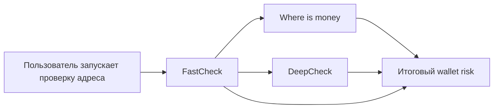

# Режимы проверки: FastCheck, DeepCheck, Where is money

## Зачем Эта Глава

У нас есть три главных режима проверки адреса:

- FastCheck;
- DeepCheck;
- Where is money.

Они похожи, потому что все смотрят один и тот же кошелек, но отвечают на разные вопросы. Если смешать их в одну кучу, становится непонятно, почему один режим видит риск, а другой пишет, что происхождение денег не доказано.

Короткая модель:

```text
FastCheck - быстрый первый осмотр кошелька.
DeepCheck - широкая forensic-картина по кошельку.
Where is money - откуда пришли конкретные деньги.
```

## Общая Логика

Когда пользователь запускает проверку адреса, система сначала делает быстрый слой. Он нужен, чтобы сразу понять, есть ли очевидные красные флаги.

После этого создаются фоновые проверки:

- Where is money;
- DeepCheck.

FastCheck не заменяет эти режимы. Он передает им короткий стартовый контекст: какой быстрый риск уже найден и какие важные направления стоит учитывать. Дальше каждый режим работает своей логикой и сохраняет отдельный результат.

В финальном отчете система не просто складывает три числа. Она собирает общий риск кошелька из нескольких слоев:

- быстрый риск;
- происхождение денег;
- глубокий forensic-контекст;
- жесткие доказательства, если они есть;
- ограничения и неполное покрытие, если данные не удалось полностью получить.

## FastCheck

FastCheck - это быстрый осмотр адреса.

Его цель: быстро ответить на вопрос:

```text
Есть ли у этого кошелька очевидные признаки риска прямо сейчас?
```

FastCheck нужен как первый фильтр. Он не должен доказывать полное происхождение денег и не должен строить всю историю кошелька. Он должен быстро подсветить важное.

Что он смотрит:

- сам проверяемый адрес;
- прямые входящие и исходящие связи;
- топ входящих адресов по сумме;
- топ исходящих адресов по сумме;
- важные сервисные направления: CEX, DEX, bridge, router, contract, service;
- известные метки и рискованные адреса;
- blacklist или ограничения по USDT, если они доступны;
- признаки подозрительного поведения;
- missing checks, то есть что система не смогла проверить.

Что он дает:

- быстрый score;
- уровень риска;
- список причин;
- быстрый снимок риска для следующих режимов;
- отдельный job в админке, чтобы мы видели, что именно было найдено.

Что важно понимать:

- FastCheck - это не полное расследование.
- Он смотрит быстро и ограниченно.
- Если FastCheck не нашел риск, это не значит, что кошелек чистый.
- Если FastCheck нашел сильный факт, например blacklist или точную риск-метку, это может сильно повлиять на итоговый риск.

Проще говоря: FastCheck отвечает первым и говорит системе, куда смотреть внимательнее.

## Where Is Money

Where is money отвечает на другой вопрос:

```text
Откуда пришли деньги, которые сейчас лежат на кошельке
или покрывают проверяемую сумму?
```

Это не биография всего кошелька. Это проверка происхождения конкретных денег.

Пример:

```text
На кошельке лежит 10 000 USDT.
Система пытается понять, какие входящие переводы сформировали эти 10 000 USDT
и откуда эти входящие деньги пришли раньше.
```

Что он смотрит:

- текущий баланс;
- входящие переводы, которые могли сформировать баланс;
- recent-flow, если баланс маленький или деньги быстро прошли дальше;
- цепочки до предыдущих кошельков;
- суммы на каждом шаге;
- временные разрывы между переводами;
- сервисные границы: биржи, мосты, DEX, контракты;
- ситуации, когда история обрывается на clean CEX, bridge, router или другом boundary;
- признаки approval-drain или похожего сценария;
- контекст FastCheck, если он уже есть.

Что он должен объяснить:

- деньги пришли из понятного источника или нет;
- цепочка короткая и чистая или запутанная;
- деньги быстро прошли через несколько кошельков или долго лежали;
- есть ли источник, которому можно доверять;
- есть ли причина отказать, отправить на ручной review или принять.

Что важно понимать:

- Where is money не проверяет весь кошелек целиком.
- Он проверяет выбранную сумму или выбранный поток денег.
- Если источник дошел до CEX или bridge, дальше публичная цепочка может оборваться.
- Если данных не хватает, режим может дать partial или review, а не делать вид, что все доказано.

Проще говоря: Where is money отвечает не "кто этот кошелек?", а "откуда эти деньги?".

## DeepCheck

DeepCheck - это широкий forensic-профиль кошелька.

Его цель:

```text
Понять общий контекст адреса: с кем он связан, как он себя ведет,
какие сервисы использует и есть ли признаки опасного паттерна.
```

DeepCheck шире FastCheck и шире Where is money, но у него другая роль. Он не всегда доказывает происхождение конкретной суммы. Он показывает профиль адреса и его окружение.

Что он смотрит:

- кто отправлял деньги на адрес;
- куда адрес отправлял деньги;
- крупнейшие входящие и исходящие направления;
- выбранные следующие шаги по важным контрагентам;
- сервисы, мосты, DEX, CEX, контракты и boundary;
- поведенческие паттерны;
- связи с risk labels;
- признаки approval-drain;
- продолжение активов после USDT, если оно найдено;
- слабые и сильные доказательства риска;
- coverage, то есть насколько полно удалось собрать данные.

DeepCheck может смотреть дальше одного прямого шага, но делает это выборочно. Он не раскрывает бесконечно весь блокчейн. Он выбирает важные направления, где есть смысл продолжать.

Почему это важно:

- полный граф всех переводов быстро превращается в кашу;
- большинство мелких адресов не дает ценности;
- важнее увидеть крупные потоки, сервисные границы, повторяющиеся паттерны и рискованные связи.

Что важно понимать:

- DeepCheck - это профиль и контекст.
- Он может найти сильные доказательства, но не каждое наблюдение является доказательством.
- Service exposure сам по себе не всегда означает плохой кошелек.
- Если DeepCheck пишет partial, это чаще значит "данные собраны не полностью", а не "проверка бесполезна".

Проще говоря: DeepCheck отвечает на вопрос "что за кошелек и вокруг чего он крутится?".

## Как Они Взаимодействуют

У режимов нет смысла делать одну большую общую проверку. Они полезны именно потому, что разделены по ролям.

Логика такая:



FastCheck дает быстрый стартовый снимок.

Where is money использует этот контекст, но проверяет происхождение денег своей логикой.

DeepCheck тоже может использовать подсказки FastCheck, чтобы лучше выбрать важные направления для анализа.

Итоговый риск собирается отдельно. Это важно: если один режим увидел слабый контекст, а другой нашел жесткое доказательство, итог должен уважать жесткое доказательство. Если жестких доказательств нет, система должна не разгонять риск до критического только из-за слабых совпадений.

## Что Не Нужно Путать

FastCheck:

- быстрый осмотр;
- хорош для первых красных флагов;
- не доказывает всю историю денег.

Where is money:

- проверяет происхождение конкретной суммы;
- хорош для решения "можно принимать деньги или нет";
- не является полной биографией кошелька.

DeepCheck:

- строит общий forensic-профиль;
- хорош для понимания окружения и паттернов;
- не обязан превращаться в бесконечный multi-hop граф.

## Что Смотреть В Админке

FastCheck:

- топ входящих;
- топ исходящих;
- важные сервисы;
- blacklist и risk labels;
- какие проверки не сработали.

Where is money:

- какие входящие переводы покрывают сумму;
- откуда они пришли;
- где цепочка оборвалась;
- какие gap по времени между шагами;
- есть ли clean source, boundary или risk source.

DeepCheck:

- общий профиль адреса;
- крупные направления;
- service exposure;
- подозрительные паттерны;
- важные соседние кошельки;
- почему проверка completed или partial.

## Текущие Ограничения

1. FastCheck не должен проверять бесконечно всех соседей.

Он берет важные направления и быстрые сигналы. Иначе быстрый режим станет таким же долгим, как глубокий.

2. Where is money может упереться в boundary.

Если деньги пришли из CEX, bridge или контракта, публичная цепочка может закончиться. Это не всегда плохо, но это нужно явно показывать.

3. DeepCheck может собрать больше данных, чем админка удобно показывает.

Это отдельная UX-задача: граф должен показывать не просто "много узлов", а понятную структуру связей.

4. Partial не всегда означает ошибку.

Часто это значит, что часть данных не успела загрузиться, provider ограничил ответ, история оборвалась или проверка специально остановилась на boundary.

5. Итоговый risk не должен быть механической суммой.

Нам важно различать:

- жесткое доказательство;
- сильный паттерн;
- слабый контекст;
- отсутствие данных.

## Короткая Формулировка Для Команды

FastCheck быстро говорит: "есть ли очевидные красные флаги".

Where is money говорит: "откуда пришли конкретные деньги".

DeepCheck говорит: "какой общий forensic-профиль у кошелька".

Финальный риск появляется только после того, как эти слои собраны вместе и оценены по силе доказательств.

## Что Документировать Дальше

Следующие главы стоит писать так:

1. Как считается итоговый риск.
2. Как устроена админка и forensic graph.
3. Что такое boundary, service, CEX, DEX, bridge и contract в наших проверках.
4. Что значит completed, partial и failed.
5. Как читать графы FastCheck, DeepCheck и Where is money.
