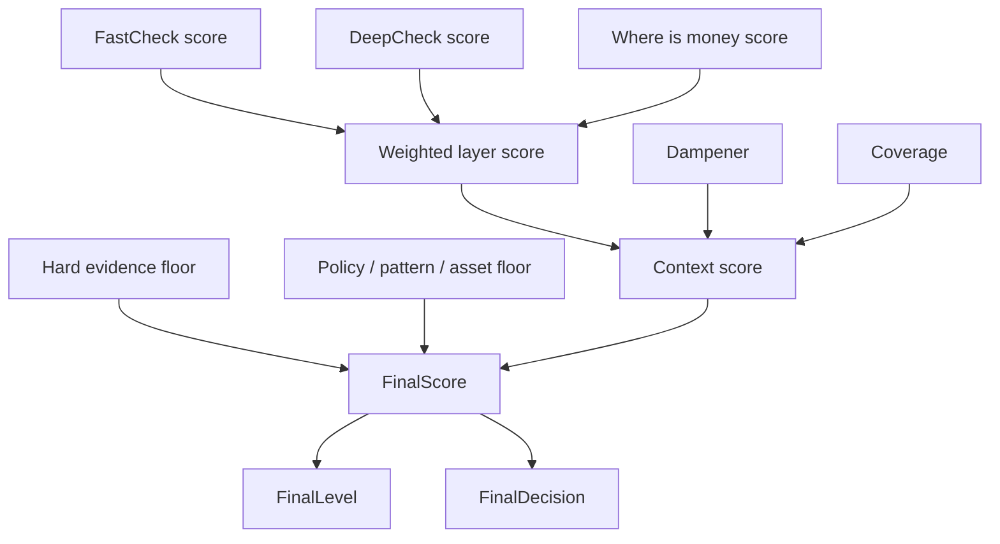

# Итоговый Риск Простым Языком

## Зачем Нужен Итоговый Риск

FastCheck, DeepCheck и Where is money отвечают на разные вопросы.

Проблема: пользователю и аналитику нужен один понятный вывод:

```text
Можно доверять этому кошельку или нет?
```

Поэтому после отдельных проверок система собирает общий результат:

- finalScore;
- finalLevel;
- finalDecision.

## Simple Score Model

Итоговый score - это не просто среднее по режимам.

Простыми словами:

```text
context score = available context - allowed dampening

final score =
max(context score, strongest applicable floor)

then caps may apply
```

Что это значит:

- context дает базовый риск по доступным слоям;
- dampening может снизить только не-жесткий контекст, если для этого есть причина;
- floor не прибавляется сверху, а задает нижнюю планку: ниже сильного сигнала итог не падает;
- cap может ограничить итог, например не дать риску стать `CRITICAL` без hard evidence.

Главное правило: сильный факт не должен исчезнуть только потому, что другие слои выглядят спокойнее.

Confirmed examples from code and tests:

- A wallet score from `0` to `29` is `LOW`, `30` to `59` is `MEDIUM`, `60` to `84` is `HIGH`, and `85` to `100` is `CRITICAL`.
- The final wallet decision becomes `DECLINE` at `finalScore >= 60`; below that it is `ACCEPTABLE`, unless hard evidence floor `>= 85` forces `DECLINE`.
- Without hard evidence, context and non-hard floors are capped below `CRITICAL` at `84`.
- Limited coverage creates a `30` minimum context/floor so the result does not look confidently clean.
- Source-policy decline evidence creates a policy floor from `70` up to `84`.
- Verified/known asset continuation with score `>= 65` creates an asset-continuation floor capped at `84`.
- A historical transit, drain-episode, or route-linked approval pattern needs score `>= 60` to become a pattern floor.
- Dampening is allowed only above the strongest floor; the applied dampener is capped at `25`.

Это и есть итоговый wallet risk.

## Что Входит В Итог

В итоговую оценку попадают три основных слоя:

1. FastCheck.

Быстрый риск по адресу: blacklist, очевидные risk labels, прямые соседи, сервисы, быстрый контекст.

2. DeepCheck.

Широкий forensic-профиль кошелька: поведение, крупные связи, сервисы, исторические паттерны, расширенные признаки риска.

3. Where is money.

Происхождение конкретных денег: откуда пришла сумма, через какие адреса прошла, где цепочка оборвалась, есть ли policy-причина отклонить.

## Почему Мы Не Складываем Score Просто Так

Нельзя взять три числа и просто сложить.

Например:

```text
FastCheck: 20
DeepCheck: 80
Where is money: 40
```

Если просто усреднить, получится средний риск. Но это может быть неправильно.

Почему:

- один режим мог найти сильное доказательство;
- другой режим мог видеть только слабый контекст;
- третий режим мог быть partial из-за provider limit;
- происхождение денег могло оборваться на CEX или bridge;
- кошелек мог выглядеть как обычный operational wallet, но иметь отдельный опасный паттерн.

Поэтому итоговый risk - это не среднее арифметическое. Это взвешенная оценка плюс специальные правила для сильных фактов.

## Базовые Веса Слоев

Когда доступны все три слоя, базовая логика такая:

```text
FastCheck: 10%
DeepCheck: 60%
Where is money: 30%
```

Почему DeepCheck весит больше:

- он шире смотрит кошелек;
- он видит поведение и историю;
- он может найти паттерны, которые не видны в одном входящем переводе.

Почему Where is money тоже важен:

- он отвечает на самый практический вопрос: откуда именно пришли деньги;
- если деньги пришли из опасного источника, это может быть важнее общего фона.

Почему FastCheck весит меньше:

- он быстрый;
- он полезен как первый сигнал;
- но он не должен один решать всю судьбу кошелька, если нет жесткого доказательства.

Если какого-то слоя нет, система не делает вид, что он есть. Она считает итог по доступным слоям и отмечает покрытие как partial или limited.

## Что Такое FinalScore

FinalScore - это итоговая числовая оценка риска от 0 до 100.

Упрощенно:

```text
0-29   LOW
30-59  MEDIUM
60-84  HIGH
85-100 CRITICAL
```

Чем выше score, тем больше причин не принимать кошелек без дополнительной проверки.

## Что Такое FinalDecision

FinalDecision - это практическое решение.

В текущей объединенной логике:

```text
score ниже 60  -> ACCEPTABLE
score 60 и выше -> DECLINE
```

Если есть жесткое доказательство, система тоже идет в DECLINE.

Важно: отдельные режимы могут внутри себя писать REVIEW, partial или insufficient coverage. Но финальный wallet-level result должен быть одним понятным решением. Если внутри есть спорный слой, это надо показывать в объяснении, а не смешивать с финальным выводом.

## Что Такое Hard Evidence

Hard evidence - это жесткое доказательство.

Примеры:

- активный USDT blacklist;
- точная scam/stolen funds метка по самому адресу;
- точная approval-drain связка;
- точная high-risk provenance;
- sanctioned service evidence;
- похожий сильный факт, который не должен растворяться в среднем score.

Если hard evidence найден, итоговый риск не должен стать мягким только потому, что другие слои спокойные.

Пример:

```text
FastCheck нашел blacklist.
Where is money не смог доказать плохой источник.
DeepCheck видит обычные переводы.

Итог все равно должен учитывать blacklist как сильный факт.
```

## Что Такое Policy Floor

Policy floor - это нижняя планка риска по правилам источника денег.

Например, Where is money видит, что проверяемая сумма пришла из источника, который по нашей политике нельзя принимать или нужно отклонять.

Если такой факт есть, его нельзя разбавить весами.

Пример:

```text
Where is money нашел source-policy decline на 70.
Даже если средний weighted score ниже,
итоговый score не должен упасть ниже этой важной планки.
```

То есть floor говорит системе:

```text
Ниже этого риска опускаться нельзя, потому что есть сильная причина.
```

## Что Такое Pattern Floor

Pattern floor - это нижняя планка по сильному паттерну поведения.

Это не всегда hard evidence. Но это может быть достаточно серьезный сценарий.

Примеры:

- большой исторический pass-through поток;
- деньги быстро входят и почти сразу уходят;
- много движения через bridge, DEX, router или unknown contracts;
- route-linked approval-drain context;
- drain episode, который выглядит как транзит через рискованную инфраструктуру.

Такой паттерн может поднять риск до HIGH, но обычно не должен делать CRITICAL без жесткого доказательства.

## Почему Есть Cap Ниже Critical

У нас есть важное правило:

```text
Если нет hard evidence, контекстный риск не должен автоматически стать CRITICAL.
```

То есть система может сказать HIGH, DECLINE, опасный паттерн, нужна осторожность.

Но CRITICAL должен быть для более жестких случаев:

- blacklist;
- exact scam;
- exact approval-drain;
- deterministic high-risk provenance;
- другой сильный доказанный факт.

Это защищает нас от ситуации, где слабый или косвенный контекст случайно превращает обычный кошелек в "критический".

## Что Такое Dampener

Dampener - это снижение риска для слабого контекста.

Он нужен, когда система видит признаки, что кошелек может быть обычным operational wallet, liquidity wallet или clean CEX-funded wallet.

Пример:

```text
Кошелек много двигает деньги.
Но он похож на обычный операционный кошелек.
Нет blacklist.
Нет точной scam-метки.
Нет точного approval-drain.
```

В таком случае часть поведенческого риска можно ослабить.

Важно: dampener не должен снижать hard evidence. Если есть жесткое доказательство, "похож на обычный кошелек" не отменяет его.

## Что Такое Coverage

Coverage показывает, насколько полно удалось проверить кошелек.

Есть три понятных состояния:

- complete - данных достаточно;
- partial - часть данных есть, но чего-то не хватает;
- limited - данных мало или проверка сильно ограничена.

Partial не значит, что кошелек плохой.

Но partial значит:

```text
Мы не должны делать слишком уверенный вывод без объяснения, где именно не хватило данных.
```

Coverage влияет на итог осторожно. Если данных мало, система может поднять минимальный контекстный риск, но не должна придумывать доказательства.

## Как Собирается Итог

Упрощенная схема:



Простыми словами:

1. Сначала система берет score каждого доступного слоя.
2. Считает базовую взвешенную оценку.
3. Проверяет, можно ли снизить слабый контекст через dampener.
4. Проверяет coverage.
5. Отдельно ищет сильные якоря: hard evidence, policy floor, pattern floor, asset continuation.
6. Берет максимальный честный риск между контекстом и сильными якорями.
7. Если нет hard evidence, не дает контексту перескочить в CRITICAL.
8. Выдает один итоговый score, level и decision.

## Почему Итог Может Отличаться От Отдельного Режима

Это нормальная ситуация.

Пример 1:

```text
Where is money: DECLINE из-за недостаточного clean source.
DeepCheck: слабый риск.
FastCheck: низкий риск.
Итог: может быть ниже, если нет сильного policy floor или hard evidence.
```

Почему: не каждое "не доказали чистоту" равно "доказали грязь".

Пример 2:

```text
FastCheck: низкий.
Where is money: средний.
DeepCheck: нашел большой pass-through паттерн.
Итог: HIGH / DECLINE.
```

Почему: DeepCheck увидел общий риск поведения кошелька, который не виден в одной сумме.

Пример 3:

```text
FastCheck: blacklist.
Where is money: данных мало.
DeepCheck: частично.
Итог: CRITICAL / DECLINE.
```

Почему: blacklist - это жесткий факт, его нельзя растворить в partial данных.

## Как Объяснять Это Пользователю

Не надо говорить:

```text
Мы сложили FastCheck, DeepCheck и Where is money.
```

Лучше говорить:

```text
Мы проверили быстрые признаки риска, происхождение денег и общий forensic-профиль кошелька.
Итоговый риск учитывает силу доказательств: точные факты важнее слабого контекста,
а неполные данные не превращаются автоматически в критический риск.
```

## Как Читать В Админке

Если итог высокий, надо смотреть:

- какой слой дал основной риск;
- есть ли hard evidence;
- есть ли policy floor;
- есть ли pattern floor;
- не был ли риск снижен dampener;
- какой coverage;
- какие проверки partial или limited.

Если итог низкий, все равно надо смотреть:

- не отсутствует ли DeepCheck;
- не отсутствует ли FastCheck;
- не оборвалась ли Where is money цепочка на boundary;
- нет ли missing checks.

Низкий итог при неполном покрытии - это не "абсолютно чисто". Это "по доступным данным сильного риска не найдено".

## Короткая Формулировка Для Команды

Итоговый риск - это не среднее трех проверок.

Это единая оценка, где:

- FastCheck дает быстрый сигнал;
- Where is money отвечает за происхождение денег;
- DeepCheck отвечает за широкий профиль кошелька;
- hard evidence и policy floors не дают сильным фактам потеряться;
- dampener снижает только слабый контекст;
- без hard evidence система не должна разгонять риск до CRITICAL.

## Что Документировать Дальше

Следующая полезная глава: как читать админку.

В ней надо объяснить:

- Jobs;
- completed / partial / failed;
- графы;
- bundle / group;
- service / boundary;
- почему в разных режимах граф выглядит по-разному;
- где смотреть историю старых прогонов.

## Final Risk Versus Diagnostics

The product keeps one final risk score for the user. That score is a rule-and-policy severity score, not a mathematical probability.

Internally we also track:

- coverage: how complete the evidence is;
- confidence: how reliable the conclusion appears from available evidence;
- evidence strength: whether the finding is hard evidence, amount-linked evidence, context, or weak context;
- policy version: which rule set produced the decision.

These diagnostics explain the final score. They are not separate public verdicts.
