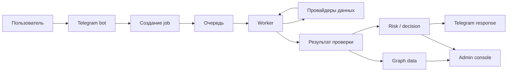

# Жизненный цикл проверки

## Зачем Эта Глава

Эта глава объясняет, что происходит после того, как пользователь отправил адрес или депозит на проверку.

Короткая версия:

```text
Пользователь запускает проверку.
Система создает job.
Worker собирает данные.
Режим проверки считает свой результат.
Итог сохраняется.
Telegram показывает короткий ответ.
Админка показывает полную forensic-картину.
```

Главная идея: проверка не живет только в Telegram-боте. Бот - это вход и короткий ответ. Основная работа идет в фоновых jobs и потом читается в админке.

## Общая Схема



## Шаг 1. Пользователь Запускает Проверку

Проверка может начаться из разных мест:

- пользователь отправил адрес в Telegram;
- пользователь нажал кнопку проверки;
- система запустила проверку после входящего депозита;
- администратор выбрал старый или новый job в админке;
- другой режим поставил follow-up проверку.

На этом шаге система должна понять:

- какой адрес проверяем;
- какой режим нужен;
- есть ли конкретная сумма;
- есть ли конкретная транзакция;
- нужно ли добавить адрес в мониторинг или только проверить один раз.

Пример:

```text
Пользователь отправил кошелек.
Бот отвечает: проверка запущена.
Адрес не добавляется в мониторинг, если сценарий был одноразовый.
```

## Шаг 2. Система Создает Job

Job - это отдельный запуск проверки.

У job есть:

- тип проверки;
- адрес;
- статус;
- время запуска;
- кто запросил проверку;
- входные данные;
- будущий результат;
- id, по которому job потом можно найти.

Почему это важно:

```text
Один и тот же кошелек можно проверять много раз.
Каждый запуск сохраняется отдельно.
```

Если мы проверили адрес вчера и сегодня, это две разные работы. Баланс, транзакции и доступные данные могли измениться.

## Шаг 3. Job Попадает В Очередь

Проверка может быть быстрой или долгой.

Чтобы Telegram не зависал, тяжелая работа уходит в очередь. Очередь нужна, чтобы worker мог выполнять проверки по порядку и не ломать бота долгими запросами к провайдерам.

Статусы на этом этапе:

- `queued` - job ждет обработки;
- `running` - worker уже взял job;
- `completed` - job завершился;
- `partial` - job завершился частично;
- `failed` - job упал.

Важно:

```text
Статус job говорит о выполнении проверки.
Он не говорит сам по себе, чистый кошелек или рискованный.
```

## Шаг 4. Worker Собирает Данные

Worker - это фоновый исполнитель.

Он берет job и собирает данные, которые нужны конкретному режиму проверки.

Обычно worker смотрит:

- транзакции адреса;
- входящие и исходящие переводы;
- текущий баланс;
- историю USDT;
- известные метки адресов;
- blacklist;
- сервисные адреса;
- CEX, DEX, bridge, contract, router;
- risk labels;
- уже сохраненный контекст, если он нужен режиму.

Worker не должен бесконечно обходить весь блокчейн. У него есть лимиты:

- глубина шагов;
- количество адресов;
- время выполнения;
- лимиты провайдеров;
- бюджет на запросы.

Поэтому некоторые проверки завершаются `partial`. Это нормально, если система честно показывает, что именно не удалось собрать.

## Шаг 5. Режим Проверки Делает Свою Работу

После сбора данных включается логика конкретного режима.

### FastCheck

FastCheck делает быстрый первый осмотр.

Он смотрит:

- сам адрес;
- прямых соседей;
- топ входящих;
- топ исходящих;
- важные сервисы;
- blacklist и риск-метки;
- очевидные красные флаги.

Его задача - быстро дать стартовый риск и подсказать, где стоит смотреть внимательнее.

### Where is money

Where is money ищет происхождение конкретных денег.

Он смотрит:

- какие входящие переводы покрывают выбранную сумму;
- откуда эти деньги пришли раньше;
- какие gap между шагами;
- где цепочка остановилась;
- дошла ли трасса до clean CEX, bridge, contract или risk boundary.

Его задача - объяснить путь денег, а не всю биографию кошелька.

### DeepCheck

DeepCheck строит широкий forensic-контекст.

Он смотрит:

- с кем адрес связан;
- какие крупные направления есть;
- какие сервисы использует кошелек;
- какие соседние адреса важны;
- есть ли service exposure;
- есть ли подозрительные паттерны;
- какие boundary и coverage gaps есть.

Его задача - профиль кошелька и окружения. Он может смотреть дальше одного шага, но выборочно, по важным направлениям.

### Incoming deposit check

Incoming deposit check проверяет конкретный входящий депозит.

Он стартует от пары:

```text
sender -> наш кошелек
```

Дальше он пытается понять, откуда sender получил деньги и как сформировался депозит.

## Шаг 6. Результат Сохраняется

Когда режим закончил работу, система сохраняет результат.

В результате могут быть:

- краткий вывод;
- risk score;
- risk level;
- decision;
- причины риска;
- top incoming;
- top outgoing;
- top services;
- найденные labels;
- missing checks;
- boundary stops;
- graph nodes;
- graph edges;
- paths;
- raw details для админки.

Это важно для истории.

Если мы позже улучшим UI графа, старый job можно открыть и увидеть его в новом интерфейсе. Но сами forensic-данные внутри старого job не станут новыми. Для новых данных нужно запускать новую проверку.

## Шаг 7. Считается Итоговый Риск

Итоговый риск не должен быть простой суммой всех найденных сигналов.

Система должна различать:

- жесткое доказательство;
- сильный паттерн;
- слабый контекст;
- service exposure;
- source exposure;
- неполное покрытие;
- отсутствие данных.

Пример:

```text
Blacklist на самом адресе - сильный факт.
Дальний контакт с сервисом - слабее.
Partial из-за timeout - это не риск сам по себе, но ограничение уверенности.
```

Итоговый риск должен отвечать на вопрос:

```text
Что мы можем честно сказать по текущим данным?
```

## Шаг 8. Telegram Показывает Короткий Ответ

Telegram не должен показывать всю forensic-кухню.

Он нужен для короткого пользовательского ответа:

- проверка запущена;
- проверка завершилась;
- риск низкий, средний или высокий;
- нужен review или отказ;
- если результат еще не готов, пользователь получает понятный статус.

Telegram не должен превращаться в админку. Если показать там все графы, paths, bundles и boundary, обычный пользователь не поймет результат.

## Шаг 9. Админка Показывает Полную Картину

Админка нужна для нас и аналитика.

Она показывает:

- историю jobs;
- тип каждой проверки;
- статус;
- risk и decision;
- граф связей;
- суммы и время;
- boundary;
- bundles;
- peer links;
- top incoming/outgoing/services;
- limitations;
- raw details, если нужно разобраться глубже.

Простая модель:

```text
Telegram отвечает пользователю.
Админка объясняет нам, почему система так ответила.
```

## Как Режимы Передают Контекст Друг Другу

Режимы не должны превращаться в один большой комбайн.

У каждого режима своя цель:

- FastCheck быстро подсвечивает очевидное;
- Where is money объясняет происхождение денег;
- DeepCheck строит профиль и окружение.

Но они могут использовать общий контекст.

Например:

- FastCheck может дать список важных соседей;
- Where is money может отдельно проверить выбранную сумму, recent-flow или drain episode;
- DeepCheck может учитывать важные сервисные направления;
- итоговый risk может собрать выводы нескольких jobs.

Важно:

```text
Режимы могут делиться контекстом, но каждый должен сохранять свой отдельный результат.
```

Так проще понимать, почему система решила именно так.

## Что Происходит При Partial

`Partial` значит: проверка дала результат, но не собрала все, что хотела.

Частые причины:

- timeout;
- provider не отдал данные;
- достигнут лимит адресов;
- достигнут лимит глубины;
- история оборвалась на сервисе;
- нет подходящих транзакций;
- часть данных не удалось нормализовать.

Как читать:

```text
Partial - это не автоматический отказ.
Partial - это предупреждение: вывод неполный.
```

Если partial затронул неважную часть, результат может быть полезным. Если partial затронул главный путь денег, нужен review или повторная проверка.

## Что Происходит При Failed

`Failed` значит, что job не смог дать нормальный результат.

Такой job нельзя использовать как полноценный forensic-вывод.

Обычно надо:

- посмотреть ошибку;
- понять, это проблема данных или кода;
- перезапустить проверку после фикса;
- не смешивать failed job с completed или partial.

## Почему Старые И Новые Прогоны Могут Отличаться

Два job по одному адресу могут отличаться.

Причины:

- проверка запущена в разные дни;
- баланс изменился;
- появились новые транзакции;
- provider вернул больше или меньше данных;
- один job был partial;
- изменилась логика графа;
- изменились labels или service lists;
- один режим проверял профиль, другой - происхождение денег.

Поэтому нельзя сравнивать только картинки графа. Надо смотреть:

- kind;
- дату запуска;
- status;
- выбранную сумму;
- tx hash;
- coverage;
- limitations.

## Что Важно Для Пользователя

Пользователь хочет простой ответ:

```text
Можно принимать деньги или нет?
Почему?
Что делать дальше?
```

Ему не нужны все внутренние paths. Но если решение серьезное, у нас должна быть админка, где можно проверить доказательства.

## Что Важно Для Аналитика

Аналитику нужен не только score.

Ему нужно понять:

- какой режим дал вывод;
- какая сумма проверялась;
- где начинается источник денег;
- где trace остановился;
- есть ли риск внутри source path;
- где только service exposure;
- какие данные не загрузились;
- можно ли доверять выводу без ручной проверки.

## Что Важно Для Инвестора Или Партнера

Продукт не просто проверяет адрес по blacklist.

Он строит несколько слоев:

- быстрый риск;
- происхождение денег;
- forensic-профиль кошелька;
- сервисные границы;
- поведенческие признаки;
- объяснимый итоговый риск;
- историю проверок в админке.

Ценность в том, что система не дает одно черное число без объяснения. Она показывает, почему риск такой, где доказательство сильное, а где данных не хватает.

## Короткая Формулировка Для Команды

Жизненный цикл проверки выглядит так:

```text
Telegram принимает запрос.
Job сохраняет запуск.
Worker собирает данные.
Режим проверки считает свой результат.
Risk-слой собирает решение.
Telegram показывает короткий ответ.
Админка показывает доказательства.
```

Если какой-то этап дал неполные данные, система должна честно показать partial, missing checks или boundary. Это лучше, чем делать вид, что мы знаем больше, чем реально собрали.
