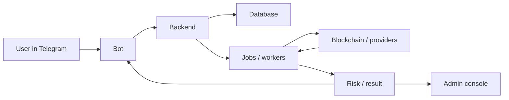

# Telegram-Бот Простым Языком

## Зачем Нужен Telegram-Бот

Telegram-бот - это пользовательский вход в продукт.

Он нужен, чтобы человек мог быстро:

- начать работу через `/start`;
- добавить свой TRON-адрес в мониторинг;
- проверить адрес без добавления в мониторинг;
- проверить транзакцию;
- увидеть краткий риск;
- получить уведомление о входящем USDT;
- получить предупреждение об approval;
- открыть dashboard кошелька;
- перейти к TronScan или другой внешней проверке.

Главная мысль:

```text
Telegram - это интерфейс.
Основная forensic-работа идет в backend, jobs, workers и админке.
```

Бот не должен превращаться в перегруженную админку. Его задача - дать пользователю понятный короткий ответ и правильное действие дальше.

## Простая Схема Работы

```text
Пользователь пишет боту.
Бот понимает сценарий.
Backend сохраняет действие или создает job.
Worker собирает данные и считает результат.
Бот показывает короткий ответ.
Админка хранит полную картину.
```

В виде цепочки:



## Что Бот Делает

Бот делает пользовательские действия.

Он:

- регистрирует Telegram user;
- хранит связь user -> watched wallets;
- принимает команды и кнопки;
- просит адрес, если пользователь нажал Add;
- запускает разовую проверку адреса;
- запускает проверку tx;
- показывает wallet dashboard;
- показывает profile;
- показывает settings;
- показывает alert mode;
- отправляет входящие alerts;
- отправляет safety alerts по approvals;
- дает ссылки на explorer;
- сообщает, если проверка запущена или завершилась.

Бот должен быть быстрым и понятным.

Если проверка тяжелая, бот не должен зависать. Он должен сказать:

```text
Проверка запущена. Результат придет сюда.
```

## Что Бот Не Делает

Бот не должен делать опасные вещи.

Он не должен:

- просить private key;
- просить seed phrase;
- подписывать транзакции;
- делать revoke за пользователя;
- брать custody денег;
- обещать, что транзакцию можно отменить;
- деанонимизировать чужой адрес;
- первым писать произвольному пользователю, который не начал диалог;
- показывать обычному пользователю всю forensic-кухню;
- выдавать `partial` как точный финальный вывод.

Важное правило:

```text
Бот read-only.
Он предупреждает, объясняет и ведет по ссылкам, но не управляет кошельком.
```

## `/start`

`/start` - это вход в продукт.

После `/start` бот должен:

- зарегистрировать пользователя;
- открыть главное меню;
- показать, что бот умеет;
- дать кнопки для основных действий.

В идеале `/start` не должен запускать тяжелые проверки.

Он должен быстро ответить, потому что это первое впечатление.

Если `/start` отвечает долго, это может означать:

- бот занят тяжелой задачей;
- база отвечает медленно;
- есть проблемы с Telegram polling/webhook;
- startup или migrations блокируют процесс;
- команда делает лишнюю работу.

Правильная логика:

```text
/start должен быть легким.
Тяжелые проверки должны идти через jobs.
```

## Главное Меню

Главное меню - это карта продукта для пользователя.

Основные действия:

- Wallets;
- Add wallet;
- Check address;
- Check tx;
- Risk intel;
- Profile;
- Settings;
- Help.

Меню должно быть компактным.

Пользователь не должен читать длинный manual, чтобы понять первый шаг.

## Добавление Кошелька

Когда пользователь добавляет кошелек, бот включает мониторинг.

Простая цепочка:

```text
User нажимает Add.
Бот просит TRON-адрес.
User отправляет адрес.
Backend валидирует адрес.
Backend сохраняет watched wallet.
Бот открывает dashboard кошелька.
Worker начинает мониторинг.
```

Важно:

```text
Добавить кошелек = включить постоянное наблюдение.
Проверить адрес = разовая проверка без мониторинга.
```

Эти сценарии нельзя смешивать.

## Проверка Адреса Без Мониторинга

Check address нужен, когда пользователь хочет проверить чужой или разовый адрес.

Например:

```text
Мне хотят отправить USDT.
Я хочу быстро проверить адрес отправителя.
```

В этом сценарии бот не должен автоматически добавлять адрес в мониторинг.

Он должен:

- принять адрес;
- создать разовую проверку;
- показать, что проверка запущена;
- вернуть короткий результат;
- не добавлять адрес в watched wallets.

Почему это важно:

```text
Пользователь может проверить десятки адресов.
Не все они должны становиться его кошельками.
```

## Проверка Транзакции

Check tx нужен, когда пользователь дает hash транзакции.

Бот должен понять:

- какая это транзакция;
- кто sender;
- кто receiver;
- есть ли сумма;
- можно ли запустить проверку sender или происхождения денег;
- что показать пользователю коротко.

Для полной forensic-картины результат должен сохраняться в job и быть виден в админке.

## Wallet Dashboard

Dashboard кошелька - это краткая карточка наблюдаемого адреса.

В ней полезно показывать:

- monitoring status;
- alert mode;
- last check;
- last result;
- risk score;
- USDT balance;
- TRX balance;
- wallet age;
- 30d in/out;
- fees;
- safety status;
- кнопки Refresh, Analytics, Safety, Remove.

Dashboard не должен превращаться в forensic report.

Он отвечает:

```text
Что сейчас с моим кошельком?
Нужно ли мне действие?
```

## Alerts По Входящим USDT

Когда на watched wallet приходит входящий TRC20 USDT, система должна:

1. увидеть новый confirmed transfer;
2. сохранить событие;
3. проверить sender;
4. посчитать риск;
5. сохранить evidence;
6. отправить Telegram alert по правилам alert mode.

Alert должен быть коротким.

В нем важно показать:

- watched wallet;
- sender;
- amount;
- tx hash;
- risk level;
- главные причины;
- кнопки для открытия tx и sender;
- кнопку для дополнительной проверки, если нужна.

Пользователь должен понять:

```text
Деньги пришли.
Риск такой-то.
Вот почему.
Вот что делать дальше.
```

## Alert Modes

У кошелька есть режим уведомлений.

Основные режимы:

### realtime

Отправлять каждое новое входящее событие сразу.

Подходит, если пользователь хочет видеть все.

### risk_only

Сразу отправлять только MEDIUM, HIGH и CRITICAL.

LOW-события сохраняются, но не спамят Telegram.

### digest

Серьезные события отправлять сразу, а спокойные группировать в digest.

Подходит, если у кошелька много обычных входящих.

### paused

События сохраняются, но owner alerts не отправляются.

Важно:

```text
Paused не значит, что мониторинг полностью исчез.
Это значит, что пользователь временно не получает owner alerts.
```

## Approval Guard

Approval Guard предупреждает о разрешениях на списание токена.

Проблема:

```text
Пользователь мог дать spender право списывать USDT через transferFrom.
```

Бот должен объяснять это простым языком:

```text
Этот адрес получил право списывать ваш токен.
Проверьте spender и при необходимости откройте revoke-инструмент.
```

Но бот не должен сам делать revoke.

Он может:

- показать spender;
- показать token;
- показать allowance;
- показать risk;
- дать ссылку на TronScan или revoke tool;
- объяснить, что пользователь сам подписывает revoke в своем кошельке.

## Customer Alert Admins

Wallet owner может добавить дополнительных получателей alert.

Это полезно для обменников или команд, где за один кошелек отвечает несколько людей.

Простая модель:

```text
Owner получает alerts по своему кошельку.
Customer alert admins получают копии по заданному режиму.
Service admins получают только важные platform-level alerts.
```

Важно:

```text
Дополнительные Telegram ID должны быть добавлены явно.
Бот не должен угадывать владельцев адресов.
```

## Service Admins

Service admins - это наши внутренние администраторы.

Они получают важные события, например HIGH или CRITICAL.

Зачем это нужно:

- видеть серьезные риски;
- разбирать проблемы;
- проверять качество скоринга;
- замечать ошибки провайдеров;
- помогать в ручном review.

Service admin alerts не должны заменять пользовательский alert.

Это отдельный слой наблюдения за качеством и безопасностью.

## Profile И Settings

Profile нужен, чтобы пользователь видел:

- свой Telegram ID;
- username;
- количество кошельков;
- язык;
- базовый статус аккаунта.

Settings нужен, чтобы управлять:

- alert behavior;
- customer alert admins;
- profile options;
- wallet-level settings.

Важная деталь:

```text
Telegram ID - это персональные данные.
С ним нужно обращаться аккуратно.
```

## Help И Risk Intel

Help должен объяснять продукт коротко:

- что бот проверяет;
- что он не делает;
- почему он read-only;
- что значит risk;
- что делать при warning;
- где открыть внешний explorer.

Risk intel должен объяснять активные и планируемые risk-модули.

Но без перегруза.

Пользователю не нужно видеть внутренние названия scoring functions. Ему нужно понять:

```text
Мы проверяем адрес, входящие деньги, approvals, сервисы и риск-метки.
```

## Как Бот Связан С Jobs

Когда пользователь запускает тяжелую проверку, бот создает или инициирует job.

Job нужен, чтобы:

- не блокировать Telegram;
- сохранять историю;
- дать worker выполнить тяжелую работу;
- показать результат позже;
- открыть полную картину в админке.

Пример:

```text
Пользователь отправил адрес.
Бот ответил: проверка запущена.
Worker сделал нужный job: FastCheck, DeepCheck или Where is money.
Бот прислал короткий итог.
Админка сохранила полный graph и details.
```

Важно:

```text
Telegram показывает короткий результат и не обязан показывать все детали FastCheck.
Job хранит доказательства.
Админка объясняет доказательства.
```

## Как Бот Связан С Админкой

Бот и админка смотрят на одну систему, но нужны разным людям.

Бот нужен пользователю:

- коротко;
- понятно;
- без перегруза;
- с кнопкой действия.

Админка нужна нам и аналитику:

- jobs;
- graphs;
- raw details;
- risk reasons;
- missing checks;
- bundles;
- boundary;
- history.

Если пользователь спрашивает "почему такой риск", полный ответ лучше смотреть в админке.

Telegram должен дать короткую причину, но не весь forensic report.

## Как Бот Должен Обрабатывать Ошибки

Ошибки должны быть понятными.

Плохой ответ:

```text
Error: operation aborted.
```

Хороший ответ:

```text
Проверка не завершилась из-за timeout.
Мы сохранили частичный результат. Попробуйте повторить или откройте job в админке.
```

Типы ситуаций:

- неверный адрес;
- неверный tx hash;
- provider timeout;
- provider unavailable;
- job failed;
- job partial;
- Telegram delivery failed;
- database temporarily unavailable.

Бот не должен молчать, если работа не завершилась.

## Почему Бот Может Отвечать Медленно

Если бот долго отвечает на простую команду, например `/start`, это сигнал проблемы.

Возможные причины:

- команда делает лишние запросы;
- бот стартует вместе с тяжелыми workers;
- база зависает;
- есть lock на миграциях;
- event loop занят;
- Telegram polling получает backpressure;
- process перегружен forensic jobs.

Правильный принцип:

```text
Легкие команды должны быть легкими.
Тяжелые проверки должны уходить в background jobs.
```

## Что Важно Для Безопасности

Бот работает с чувствительными данными:

- Telegram ID;
- username;
- адреса кошельков;
- risk history;
- incoming alerts;
- admin labels;
- потенциальные incident details.

Поэтому нельзя:

- логировать `BOT_TOKEN`;
- логировать полный `.env`;
- раскрывать чужие Telegram ID без причины;
- обещать деанонимизацию адресов;
- давать юридически жесткие обвинения без доказательств;
- просить доступ к кошельку.

Безопасная формулировка:

```text
Этот адрес имеет признаки риска.
Рекомендуется manual review.
```

Опасная формулировка:

```text
Это мошенник.
```

## Что Важно Для Юридической Чистоты

Telegram-бот не может знать владельца любого адреса.

Он знает только тех пользователей, которые:

- сами начали диалог;
- добавили адрес;
- согласились использовать бота;
- дали Telegram ID внутри продукта.

Поэтому нельзя говорить:

```text
Мы найдем Telegram владельца любого кошелька.
```

Правильно говорить:

```text
Мы можем связать Telegram user и адрес только внутри opt-in базы пользователей бота.
```

Это важная граница продукта.

## Как Объяснять Пользователю Результат

Пользовательский ответ должен быть коротким.

Пример структуры:

```text
Проверка завершена.
Риск: MEDIUM.
Причина: sender связан с сервисными адресами и быстрым транзитом.
Что делать: принять вручную после review или запросить другой адрес.
```

Если данных не хватило:

```text
Проверка частичная.
Сильный риск не найден, но источник денег не удалось проверить полностью.
Рекомендуется manual review.
```

Если риск высокий:

```text
Высокий риск.
Причина: источник денег связан с high-risk label.
Рекомендуется не принимать без ручного разбора.
```

## Как Объяснять Бота Инвестору Или Партнеру

Хорошая формулировка:

```text
Telegram-бот - это быстрый операционный интерфейс для мониторинга кошельков.
Пользователь добавляет адрес, получает alerts по входящим USDT, approvals и risk events.
Тяжелая forensic-логика работает на backend и сохраняет доказательства в jobs и админке.
```

Ценность:

- пользователь не должен вручную проверять TronScan каждый день;
- обменник быстрее видит риск входящих денег;
- команда получает alerts по проблемным депозитам;
- все серьезные решения можно проверить в админке;
- продукт остается read-only и не трогает средства пользователя.

## Короткая Формулировка Для Команды

Telegram-бот - это не forensic engine.

Это пользовательский слой:

```text
принимает запросы;
запускает проверки;
показывает короткие ответы;
отправляет alerts;
ведет пользователя к следующему действию.
```

Forensic engine, jobs, graph и полный разбор живут в backend и админке.

Главное правило:

```text
Бот должен быть быстрым, read-only, понятным и честным про ограничения.
```

## What Telegram Does Not Show

Telegram does not try to show the full forensic graph or every raw signal.

Those details belong in admin, because they are review material, not a short user alert.
