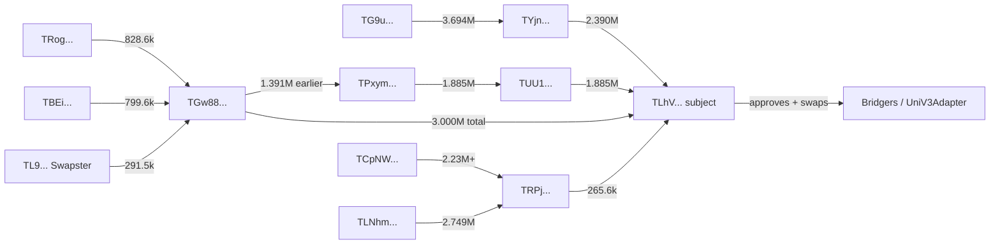

# TLhV Wallet Forensic Case

Date: 2026-05-22

Subject wallet: `TLhVzkRYUuoVuSCgVAwB8nDJPdMy7gAgXe`

Window: 2026-03-22 00:00 MSK to 2026-05-22 23:59 MSK.

Source: TronScan API and transaction detail pages. This is not a legal/AML verdict. It is a product case study for evidence-backed risk signals.

## Executive Summary

In the two-month window, the subject wallet received 12 incoming USDT transfers from 5 sender addresses, totaling about 7,541,408.439833 USDT.

The strongest finding is not one single "dirty" label. The strongest finding is the combination of behaviors:

- multiple direct senders are fresh or short-lived high-volume wallets;
- several senders received large USDT inflows minutes before sending to the subject wallet;
- in/out volumes on several senders are nearly equal, which is consistent with pass-through routing;
- there are shared counterparties between direct senders and hop1 wallets;
- the subject wallet later sent large chunks through Bridgers/adapter contracts after a 1.885M incoming transfer;
- the subject wallet made unlimited USDT approvals to service/approval addresses on the same day as the 1.885M flow.

Confirmed from TronScan:

- bridge context exists: transaction details contain `toToken: TRX|zvcm92|0.1|bridgers|0`, and `TPwezUWpEGmFBENNWJHwXHRG1D2NCEEt5s` is named `Bridgers`;
- unlimited approvals exist for USDT;
- TRON resource delegation/undelegation activity exists on the subject wallet.

Not confirmed yet:

- a direct Tornado Cash connection. The available TRON data confirms bridge-like routing, not the destination-side EVM path. To prove or reject Tornado exposure, we need cross-chain bridge route resolution or a paid forensic/AML provider.

## Direct Incoming Transfers To Subject Wallet

| Sender | Count | Total USDT | Key pattern |
| --- | ---: | ---: | --- |
| `TGw88ZRK3tNjUbbk2yxs1i7rJyz7cMv2Ck` | 5 | 3,000,100 | 5 transfers in about 62 minutes; high fan-in/fan-out; exact in/out volume behavior |
| `TYjnksQvAJcKNktrkc1whYB6aQYq3MDyDu` | 2 | 2,390,438.25 | created minutes before flow; funded by `TG9u...`; quick split after payment |
| `TUU1AzQ1ATHGdWJyyUhdjE6GQMpgUrGJjh` | 1 | 1,885,262.475832 | received near-identical amount from `TPxym...` 3.9 minutes before |
| `TRPjqKLWkvYvQkKYXVreqyGvPJ7xutR9ry` | 2 | 265,604.25 | fresh router; high fan-in/fan-out; paid subject as small part of larger routing |
| `TPUMBbL85r4pgM5WJySgsCQraPsQL6F2L1` | 2 | 3.464001 | tiny exact pass-through/test transfers |

Important transaction examples:

- `TYjn... -> TLhV...`, 2,390,400 USDT, tx `ce69640d667b2bec8d77fe208e1e7a431d51e8775ca29df1ba00cd48589aea63`
- `TUU1... -> TLhV...`, 1,885,262.475832 USDT, tx `d50d7a52d11ba68d428a9f5f6a3530399e15a44754f5fc0dd3eac8fb58ff19a1`
- `TGw88... -> TLhV...`, 999,900 USDT, tx `75b3c83693564a17172682e397d7bd46697e26900f72c9e75dee43247f603c96`
- `TGw88... -> TLhV...`, 900,000 USDT, tx `2fc007b36b79791ab750eb9333d8975126d83e873cde008e7dbdae4058eae31a`
- `TGw88... -> TLhV...`, 800,000 USDT, tx `a90005c25512f440c0a38c5af918c1d6bf41dfe95851c29be627d4d213a8ecca`

## Direct Sender Assessment

### `TGw88ZRK3tNjUbbk2yxs1i7rJyz7cMv2Ck`

Case severity: high.

Facts:

- created: 2026-04-07;
- in-window transfer count: 190;
- incoming: about 34,366,212.872251 USDT;
- outgoing: about 34,366,212.872251 USDT;
- unique inbound counterparties: 59;
- unique outbound counterparties: 40;
- sent 3,000,100 USDT to the subject wallet in 5 transfers on 2026-04-21.

Key evidence:

- `TRogXTCqB9Y4gvoc5AtDsbBtEP5B4Tvba8 -> TGw88...` sent 828,617 USDT 5.7 minutes before `TGw88... -> TLhV...` sent 900,000 USDT.
- `TBEi3EztcJ1YjmaANuHXCtbwS17j4VC8MC -> TGw88...` sent 799,612 USDT 1.9 minutes before `TGw88... -> TLhV...` sent 800,000 USDT.
- `TL9ihHWHkqXd11HFdCtyTx2r6qmVH7cfJg -> TGw88...` sent 291,511 USDT 0.9 minutes before `TGw88... -> TLhV...` sent 300,100 USDT.

Signals this should trigger:

- `fast_transit`;
- `amount_preservation`;
- `fan_in_fan_out_router`;
- `short_burst_to_watched_wallet`;
- `shared_counterparty_cluster`;
- `manual_review_recommended`.

### `TYjnksQvAJcKNktrkc1whYB6aQYq3MDyDu`

Case severity: high.

Facts:

- created: 2026-04-20 12:35:57 UTC;
- sent to subject wallet at 12:46:48 UTC and 12:53:03 UTC;
- incoming: about 3,694,024.6765 USDT;
- outgoing: about 3,694,024.6765 USDT;
- about 64.7 percent of its in-window outgoing volume went to the subject wallet.

Key evidence:

- `TG9uPUsWBVcppDUs5hu8YdDFgDcdFTWJVX -> TYjn...` sent 3,694,020 USDT at 2026-04-20 12:38:30 UTC.
- `TYjn... -> TLhV...` sent 2,390,400 USDT at 2026-04-20 12:53:03 UTC.
- The remaining funds were split to several destinations shortly after.

Signals this should trigger:

- `fresh_wallet_high_volume`;
- `fast_transit`;
- `amount_splitting`;
- `funded_minutes_before_payment`;
- `single_source_large_funding`;
- `manual_review_recommended`.

### `TUU1AzQ1ATHGdWJyyUhdjE6GQMpgUrGJjh`

Case severity: high.

Facts:

- older wallet, created 2025-08-15;
- in-window incoming: about 8,055,693.382911 USDT;
- in-window outgoing: about 8,057,478.475832 USDT;
- sent 1,885,262.475832 USDT to the subject wallet.

Key evidence:

- `TPxymR27g7bn2vRHi48EHGkjNRAkEaQFUA -> TUU1...` sent 1,885,242.157871 USDT at 2026-05-05 13:27:39 UTC.
- `TUU1... -> TLhV...` sent 1,885,262.475832 USDT at 2026-05-05 13:31:30 UTC.
- Time delta: about 3.9 minutes.
- Amount delta: about 20.317961 USDT.

Signals this should trigger:

- `amount_preserving_fast_transit`;
- `hop1_large_source`;
- `manual_review_recommended`;
- `bridge_after_inflow` on the watched wallet side, because the subject wallet then routed funds through Bridgers.

### `TRPjqKLWkvYvQkKYXVreqyGvPJ7xutR9ry`

Case severity: medium-high.

Facts:

- created: 2026-04-20 05:29:45 UTC;
- incoming: about 4,979,870.259642 USDT;
- outgoing: about 4,979,870.25 USDT;
- unique inbound counterparties: 15;
- unique outbound counterparties: 12;
- sent 265,604.25 USDT to the subject wallet.

Key evidence:

- `TCpNWX4T8DwFZ68cgrWT5EeGeP2HVCmLzY -> TRPj...` sent 212,359.82, 1,514,830.51, and 503,721.166393 USDT on 2026-04-20.
- `TLNhmS4roL83JbuFmrKLQWk4H9m68a91Uo -> TRPj...` sent 2,748,921.77 USDT at 2026-04-20 12:03:00 UTC.
- `TRPj... -> TLhV...` sent 265,500 USDT at 2026-04-20 14:19:15 UTC.

Signals this should trigger:

- `fresh_wallet_high_volume`;
- `fan_in_fan_out_router`;
- `pass_through_balance_pattern`;
- `manual_review_recommended`.

### `TPUMBbL85r4pgM5WJySgsCQraPsQL6F2L1`

Case severity: low-medium because the value is tiny, but useful as a probe/test-transfer signal.

Facts:

- created: 2026-04-18;
- received small amounts from `TSXCQgtKykY8Xnd1z9bw4j5Kaimg1UJMvM`;
- sent 1.81 and 1.654001 USDT to the subject wallet within seconds after receiving matching amounts;
- also sent a tiny amount to `TGw88...`.

Signals this should trigger:

- `test_transfer`;
- `exact_small_pass_through`;
- `cluster_link_to_high_risk_sender` if paired with `TGw88...`.

## Hop1 Findings

### `TPxymR27g7bn2vRHi48EHGkjNRAkEaQFUA`

This is the key hop1 wallet for the 1.885M flow.

Facts:

- created: 2026-04-22;
- incoming: about 27,214,534.256962 USDT;
- outgoing: about 27,214,534.256962 USDT;
- unique inbound counterparties: 60;
- unique outbound counterparties: 39;
- received 1,391,315.872251 USDT from `TGw88...` on 2026-04-22;
- sent 1,885,242.157871 USDT to `TUU1...` on 2026-05-05.

Product signal:

- this wallet links two direct senders: `TGw88...` and `TUU1...`.
- this should become `shared_counterparty_cluster` and `repeated_route`.

### `TG9uPUsWBVcppDUs5hu8YdDFgDcdFTWJVX`

Facts:

- funded `TYjn...` with 3,694,020 USDT shortly before `TYjn...` paid the subject wallet;
- incoming: about 46,829,054.57 USDT;
- outgoing: about 46,761,815.7 USDT.

Product signal:

- `single_source_large_funding` followed by quick downstream payment.

### `TCpNWX4T8DwFZ68cgrWT5EeGeP2HVCmLzY`

Facts:

- incoming: about 42,635,814.456632 USDT;
- outgoing: about 42,635,814.455632 USDT;
- unique inbound counterparties: 75;
- unique outbound counterparties: 27;
- funded `TRPj...` several times and also funded `TLNhm...`.

Product signal:

- high-volume router/fan-in address.

### `TL9ihHWHkqXd11HFdCtyTx2r6qmVH7cfJg`

Facts:

- TronScan name: `Swapster Wallet`;
- very high-degree service-like wallet;
- sent 291,511 USDT to `TGw88...` about 0.9 minutes before a 300,100 USDT payment from `TGw88...` to the subject wallet.

Product signal:

- this needs a dampener, because high-degree named service wallets can create false positives.
- label as `exchange` or `unknown_service`, not automatically dirty.

## Subject Wallet Outgoing Context

The subject wallet is not only a passive receiver in this case.

On 2026-05-05:

- `TUU1... -> TLhV...` sent 1,885,262.475832 USDT at 13:31:30 UTC.
- The subject wallet approved unlimited USDT allowance:
  - spender `TPwezUWpEGmFBENNWJHwXHRG1D2NCEEt5s`, TronScan name `Bridgers`, tx `0e940f99be24d8edf73b7f7ab000a3b6479b0a2132c3be7f6cb7d440637fad34`;
  - spender `TNKG4Mji5CjwaEZ8QXk5B4PaDDtax5pxQ5`, TronScan name `tokenApprove`, tx `3e5bc9adcd5c935e1932cb20a661fd09fb0b87a60f60bc3adae567a82d748c95`.
- The subject wallet then sent about 1,885,347.47 USDT in chunks through:
  - `TPwezUWpEGmFBENNWJHwXHRG1D2NCEEt5s`, `Bridgers`;
  - `TUrnbcEpndZVdgavhy4FyvfdMhyuETMFkt`, `UniV3Adapter`.

Example transaction details show:

```text
method: swap(address fromToken,string toToken,string destination,uint256 fromAmount,uint256 minReturnAmount)
fromToken: TR7NHqjeKQxGTCi8q8ZY4pL8otSzgjLj6t
toToken: TRX|zvcm92|0.1|bridgers|0
```

This is enough to create `bridge_after_suspicious_inflow` as a product signal. It is not enough to confirm Tornado Cash exposure.

On 2026-04-20:

- after large inbound flows from `TYjn...`, `TRPj...`, and tiny probe flows from `TPUM...`, the subject wallet sent about 2,656,044.756679 USDT out the same UTC day;
- largest destinations:
  - `TStzuTXogAFhNu4oCZ7Cwa597oYZL6F2L1`: about 1,654,180 USDT;
  - `TGw88ZRK3tNjUbbk2yxs1i7rJyz7cMv2Ck`: about 1,001,851 USDT.

This supports a wallet-level context signal: `watched_wallet_fast_outflow_after_high_risk_incoming`.

## Graph Sketch



## Product Signals We Should Extract

Recommended detector codes from this case:

| Code | Why it matters | Evidence from case |
| --- | --- | --- |
| `fresh_wallet_high_volume` | newly created wallet handles large sums | `TYjn...`, `TRPj...`, `TPxym...` |
| `fast_transit` | funds enter and leave within minutes | `TPxym -> TUU1 -> TLh`, `TG9u -> TYjn -> TLh` |
| `amount_preservation` | near-identical amount moves through intermediates | 1.885M flow, 799.6k -> 800k flow |
| `fan_in_fan_out_router` | many inbound and outbound counterparties with near-zero retained balance | `TGw88...`, `TRPj...`, `TCpNW...`, `TBEi...` |
| `test_transfer_then_large_transfer` | small probe followed by major transfer | `TGw88...` 100 then 999,900; `TYjn...` 38.25 then 2,390,400 |
| `shared_counterparty_cluster` | direct senders share hop1 addresses | `TPxym...`, `TCuo...` connect multiple senders |
| `bridge_after_suspicious_inflow` | large suspicious inflow followed by bridge/swap route | 1.885M into subject then Bridgers swaps |
| `unlimited_approval` | wallet safety risk and routing context | approvals to `Bridgers` and `tokenApprove` |
| `service_wallet_dampener` | avoid false positives from high-degree services | `TL9...` is `Swapster Wallet` |

## How To Store This In The Product

The current `address_labels` table is useful for quick MVP labels, but it is too flat for cases like this. We should add assertion-based labeling:

```text
address_label_assertions
  id
  chain
  address
  label_type
  source_name
  source_url
  source_record_id
  confidence
  severity
  status
  first_seen
  last_seen
  created_by
  evidence_json
  created_at
```

For this case, suggested labels:

- `TGw88...`: `collector`, `mixer_like`, `needs_review`, confidence `medium-high`, severity `high`;
- `TYjn...`: `mule` or `needs_review`, confidence `medium-high`, severity `high`;
- `TUU1...`: `needs_review`, confidence `medium`, severity `high`;
- `TRPj...`: `collector`, `needs_review`, confidence `medium`, severity `medium-high`;
- `TPUM...`: `needs_review`, confidence `medium`, severity `low-medium`;
- `TPwez...`: `bridge`, source `tronscan_name: Bridgers`;
- `TUrnbc...`: `bridge` or `unknown_service`, source `tronscan_name: UniV3Adapter`;
- `TL9...`: `exchange` or `unknown_service`, source `tronscan_name: Swapster Wallet`, with dampener enabled.

Every detector hit should write:

- `raw_evidence`: raw TronScan transfer/account/transaction response or compact normalized evidence;
- `risk_signal_observations`: detector code, score impact, confidence, severity, policy version;
- later `graph_paths`: exact path with addresses, tx hashes, amounts, timestamps, and depth.

## How To Feed More Examples

Best format for manual examples:

```csv
chain,address,role,label,severity,confidence,source_name,source_url,tx_hash,observed_at_utc,notes
tron,TGw88ZRK3tNjUbbk2yxs1i7rJyz7cMv2Ck,direct_sender,needs_review,high,medium,manual_case,,75b3c83693564a17172682e397d7bd46697e26900f72c9e75dee43247f603c96,2026-04-21T14:19:42Z,"100 test then 999900; high fan-in/out"
```

For graph paths:

```csv
case_id,signal_code,subject_address,path_addresses,path_tx_hashes,amounts,timestamps_utc,confidence,notes
tlhv-2026-05,amount_preserving_fast_transit,TLhVzkRYUuoVuSCgVAwB8nDJPdMy7gAgXe,"TPxym>TUU1>TLhV","0e6bc088...>d50d7a52...","1885242.157871>1885262.475832","2026-05-05T13:27:39Z>2026-05-05T13:31:30Z",high,"3.9 min delta"
```

Keep notes short and factual. The important thing is to store evidence and labels separately:

- label: what we think the address/entity is;
- evidence: why we think that;
- detector signal: what the system can reproduce automatically.

## Next Recommended Phase

Phase 3.2 should be renamed/prioritized as:

```text
Case Intelligence Import + Graph/Behavior v0
```

Build in this order:

1. `address_label_assertions` and a CSV/JSON import script for your real examples.
2. Normalized USDT transfer storage for checked addresses and watched-wallet incoming senders.
3. First graph path builder: depth 0, hop1, hop2, max-pages/page caps, high-degree dampeners.
4. First detectors:
   - `fresh_wallet_high_volume`;
   - `fast_transit`;
   - `amount_preservation`;
   - `fan_in_fan_out_router`;
   - `bridge_after_suspicious_inflow`;
   - `unlimited_approval`.
5. Bot/admin output that shows: risk score, detector reasons, exact tx links, confidence, missing checks.

This phase gives the bot a real "police/security" core without paid AML yet.

## Open Follow-Up Checks

- Resolve Bridgers destination-side route to see whether funds entered EVM, which chain, and whether Tornado/mixer contracts appear downstream.
- Query or integrate an approval-specific TRON endpoint so the wallet safety page can show current allowances, not only historical approval calls.
- Decide whether `Swapster Wallet` should be treated as `exchange`, `unknown_service`, or separate `service_wallet` label.
- Add high-degree dampening so large exchanges/bridges do not create false `dirty 1-hop` results by themselves.
- Run a paid/free AML comparison on the direct senders once provider access is available.
