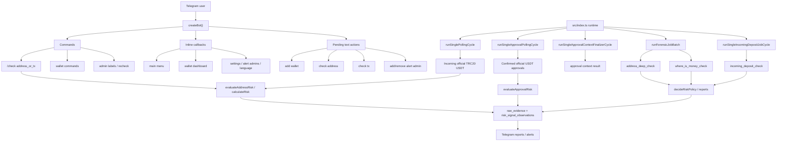
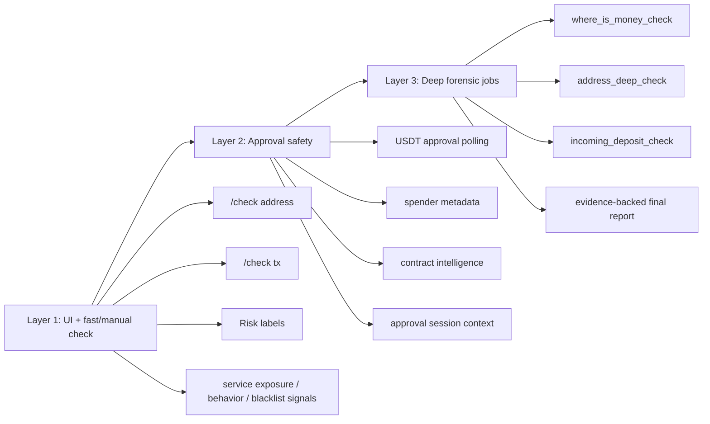
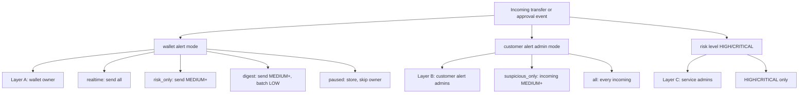
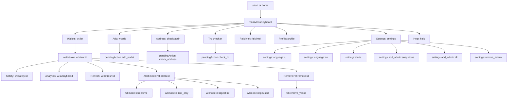
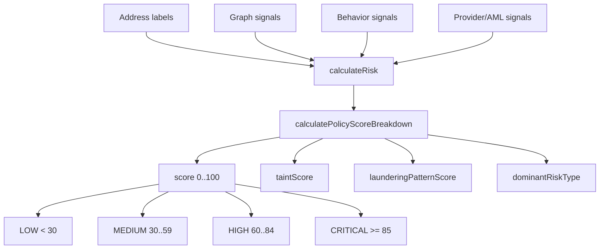
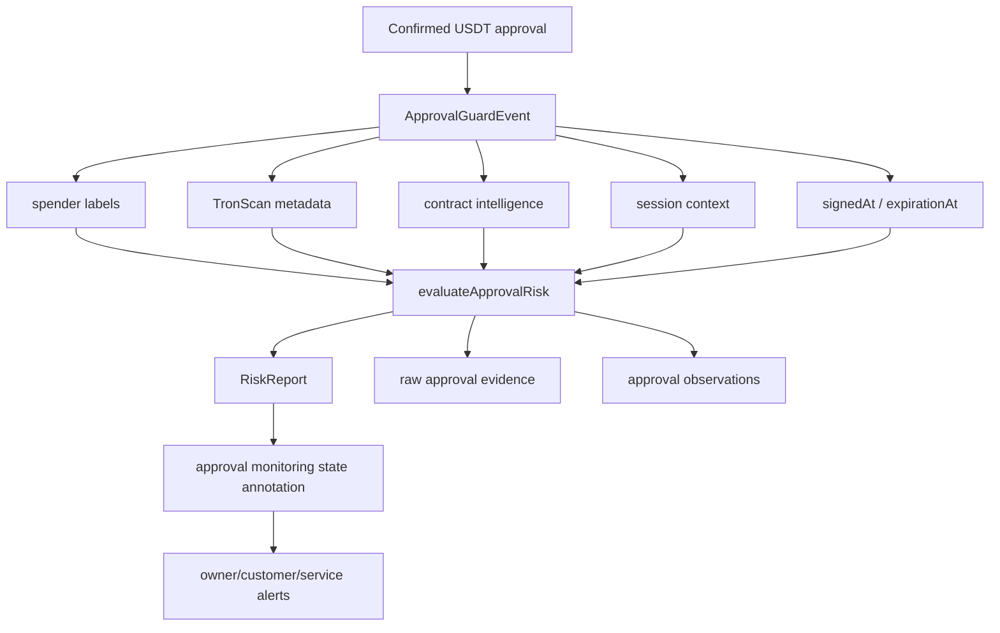
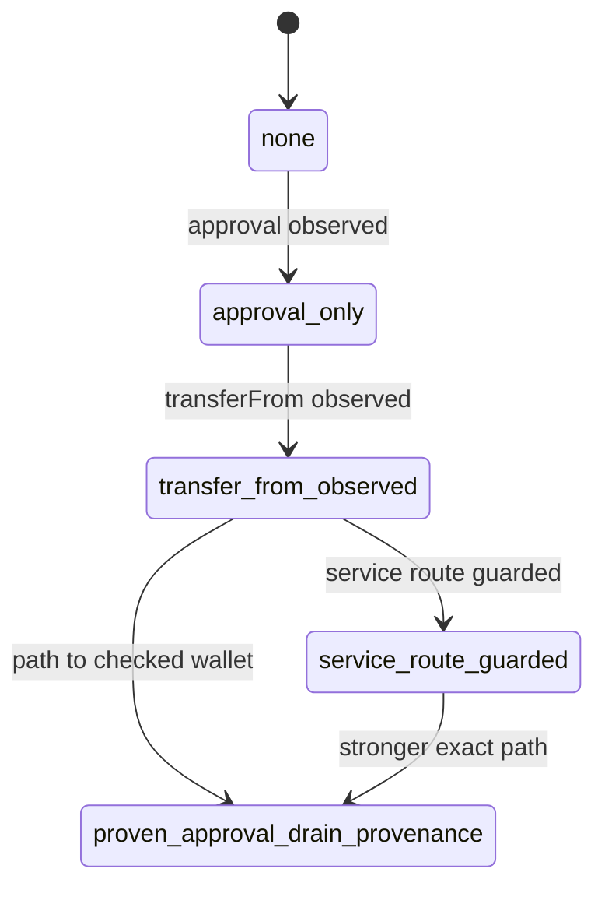
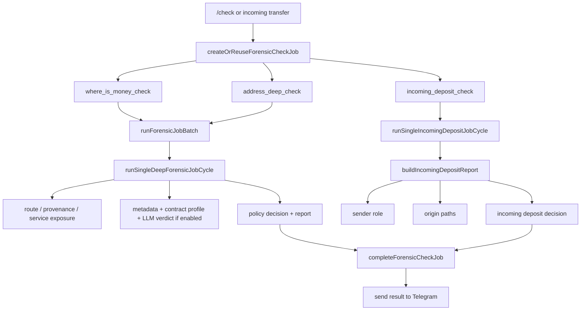

# Manual Verification Function Map

**Goal:** give us a single visual map for manually walking through the bot: buttons, checks, approvals, scoring, alert routing, evidence storage, and forensic jobs.

**Scope:** this is a review/check plan, not a code-change plan. Use it while running the bot locally or in staging with a real Telegram bot token, Postgres, and safe TRON test addresses.

**Primary files:**
- `src/index.ts` - runtime wiring, polling intervals, worker orchestration.
- `src/bot/createBot.ts` - Telegram commands, callbacks, pending text flows.
- `src/bot/keyboards.ts` - callback data and button map.
- `src/monitor/monitorWorker.ts` - incoming USDT monitoring and owner/customer/service alert delivery.
- `src/approvals/approvalWorker.ts` - Approval Guard polling and finalizer.
- `src/approvals/approvalRisk.ts` - approval risk scoring.
- `src/approvals/approvalStateMachine.ts` - approval state progression.
- `src/check/manualCheck.ts` - `/check` address/tx entry.
- `src/check/addressExposureSignals.ts` - fast graph/service/behavior signals for manual checks.
- `src/risk/riskEngine.ts` - generic risk score and LOW/MEDIUM/HIGH/CRITICAL bands.
- `src/risk/riskPolicy.ts` - bounded score composition.
- `src/risk/riskPolicyEngine.ts` - exchange-style ACCEPTABLE/REVIEW/DECLINE policy.
- `src/forensics/deepForensicJob.ts` - deep and where-is-money forensic job execution.
- `src/forensics/incomingDepositJob.ts` - incoming deposit job report.
- `src/storage/repositories.ts` - persistence: wallets, jobs, alerts, evidence, labels.

---

## 1. System Map



## 2. Three Practical Check Layers

These are the three layers we should walk through manually.



Manual acceptance rule: a feature is not considered verified until the Telegram output, DB state, and log behavior match the expected path.

## 3. Three Alert Delivery Layers



Approval Guard differs from incoming transfers: approval events are low-volume and safety-relevant, so owner/customer approval alerts are sent for all approval levels unless wallet delivery is paused/skipped by the owner rule. Service admins still receive only HIGH/CRITICAL.

## 4. Button And Command Map



Command surface to check:

| Command | Manual expectation |
| --- | --- |
| `/start` | registers/upserts user, clears pending action, shows main menu |
| `/help` | shows honest product limits and menu |
| `/settings` | shows language and alert-admin controls |
| `/language` | shows current locale and language buttons |
| `/profile` | shows Telegram ID, username, wallet count |
| `/my_id` | returns numeric Telegram user ID |
| `/alert_admins`, `/alert_recipients` | lists customer alert recipients |
| `/add_alert_admin`, `/alert_add` | adds suspicious-only recipient by default |
| `/remove_alert_admin`, `/alert_remove` | removes recipient |
| `/alert_mode` | updates existing recipient mode |
| `/wallet_mode` | updates wallet alert mode |
| `/add_wallet` | adds wallet or starts pending add flow |
| `/wallets` | lists owned wallets |
| `/remove_wallet` | removes owned wallet |
| `/check` | runs address or tx check and queues deeper jobs where applicable |
| `/version` | reports runtime status |
| `/check_status` | reports forensic job status |
| `/labels` | service admin only |
| `/admin_users` | service admin only |
| `/mark` | service admin only, writes address label |
| `/recheck_safety` | service admin only, reruns approval safety |

## 5. Risk Scoring Map



Important score inputs to manually probe:

| Signal | Expected impact |
| --- | ---: |
| `scam`, `reported_scam`, `stolen_funds`, `phishing`, `mixer_like`, `risky_contract`, `whitebit`, `darknet_exchange` | about 90 |
| `darknet_exchange_proximity`, `approval_drain_proximity` | about 80 |
| unknown/internal review-style labels | about 35 |
| `trusted`, `false_positive` | dampener -40 |
| `victim` | context only, 0 |
| stablecoin USDT blacklist | exact critical, capped near 90 |
| approval-drain provenance | exact approval-drain, capped near 90 |
| behavior-only context | capped near 30 |
| service-boundary context | capped near 15 |
| operational flow pattern | capped near 50 |

Manual DB check after each score:

```sql
select code, score_impact, confidence, severity, source, policy_version, raw_evidence_id
from risk_signal_observations
where subject_address = '<address>'
order by created_at desc
limit 20;
```

```sql
select source, source_type, address, tx_hash, observed_transaction_hash, evidence_json
from raw_evidence
where address = '<address>' or observed_transaction_hash = '<tx_hash>'
order by created_at desc
limit 20;
```

## 6. Approval Guard Map



Approval scoring probes:

| Scenario | Expected result |
| --- | --- |
| spender label `scam`, `stolen_funds`, `phishing`, `risky_contract` | CRITICAL, score 95 |
| spender label `trusted` or `false_positive` without risky label | LOW, score 0 |
| provider metadata marks spender as risky contract | CRITICAL, score 90 |
| strong provider/contract service tag on large/unlimited approval | usually LOW/MEDIUM context, score around 15 |
| service-labeled spender, large/unlimited approval | MEDIUM, score around 35 |
| unknown suspicious contract profile, unlimited approval | review signal, score around 35 |
| named provider contract, unlimited approval | review signal, score around 35 |
| unknown unlimited official USDT approval | HIGH, score about 80: 60 + unknown EOA 20 |
| very large finite official USDT approval, `>= 50,000 USDT` | HIGH, score about 70, plus unknown EOA if applicable |
| large finite official USDT approval, `>= 10,000 USDT` | MEDIUM, score about 30, plus unknown EOA if applicable |
| small finite official USDT approval | LOW evidence row, no risk score |
| delayed signed approval, `>= 6h` signed-to-block delay | +10 if not trusted/service-tagged |
| extended expiration, `>= 24h` | +5 if not trusted/service-tagged |

Approval state progression:



Note: `route_linked` exists as a higher-rank state for session-context classifications such as known swap route or service-linked helper.

## 7. Forensic Job Map



Manual job checks:

```sql
select id, kind, subject_address, status, priority, last_error, created_at, updated_at
from forensic_check_jobs
order by created_at desc
limit 20;
```

For any `partial` or `failed` job, inspect `last_error`, `progress_json`, provider coverage, and whether the Telegram user received a clear status.

## 8. Manual Verification Order

### Phase 0: Runtime prep

- [ ] Confirm `.env` has real local/staging values and no secrets are pasted into chat/docs.
- [ ] Run migrations with `npm run db:migrate`.
- [ ] Start bot with `npm run dev`.
- [ ] Confirm logs show `bot_started`.
- [ ] Confirm logs do not print `BOT_TOKEN`, TronScan keys, or full `.env`.

### Phase 1: Telegram navigation

- [ ] `/start` shows main menu.
- [ ] Press every main-menu button once.
- [ ] Open wallet list with no wallets.
- [ ] Press `Add`, send invalid text, confirm validation.
- [ ] Send a valid TRON address, confirm wallet dashboard appears.
- [ ] Press dashboard buttons: Safety, Analytics, Refresh, Alert mode, Address, Tx, Wallets, Settings, Remove/back.
- [ ] Switch RU/EN language and confirm buttons still work.

### Phase 2: Wallet alert modes

- [ ] Set `realtime`, confirm dashboard reflects it.
- [ ] Set `risk_only`, confirm LOW incoming is stored/skipped and MEDIUM+ is sent.
- [ ] Set `digest`, confirm LOW incoming is batched and not repeated after digest sent.
- [ ] Set `paused`, confirm events are stored but owner alerts are skipped.
- [ ] Return to `realtime`.

### Phase 3: Customer alert admins

- [ ] Use `/my_id` from a second Telegram user.
- [ ] Add that ID as suspicious-only admin.
- [ ] Trigger/mock LOW incoming: owner receives, suspicious-only admin does not.
- [ ] Trigger/mock MEDIUM/HIGH/CRITICAL incoming: owner and suspicious-only admin receive.
- [ ] Change admin to `all`.
- [ ] Trigger/mock LOW incoming: admin receives.
- [ ] Remove admin and confirm no future customer delivery.

### Phase 4: Service admin controls

- [ ] Non-admin runs `/mark <address> scam`; bot rejects.
- [ ] Service admin runs `/labels`; labels are listed.
- [ ] Service admin runs `/admin_users`; configured IDs are listed.
- [ ] Service admin marks address as `scam`.
- [ ] `/check <address>` returns CRITICAL/high score and stores evidence.
- [ ] Mark same address `trusted` or use another test address to confirm dampener behavior.

### Phase 5: Manual check

- [ ] `/check <safe-address>` returns subject, risk, score, reasons, and job/deep status if queued.
- [ ] `/check <tx-hash>` extracts sender from official USDT transfer and checks sender.
- [ ] Invalid tx/address produces clear validation.
- [ ] Evidence rows exist for labels/signals used in the response.
- [ ] Missing or timed-out provider checks appear as limited coverage, not as silent success.

### Phase 6: Approval Guard

- [ ] Open wallet Safety; confirm approval counts and read-only revoke guidance.
- [ ] Use a known unlimited USDT approval or fixture tx.
- [ ] Confirm approval event is claimed once, risk is recorded, and alert is sent/skipped according to wallet mode.
- [ ] Test risky spender label -> CRITICAL 95.
- [ ] Test trusted spender label -> LOW 0.
- [ ] Test unknown unlimited spender -> HIGH around 80.
- [ ] Test known service contract -> dampened LOW/MEDIUM context.
- [ ] Confirm raw evidence includes owner, spender, token contract, amount, spender type, metadata, signing metadata, and approval monitoring state.

### Phase 7: Approval context finalizer

- [ ] Trigger a pending approval context case for suspicious unknown contract where lookahead is still open.
- [ ] Confirm initial pending HIGH report around 70.
- [ ] Wait/finalize with route context.
- [ ] Confirm final state moves to route-linked, service-guarded, expired, or exact provenance as appropriate.
- [ ] Confirm final alert is sent once.

### Phase 8: Incoming deposit jobs

- [ ] Trigger/mock incoming transfer to watched wallet.
- [ ] Confirm `incoming_deposit_check` job is created.
- [ ] Confirm owner alert enters analyzing state.
- [ ] Confirm final incoming deposit report is delivered.
- [ ] Confirm observed transaction risk is updated from the final report.

### Phase 9: Where-is-money and deep forensic

- [ ] Run `/check <address>` for a case that should queue where-is-money.
- [ ] Poll `/check_status <job-id>`.
- [ ] Confirm completed/partial status is honest.
- [ ] Confirm report mentions proof level, internal/user decision, key route/service/coverage reasons.
- [ ] Confirm derived labels such as `darknet_exchange_proximity` or `approval_drain_proximity` are only created when evidence supports them.

### Phase 10: Regression commands

- [ ] Run `npm test`.
- [ ] Run `npm run typecheck`.
- [ ] If live manual checks found issues, add focused tests near the matching module before changing behavior.

## 9. What To Record During Manual Review

For each manual case, capture:

- entry point: command, button, poller, or job kind;
- input: wallet/address/tx hash, alert mode, labels;
- expected path in this map;
- actual Telegram output;
- DB rows touched: wallet state, observed alert, job, evidence, observations;
- risk level, score, `taintScore`, `launderingPatternScore`, `dominantRiskType`;
- policy/proof fields if present: internal decision, user decision, proof level;
- log errors or provider coverage warnings;
- verdict: pass, pass with coverage caveat, fail.

Recommended review table:

| Case | Entry | Input | Expected | Actual | DB evidence | Verdict |
| --- | --- | --- | --- | --- | --- | --- |
| Main menu smoke | `/start` | user ID | 8 buttons |  | n/a |  |
| Manual scam label | `/mark` + `/check` | address + scam | CRITICAL ~90 |  | raw + observation |  |
| Unknown unlimited approval | approval poll | approval tx | HIGH ~80 |  | approval evidence |  |
| Digest LOW incoming | poller | LOW transfer | stored + digest later |  | observed tx |  |
| Incoming deposit job | poller | transfer tx | final deposit report |  | job + evidence |  |
