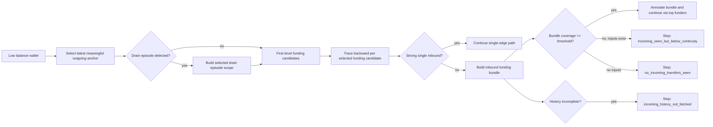

# Multi-Input Provenance Tracing Design

Date: 2026-06-02

## Summary

The current `where_is_money` flow can explain a low-balance wallet by selecting the latest meaningful outgoing transfer and finding inbound funding candidates for that outgoing. This works for simple one-in, one-out flows, but it breaks down when an intermediate wallet forms an outgoing transfer from several prior inbound transfers.

The approved direction is to keep the existing architecture and add bundle-aware tracing. `no_previous_transfer` must mean that no prior incoming transfer was seen. If prior incoming transfers exist but do not individually satisfy continuity, the report must say that explicitly and show the bundle evidence.

## Case Motivation

Subject wallet:

`TLhVzkRYUuoVuSCgVAwB8nDJPdMy7gAgXe`

Observed behavior:

- The wallet had a near-zero USDT balance.
- `where_is_money` selected the latest meaningful outgoing anchor: `135.3K USDT` to `TPwezUWpEGmFBENNWJHwXHRG1D2NCEEt5s`.
- The graph displayed original selected funding transfers of about `1.885M` and `800K`, which looked like the system was checking `2.69M`, not `135.3K`.
- On the lower path, `TV3H25qTg6zs52PcasjCbBZ2ZMeJST3JMN` was marked with `no_previous_transfer`, even though TronScan shows prior inbound transfers before its `850K` outgoing.

Important example around `TV3H25...`:

- `+85.013K`
- `+39.116K`
- `+100`
- `+600K`
- `+80.5K`
- then `-850K`

This is not "no previous transfer". It is a multi-input funding bundle that needs continuity scoring.

## Current Logic

### Low-Balance Recent-Flow Mode

When the current USDT balance is below the low-balance threshold, the system does not try to explain the whole wallet history. It selects a recent meaningful outgoing transfer as the anchor.

For this case:

- current balance was about `1.49 USDT`;
- threshold is `1000 USDT`;
- anchor was the latest meaningful outgoing `135.3K USDT`.

The first-level funding selector already calculates usable coverage toward the anchor. However, the graph currently displays the original transfer amounts, not the used amounts. This creates a UI mismatch.

### Deep Hop Tracing

After the first funding selection, `traceMoneyOriginPath` walks backward hop by hop. Today it effectively asks:

"Is there one previous inbound transfer that covers enough of the expected outgoing amount?"

The default amount-preservation threshold is about `70%`. This misses cases where several inbound transfers collectively fund the outgoing transfer.

## Problems To Fix

1. **Ambiguous displayed amount**

   A graph edge can show the full original transfer amount even when only part of that transfer was used to cover the selected anchor.

2. **Overloaded `no_previous_transfer`**

   The stop reason currently can mean several different things:

   - no incoming transfers exist;
   - incoming history was not fetched far enough;
   - incoming transfers exist but are too small or too old;
   - several incoming transfers exist and should be bundled, but the tracer only looked for one.

3. **No bundle tracing on deeper hops**

   The first selector can reason about multiple prior inputs, but deeper origin tracing reverts to single-edge continuity.

4. **Unclear risk and weight display**

   Admin graph panels can show `risk n/a` and `weight n/a` even when the selected node participates in a path with a risk contribution or a service exposure score.

5. **Single-anchor drain blind spot**

   Low-balance mode can truthfully cover `100%` of the selected anchor while leaving the wider drain episode unexplained. In the TLhV case, the selected anchor was `135.3K`, but the wallet routed a much larger post-inflow series through bridge and adapter contracts.

6. **Layer separation without layer reconciliation**

   `fast`, `address_deep_check`, and `where_is_money` answer different questions. The final/admin view does not always make that clear. Deep can see service exposure around `1.89M`, while where-is-money explains only the selected provenance anchor.

7. **Cross-chain trigger is too narrow**

   Cross-chain corridor analysis can be skipped when no selected where-is-money path ends at a cross-chain boundary, even if `address_deep_check` separately found high-volume direct bridge exposure.

8. **High-share terminal boundaries may skip enrichment**

   A terminal service/contract boundary can carry most of a path's share and still not receive a standalone contract/LLM enrichment verdict.

9. **Top-by-amount bias**

   Expansion and graph emphasis can favor the largest single transfers. Multi-input funding requires ranking by contribution to a bundle, not only by raw transfer size.

10. **Legacy report ambiguity**

   Old jobs will still contain `no_previous_transfer`. The admin UI should not present legacy stop reasons as strong evidence that the blockchain has no prior inbound transfer.

## Approved Design

### 1. Keep Low-Balance Anchor Selection

`where_is_money` should continue using low-balance recent-flow mode:

- if balance is below threshold;
- find latest meaningful outgoing transfer;
- treat that outgoing as the amount to explain;
- select funding candidates for that anchor.

This preserves the product behavior: a drained wallet is checked by recent outgoing flow, not by stale remaining balance.

### 2. Add Bundle-Aware Deep Tracing

For each backward hop, the tracer should first try the existing strong single-edge match. If a strong single edge is found, behavior remains unchanged.

If no strong single edge is found, the tracer must build an inbound funding bundle:

- consider inbound transfers to the current address before the current hop timestamp;
- ignore the current outgoing transfer itself;
- account for later outgoing transfers from the same address as spend-overhang;
- sort candidates in reverse time order for cashflow reconstruction;
- accumulate usable inbound amounts until the outgoing amount is sufficiently covered;
- continue tracing through the top funders in the bundle.

Default target:

- bundle coverage threshold: `>= 80%`;
- single-edge preservation threshold can stay at the current default unless tests show it should be tuned.

The bundle should be attached to the path output so UI and reports can show why the tracer continued or stopped.

### 3. Replace Ambiguous Stop Reasons

Add precise stop reasons:

- `no_incoming_transfers_seen`
  - No prior inbound USDT transfer was available for this address before the hop timestamp.

- `incoming_history_not_fetched`
  - The system cannot prove absence because fetched history did not reach the relevant time window or provider pagination limit.

- `incoming_seen_but_below_continuity`
  - Prior inbound transfers exist, but neither a single edge nor a bundle met the continuity threshold.

- `multi_input_bundle_required`
  - Prior inbound transfers exist and a bundle explains the outgoing flow. This is not a terminal stop; it is a trace annotation.

Keep legacy `no_previous_transfer` only as a compatibility alias in old reports. New reports should use the precise stop reasons.

### 4. Clarify Amount Semantics

Add amount fields where needed:

- `anchorAmountRaw`
  - Amount currently being explained.

- `originalAmountRaw`
  - Full on-chain transfer amount.

- `usedAmountRaw`
  - Amount counted toward the selected anchor or bundle coverage.

- `coverageShare`
  - `usedAmountRaw / anchorAmountRaw`.

- `bundleAmountRaw`
  - Sum of usable amounts in a funding bundle.

The admin UI must label these clearly:

- `Original`
- `Used`
- `Coverage`
- `Role`

This prevents the case where the graph appears to check `2.69M` while the scoring is checking `135.3K`.

### 5. Clarify Weight Semantics

Admin graph nodes and the side panel must distinguish these weight types:

- `Path risk contribution`
- `Service exposure score`
- `Counterparty risk`
- `Node risk`

If a selected node has no node-level risk but belongs to a risky path, the panel should show:

- `Node risk: n/a`
- `Path risk contribution: 35`

If a selected bridge/adapter has service exposure but no final node risk, the panel should show:

- `Node risk: n/a`
- `Service exposure score: 65`

The UI should avoid bare `n/a` when a related path or service weight exists.

### 6. Add Drain Episode Mode

Low-balance recent-flow mode should identify a drain episode when a wallet receives a large inbound transfer and then sends a burst of meaningful outgoing transfers within a short time window.

For the TLhV case, the system should be able to say:

- selected anchor: latest meaningful outgoing `135.3K`;
- drain episode: related post-inflow outgoing burst through bridge/adapter contracts;
- episode total: sum of meaningful outgoing transfers in the episode;
- episode funding: inbound transfers that plausibly funded the burst.

This does not replace the selected anchor. It adds scope clarity:

- `anchorCoverage`: how much of the selected outgoing was explained;
- `episodeCoverage`: how much of the drain episode was explained;
- `walletHistoryCoverage`: optional broader context, not a final proof claim.

The report must avoid saying "100% checked" without naming the scope. It should say "100% of selected anchor checked" or "100% of selected drain episode checked".

### 7. Add Cross-Layer Summary

The final/admin view should display the three layers as separate but reconciled signals:

- `Fast check`
  - quick label/snapshot risk;
  - not a full provenance trace.

- `Where is money`
  - selected amount provenance;
  - anchor or drain episode scope;
  - origin paths and stop reasons.

- `Deep check`
  - broader wallet behavior;
  - service exposure;
  - top counterparties and routing context.

The report should explicitly state when one layer saw context that another layer did not use for final provenance scoring.

Example:

`Where is money explained the 135.3K selected anchor. Deep check separately found direct bridge/adapter exposure of about 1.89M. This is service/drain context, not direct dirty-source proof.`

### 8. Trigger Cross-Chain Stage 2 From Bridge Exposure

Cross-chain corridor analysis should be allowed to trigger from high-volume bridge exposure discovered by `address_deep_check`, not only from a selected where-is-money boundary.

Trigger candidates:

- selected where-is-money path reaches a bridge/cross-chain boundary;
- drain episode sends meaningful volume to a known bridge;
- deep service exposure has bridge volume above threshold;
- bridge exposure carries a large share of recent outgoing volume.

The trigger should carry a reason, for example:

- `selected_origin_boundary`;
- `drain_episode_bridge_exposure`;
- `deep_service_exposure_bridge`.

If Stage 2 is skipped, the skipped reason must name the data source considered:

`Skipped: selected origin paths had no cross-chain boundary; deep bridge exposure was below threshold.`

or:

`Skipped: selected origin paths had no cross-chain boundary, but deep bridge exposure was present; rerun with cross-chain budget required.`

### 9. Enrich High-Share Terminal Boundaries

When a path stops at a terminal service/contract boundary with high share or high amount, that address must become an enrichment candidate.

Default thresholds:

- path share `>= 50%`; or
- used/original amount `>= 100K USDT`; or
- terminal address is a contract account; or
- terminal stop contributes risk `>= 35`.

The enrichment result should be attached to the path and graph node. If enrichment is skipped, the report must say why:

- budget exhausted;
- provider unavailable;
- not a contract;
- below threshold;
- already known service.

### 10. Rank Expansion By Bundle Contribution

Expansion should support two ranking modes:

- `top_by_amount`
  - current behavior for broad volume context.

- `top_by_bundle_contribution`
  - required for multi-input tracing.

For bundle tracing, the top funders should be selected by usable amount inside the bundle, not by raw address volume across the whole wallet history.

This prevents small but relevant funding inputs from disappearing behind unrelated larger transfers.

### 11. Add History Coverage Semantics

Every absence-style stop must include data coverage facts:

- fetched transfer count;
- fetched page count;
- oldest fetched transfer timestamp;
- target hop timestamp;
- whether fetched history reached the target hop;
- whether local index or live provider supplied the data.

If the fetched history does not reach the relevant timestamp, the system must not emit `no_incoming_transfers_seen`. It should emit `incoming_history_not_fetched`.

### 12. Handle Legacy `no_previous_transfer`

Old reports should continue rendering, but the admin UI should mark legacy stop reasons.

For old jobs:

- show `Legacy stop reason: no_previous_transfer`;
- add `Rerun recommended for precise stop classification`;
- avoid wording that says no previous transfer exists on-chain.

New jobs should use the precise stop reason taxonomy from this spec.

## Data Flow

## Reporting Requirements

Reports must answer these questions:

1. What amount was the system trying to explain?
2. Which original transfers were selected?
3. How much of each original transfer was used?
4. Was a path stopped because no inputs exist, or because continuity was weak?
5. Did a multi-input bundle explain a hop?
6. Which weight affected the final view: path, service, counterparty, or node?
7. Was the checked scope a single anchor, a drain episode, or a broader wallet history view?
8. Did deep service exposure find bridge/adapter flows outside the selected provenance anchor?
9. Did cross-chain Stage 2 run, skip cleanly, or skip despite separate bridge exposure?
10. Were high-share terminal boundaries enriched or explicitly skipped?

## Testing Requirements

Add tests for:

- low-balance recent-flow UI/JSON amount fields;
- a deep hop where `600K + 80.5K + 39.1K + 85K` explains an `850K` outgoing better than a single-edge lookup;
- a true no-input case that still returns `no_incoming_transfers_seen`;
- a provider/page-limit case that returns `incoming_history_not_fetched`;
- a weak bundle case that returns `incoming_seen_but_below_continuity`;
- admin graph projection showing path/service weights even when node risk is `n/a`.
- a low-balance wallet with one selected anchor and a larger drain episode, verifying both `anchorCoverage` and `episodeCoverage`;
- cross-layer summary where deep check sees bridge exposure but where-is-money selected origin paths do not;
- cross-chain trigger from deep bridge exposure;
- terminal boundary enrichment candidate selection for a high-share contract boundary;
- legacy `no_previous_transfer` rendering as a rerun-recommended legacy stop, not as a definitive no-input claim.

## Non-Goals

- Do not replace the full scoring policy engine.
- Do not claim dirty provenance from bundle continuity alone.
- Do not auto-decline solely because a multi-input bundle exists.
- Do not implement a full ledger-grade balance simulator in this change.
- Do not change the user-facing decision mapping without a separate policy decision.

## Implementation Notes

The most likely modules to change:

- `src/forensics/moneyOriginTrace.ts`
- `src/forensics/incomingDepositCashflow.ts`
- `src/forensics/recentFlowProvenanceSelection.ts`
- `src/check/whereIsMoneyCheck.ts`
- `src/admin/forensicsGraph.ts`
- admin console rendering code in `src/admin/adminConsole.ts`
- `src/forensics/crossChainStage2Triggers.ts`
- `src/forensics/contractEnrichment.ts`
- `src/forensics/serviceExposure.ts`
- shared report types in `src/types.ts`

The existing `selectIncomingDepositFundingCandidates` logic is a useful starting point, but it is currently used mainly at the first funding-selection layer. The design requires similar bundle reasoning inside deeper path tracing.

## Open Decisions

1. Exact bundle threshold: default proposal is `80%`.
2. Maximum number of bundle funders to continue tracing: default proposal is top `3` by usable amount.
3. Whether small dust/test transfers should be displayed by default or collapsed under a bundle details section.
4. Drain episode window: default proposal is same-day burst after a large inbound, with a configurable maximum duration.
5. Bridge exposure threshold for cross-chain Stage 2: default proposal is `>= 100K USDT` or `>= 25%` of selected drain episode outgoing volume.
6. Whether service exposure score should affect final risk directly or remain context/manual-review evidence.
