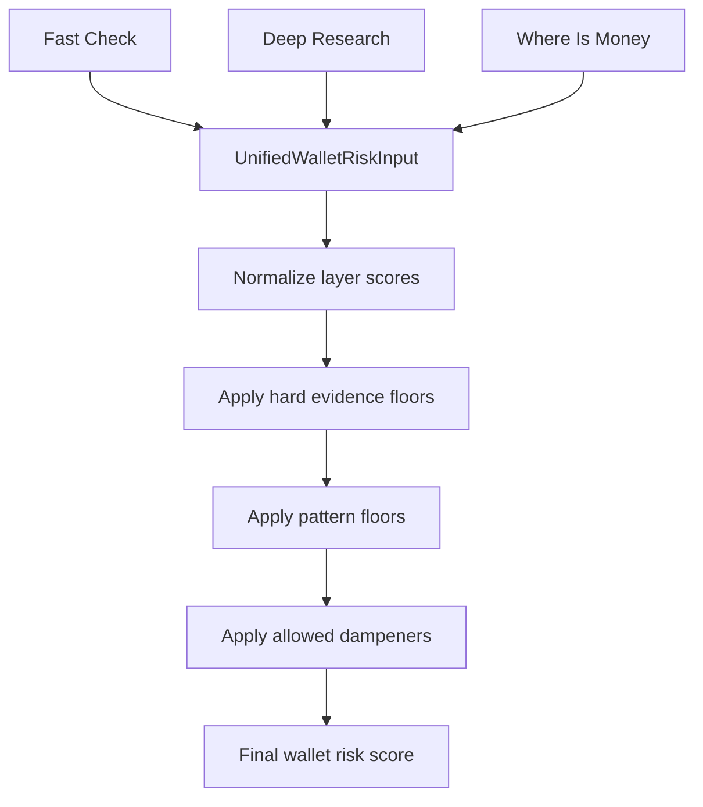

# Unified Wallet Risk Score v1 Design

## Goal

Create one final wallet risk score that objectively combines the three address-check layers:

- Fast Check.
- Deep Research.
- Where Is Money.

The product must show one final score and one final risk level. It must not require a manual review branch as the main user-facing outcome.

The first version should not rewrite every detector. It should add a separate unified scoring layer above the existing checks, preserve current hard-evidence rules, and make the final score explainable.

## User-Approved Approach

Use Approach A: add one new unified scorer above the current checks.

```text
Fast Check report
+ Deep Research report
+ Where Is Money report
+ coverage facts
+ hard evidence facts
+ dampeners
= finalWalletRiskScore
```

This keeps the existing check implementations intact and fixes the main scoring gap: the final report now combines all three layers through a separate wallet-level scorer.

## Implemented Facts From Code

### Final Score Now

Fact from code:

- `src/bot/createBot.ts` imports `calculateUnifiedWalletRisk`: `src/bot/createBot.ts:18`.
- `formatUnifiedAddressFinalReport` calls `calculateUnifiedWalletRisk(...)` with `fastReport`, `deepReport`, and `whereReport`: `src/bot/createBot.ts:2055`.
- The formatter uses `unifiedRisk.finalDecision`, `unifiedRisk.finalScore`, and `unifiedRisk.finalLevel`: `src/bot/createBot.ts:2061`.
- The result shape includes `weightedLayerScore`, `hardEvidenceFloor`, `patternFloor`, `dampener`, `coverageLevel`, `finalDecision`, and `finalLevel`: `src/risk/unifiedWalletRisk.ts:42`.

Reasoned interpretation: the final address score is no longer the old hard-evidence/Where-Is-Money shortcut. One final wallet risk score is formed above the three finished reports.

### Unified Scorer

Fact from code:

- Inputs are `address`, optional `fastReport`, optional `deepReport`, and required `whereReport`: `src/risk/unifiedWalletRisk.ts:35`.
- Layer weights are Fast `0.10`, Deep `0.60`, Where `0.30`: `src/risk/unifiedWalletRisk.ts:55`.
- `normalizedWeightedLayers(...)` normalizes missing layers among available layers; unavailable Fast or Deep receives zero contribution, while Where is always available: `src/risk/unifiedWalletRisk.ts:323`, `src/risk/unifiedWalletRisk.ts:335`.
- Final calculation builds layer scores, hard-evidence floors, pattern floors, dampener, coverage adjustment, no-hard-evidence cap, and final level/decision: `src/risk/unifiedWalletRisk.ts:501`.

Implemented formula:

```text
weightedLayerScore = normalized weighted Fast/Deep/Where score
baseScore = max(weightedLayerScore, hardEvidenceFloor, patternFloor)
dampenedScore = baseScore - allowedDampener
coverageAdjustedScore = max(dampenedScore, 30) when coverage is limited
finalScore = min(coverageAdjustedScore, 84) when there is no hard evidence
```

Hard evidence floors dominate. `allowedDampener(...)` cannot reduce the score below `hardEvidenceFloor`: `src/risk/unifiedWalletRisk.ts:487`. Without hard evidence, `finalScore` is capped below `CRITICAL` at `84`: `src/risk/unifiedWalletRisk.ts:532`. Limited coverage floors the result to at least `30`: `src/risk/unifiedWalletRisk.ts:455`, `src/risk/unifiedWalletRisk.ts:531`.

### Hard Evidence And Pattern Floors

Fact from code:

- Fast hard evidence covers USDT blacklist, exact approval-drain style reasons, and direct high-risk internal labels: `src/risk/unifiedWalletRisk.ts:135`.
- Deep hard evidence covers active USDT blacklist, exact approval drain, deterministic high-risk inbound provenance, and exact high-risk extended provenance: `src/risk/unifiedWalletRisk.ts:165`.
- Where hard bad evidence becomes a hard-evidence floor of at least `85`: `src/risk/unifiedWalletRisk.ts:218`.
- Historical transit behavior and route-linked approval context are pattern floors, not hard proof: `src/risk/unifiedWalletRisk.ts:400`, `src/risk/unifiedWalletRisk.ts:430`.

Reasoned interpretation: exact evidence can make a wallet `CRITICAL`; pattern-only behavior can become `HIGH` but is bounded below `CRITICAL` unless hard evidence exists.

### Telegram Breakdown

Fact from code:

- The short "Why" section includes `Weighted layer score`: `src/bot/createBot.ts:1952`.
- The score breakdown renders raw layer score, configured weight, normalized contribution, hard evidence floor, pattern floor, dampener, and coverage: `src/bot/createBot.ts:1957`.
- The final report adds that breakdown section after the final risk line: `src/bot/createBot.ts:2075`.

### Existing Risk Policy Caps

`riskPolicy.ts` already has a useful cap/dampener model:

- negative reasons become `dampener` and are capped at 40;
- exact self evidence is capped at 95;
- exact approval drain is capped at 90;
- operational flow pattern is capped at 50;
- service boundary context is capped at 15;
- behavior-only context is capped at 30;
- provenance context is capped at 60.

Source: `src/risk/riskPolicy.ts:93`.

`calculatePolicyScoreBreakdown` sums buckets with separate caps:

```text
min(40, provenance)
+ min(30, approval_drain)
+ min(25, behavior)
+ min(20, service_context)
+ min(20, provider_label)
- min(40, dampener)
```

It also calculates a separate laundering-pattern score and returns the max of bounded policy score, taint score, and laundering-pattern score.

Source: `src/risk/riskPolicy.ts:172`.

### Production Limits Now

Fast Check exposure provider:

- `maxDepth = 2`;
- `maxPagesPerAddress = 2`;
- `pageLimit = 100`;
- `limit = 10`;
- `contractProfileFetchLimit = 15`;
- `maxExpandedIntermediates = 30`;
- `timeoutMs = 30_000`;
- `metadataFetchLimit = 30`;
- recent fallback min/limit = `100/100`.

Sources: `src/check/addressExposureSignals.ts:55`, `src/check/addressExposureSignals.ts:430`.

Bot windows:

- transaction-origin path remains 30 days;
- address profile path is 90 days;
- queued address checks preserve `wallet_profile` mode.

Sources: `src/bot/createBot.ts:163`, `src/bot/createBot.ts:164`, `src/bot/createBot.ts:2545`, `src/bot/createBot.ts:2901`, `src/bot/createBot.ts:3411`.

Where Is Money CLI/runtime:

- `days = 90` in CLI;
- `maxDepth = 20`;
- `beamWidth = 12`;
- `maxAddressFetches = 150`;
- `maxEdgesPerAddress = 100` default, capped at `150` by CLI validation;
- recent fallback min/limit = `150/150`;
- `approvalEnrichmentMode = "triggered"`;
- `maxApprovalCandidates = 30`;
- `maxContractTxInfo = 30`;
- `contractTxInfoDelayMs = 15000`;
- cross-chain provider calls default effectively to `200` via config/env. The omitted CLI flag returns `null`, so `scripts/forensicWhereIsMoney.ts` uses `config.crossChainStage2MaxProviderCalls`.

Sources: `src/forensics/whereIsMoneyCliArgs.ts:23`, `src/forensics/whereIsMoneyCliArgs.ts:272`, `src/check/whereIsMoneyCheck.ts:106`, `src/check/whereIsMoneyCheck.ts:759`, `src/config.ts:293`, `scripts/forensicWhereIsMoney.ts:72`.

Queued Where Is Money runtime:

- `whereIsMoneyJobModeField(...)` preserves `wallet_profile`;
- indexed primary/fallback fetch limit is `max(recentFallbackTransferLimit, maxEdgesPerAddress)` with production `150`;
- live primary/fallback fetch limit is capped by `maxEdgesPerAddress`, production `100`.

Sources: `src/forensics/deepForensicJob.ts:89`, `src/forensics/deepForensicJob.ts:404`, `src/forensics/deepForensicJob.ts:507`, `src/forensics/deepForensicJob.ts:560`.

Manual Where Is Money script:

- indexed primary default is `150`;
- live fallback is capped by `maxEdgesPerAddress`.

Sources: `src/forensics/whereIsMoneyFetchLimits.ts:1`, `src/forensics/whereIsMoneyFetchLimits.ts:7`, `scripts/forensicWhereIsMoney.ts:168`, `scripts/forensicWhereIsMoney.ts:195`.

Deep Research runtime:

- `maxPagesPerAddress = 3`;
- `maxExpandedIntermediates = 30`;
- `metadataFetchLimit = 30`;
- `contractProfileFetchLimit = 15`;
- `maxInboundSenders = 15`;
- `maxApprovalDrainCandidates = 15`;
- `approvalChangeLookupLimit = 20`;
- `extendedSearchMode = "always"`;
- `extendedSearchMaxDepth = 6`;
- `extendedSearchBeamWidth = 12`;
- `extendedSearchMaxAddressFetches = 150`;
- recent fallback min/limit = `150/150` in production runtime options;
- counterparty fast snapshot sparse/active = `60/30`.

Sources: `src/runtime/deepForensicRuntimeOptions.ts:8`, `src/forensics/deepForensicJob.ts:621`, `src/check/deepForensicCheck.ts:124`, `src/check/deepForensicCheck.ts:375`, `src/check/deepForensicCheck.ts:548`, `src/check/deepForensicCheck.ts:563`.

## Product Principles

One score must mean one thing: how risky this wallet is based on all available evidence.

Hard evidence must dominate. If the wallet is USDT-blacklisted, has exact approval-drain provenance, or has exact scam/stolen/phishing evidence, the final score must stay high even if other layers look normal.

Behavioral/context signals must matter, but they must not pretend to be proof. A bridge-heavy transit wallet can become HIGH risk because of volume, pass-through, service exposure, and routing behavior. In v1 it should not become CRITICAL without hard evidence: after dampening and coverage adjustment, no-hard-evidence results are capped at `84` (`src/risk/unifiedWalletRisk.ts:530-532`).

Dampeners must reduce only the part they are allowed to reduce. A dampener can lower weak context or noisy behavior. It must not erase hard evidence.

Coverage must be explicit. If we checked too little data, the system must not call the wallet clean just because it did not see enough.

## Implemented Architecture

The earlier proposal is now implemented in:

```text
src/risk/unifiedWalletRisk.ts
```

This module is responsible for only one thing: producing the final wallet risk score from finished reports.

It does not fetch blockchain data, call providers, classify contracts, or mutate jobs.

### Input

```ts
type UnifiedWalletRiskInput = {
  address: string;
  fastReport?: RiskReport | null;
  deepReport?: DeepAddressForensicReport | null;
  whereReport: WhereIsMoneyReport;
};
```

### Output

```ts
type UnifiedWalletRiskResult = {
  finalScore: number;
  finalLevel: RiskLevel;
  finalDecision: UserExchangeDecision;
  weightedLayerScore: number;
  hardEvidenceFloor: number;
  patternFloor: number;
  dampener: number;
  coverageLevel: "complete" | "partial" | "limited";
  layerBreakdown: {
    fast: LayerScoreBreakdown;
    deep: LayerScoreBreakdown;
    where: LayerScoreBreakdown;
  };
  reasons: UnifiedWalletRiskReason[];
};
```

The Telegram final report consumes this result through `formatUnifiedAddressFinalReport`: `src/bot/createBot.ts:2055`.

## Data Flow



## Scoring Formula

### Layer Weights

Use these v1 production weights:

```text
fastLayerWeight = 0.10
deepLayerWeight = 0.60
whereLayerWeight = 0.30
```

Reasoning:

- Fast Check is useful for quick labels, provider context, USDT restriction context, and cheap graph/behavior signals, but it is intentionally shallow.
- Deep Research should be the main wallet-risk layer because it sees richer provenance, counterparty, service exposure, approval-drain, operational flow, and extended provenance context.
- Where Is Money remains important because it answers the concrete provenance question: where the current or recent funds came from.

### Base Formula

```text
weightedLayerScore =
  fastLayerScore * 0.10
+ deepLayerScore * 0.60
+ whereLayerScore * 0.30
```

Then:

```text
baseScore = max(weightedLayerScore, hardEvidenceFloor, patternFloor)
allowedDampener = calculateAllowedDampener(baseScore, hardEvidenceFloor, patternFloor, dampener)
dampenedScore = clamp(baseScore - allowedDampener)
coverageAdjustedScore = coverage == limited ? max(dampenedScore, 30) : dampenedScore
finalScore = hardEvidenceFloor == 0 ? min(coverageAdjustedScore, 84) : coverageAdjustedScore
```

The last three steps mirror the implemented final adjustment (`src/risk/unifiedWalletRisk.ts:530-532`).

### Dampener Rule

Hard evidence cannot be dampened below its hard floor.

```text
if hardEvidenceFloor > 0:
  finalScore >= hardEvidenceFloor
```

Pattern floors can be dampened only slightly, because they are not exact proof but should still matter.

```text
if patternFloor > 0 and hardEvidenceFloor == 0:
  maxPatternDampener = 15
```

Weak/context-only weighted scores can be dampened more.

```text
if hardEvidenceFloor == 0 and patternFloor == 0:
  maxContextDampener = 25
```

This prevents two bad outcomes:

- a blacklist or exact approval drain getting reduced by "old wallet" or "many counterparties";
- a bridge-heavy transit wallet getting reduced to LOW only because there is no exact taint label.

## Hard Evidence Floors

These signals set a minimum final score:

| Evidence | Floor | Meaning |
|---|---:|---|
| Active USDT blacklist | 95 | Token contract says the address is blacklisted |
| Exact approval drain | 90 | Exact approve/transferFrom drain evidence |
| Exact scam/stolen/phishing internal label | 90 | Verified internal high-risk label |
| Exact high-risk provenance path | 85 | Deterministic path to high-risk source |
| Where hard bad evidence | 85 | Where Is Money produced deterministic hard bad evidence |

These floors should be centralized in `unifiedWalletRisk.ts`, not duplicated inside report formatting.

## Pattern Floors

Pattern floors are for strong behavior that is not hard proof.

They should raise the final score even if each individual signal is capped.

### Historical Transit Pattern

Use a HIGH floor when the wallet shows:

- high incoming volume;
- high outgoing volume;
- high pass-through ratio;
- large share of outgoing funds to bridge/swap/router/DEX or unknown contract destinations;
- low retained balance compared with total historical flow.

For a wallet like `TLhVzkRYUuoVuSCgVAwB8nDJPdMy7gAgXe`, this is the v1 behavior targeted by the rollout. The wallet can have a low current balance, but that does not mean low risk if it already routed large volume through bridge/swap-like paths.

This pattern should not wait for a special trigger. Deep Research should always compute a historical movement profile when indexed transfers or recent-transfer fallback are available.

Suggested v1 floor:

```text
historical transit pattern = 70-80
```

The exact floor depends on volume, pass-through ratio, destination mix, and coverage.

### Service Boundary Pattern

Service boundaries alone should stay capped as context. Current policy already caps service-boundary context at 15.

But service boundary plus large pass-through plus bridge/swap/router/DEX movement is stronger than simple service context.

Suggested v1 floor:

```text
service boundary only = no floor, context cap applies
service boundary + high historical transit = pattern floor from historical transit
```

### Approval-Drain Route Context

Exact approval drain is hard evidence.

Route-linked approval context is not automatically hard evidence. It can contribute to a pattern floor if combined with:

- suspicious transferFrom behavior;
- close time proximity;
- strong amount preservation;
- high-risk downstream route;
- repeated drain-like flows.

Suggested v1 floor:

```text
route-linked approval pattern = 60-80
exact approval drain = hard floor 90
```

## Dampeners

Dampeners should be structured and visible in the breakdown.

Each dampener should say:

```text
raw score
what it can reduce
max reduction
actual reduction
final contribution
```

### Allowed Dampeners

| Dampener | Can reduce | Max |
|---|---|---:|
| trusted/clean internal label | context and behavior only | 40 |
| old wallet with normal activity | weak behavior only | 10 |
| many normal counterparties | weak behavior/service context | 10 |
| exchange/merchant-like role | operational context | 15 |
| low data coverage | clean/low confidence only | does not reduce hard evidence |

Low coverage is not proof of low risk. If coverage is limited, it should reduce confidence in a clean result, not reduce high-risk evidence.

## Implemented Production Limit Profile v1

The scoring change shipped with larger production limits. This matters because the unified score should not look objective while still being based on a shallow sample.

### Fast Check Limits

| Limit | Implemented |
|---|---:|
| address profile window | 90 days |
| max depth | 2 |
| max pages per address | 2 |
| page limit | 100 |
| result/path limit | 10 |
| expanded intermediates | 30 |
| metadata fetch limit | 30 |
| contract profile fetch limit | 15 |
| recent fallback min/limit | 100/100 |
| timeout | 30s |

Fast Check should remain fast, but not so shallow that it misses obvious recent activity.

Sources: `src/check/addressExposureSignals.ts:55`, `src/check/addressExposureSignals.ts:430`, `src/bot/createBot.ts:164`.

### Deep Research Limits

| Limit | Implemented |
|---|---:|
| primary max depth | 3 |
| max pages per address | 3 |
| page limit | 100 |
| expanded intermediates | 30 |
| metadata fetch limit | 30 |
| contract profile fetch limit | 15 |
| inbound senders | 15 |
| approval drain candidates | 15 |
| approval lookup limit | 20 |
| extended search mode | always |
| extended depth | 6 |
| extended beam | 12 |
| extended max addresses | 150 |
| production recent fallback min/limit | 150/150 |
| counterparty fast snapshot sparse/active | 60/30 |

Deep Research should be allowed to take longer than Fast Check. It is the main risk layer in the new formula.

Sources: `src/runtime/deepForensicRuntimeOptions.ts:8`, `src/forensics/deepForensicJob.ts:621`, `src/check/deepForensicCheck.ts:124`.

### Where Is Money Limits

| Limit | Implemented |
|---|---:|
| default wallet profile window | 90 days |
| transaction-origin window | 30 days |
| max depth | 20 |
| beam width | 12 |
| max address fetches | 150 |
| max edges per address | 100 default, 150 CLI cap |
| recent fallback min/limit | 150/150 |
| approval candidates | 30 |
| contract tx info fetches | 30 |
| cross-chain provider calls | 200 effective default |
| contract tx info delay | 15s CLI default |

Where Is Money should still answer provenance, not become a full-wallet behavior scanner. Historical outflow belongs mostly to Deep Research.

Sources: `src/forensics/whereIsMoneyCliArgs.ts:23`, `src/check/whereIsMoneyCheck.ts:106`, `src/bot/createBot.ts:163`, `src/bot/createBot.ts:164`.

## Coverage Rules

Each layer should return coverage data that the unified scorer can understand.

Minimum useful fields:

```ts
type UnifiedCoverage = {
  checkedTransferCount: number;
  checkedAddressCount: number;
  hitTransferLimit: boolean;
  hitAddressLimit: boolean;
  hitMetadataLimit: boolean;
  hitTimeout: boolean;
  providerErrors: string[];
};
```

Coverage affects score like this:

- high-risk hard evidence stays high even with partial coverage;
- strong pattern evidence stays meaningful if enough data supports the pattern;
- clean/low results need enough coverage before they can stay LOW;
- if coverage is limited and no evidence is found, the result should be MEDIUM/limited-confidence rather than clean by default.

## TLh Case Target Behavior

Address:

```text
TLhVzkRYUuoVuSCgVAwB8nDJPdMy7gAgXe
```

Observed in our walkthrough:

- current balance was very low;
- historical inbound/outbound flow was high;
- wallet passed through most funds;
- bridge/swap-like outgoing volume was around 1.885M USDT;
- bridge/swap-like share was about 25% of outgoing flow;
- several large outgoing destinations were not fully classified.

Target scoring behavior:

- not CRITICAL only because it used a bridge or swap;
- not LOW/MEDIUM only because current balance is low;
- likely HIGH because historical movement shows large-volume pass-through and bridge/swap/router/DEX exposure;
- final score target range: 70-80 unless hard evidence is found.

## Reporting Requirements

The final report should include a compact breakdown:

```text
Final score: 76/100 HIGH

Layer scores:
Fast Check: 22 * 0.10 = 2
Deep Research: 82 * 0.60 = 49
Where Is Money: 65 * 0.30 = 20

Floors:
Hard evidence floor: 0
Pattern floor: 75

Dampeners:
Service/merchant dampener: -0
Coverage dampener: -0

Final: max(71, 0, 75) - 0 = 75
```

The product can show a short version to users and a full version in admin/debug output.

## Implementation Shape

Added:

```text
src/risk/unifiedWalletRisk.ts
tests/risk/unifiedWalletRisk.test.ts
```

Updated:

```text
src/bot/createBot.ts
```

The report formatter calls the unified scorer and uses its `finalScore`, `finalLevel`, and `finalDecision`.

Do not move blockchain fetching into the scorer.

Do not duplicate detector logic in the formatter.

Do not replace `riskPolicy.ts` in v1. Reuse its concepts, but keep the new wallet-level composition separate.

## Acceptance Criteria

1. If Deep Research finds active USDT blacklist, final score is at least 95.
2. If Deep Research finds exact approval drain, final score is at least 90.
3. If no hard evidence exists, the final score is no longer just the legacy Where Is Money score.
4. A strong Deep Research behavior/profile can make the final score HIGH even when Where Is Money is lower.
5. Service-boundary-only context does not become hard proof.
6. Dampeners cannot reduce hard evidence below its floor.
7. Limited coverage cannot turn an unknown wallet into a clean wallet.
8. The final report can explain raw layer scores, weights, floors, dampeners, and final score.
9. Production limit profile is larger than the pre-rollout defaults and is visible in coverage/debug output.
10. The user still receives one final score.

## Test Coverage

Implemented unit tests for `unifiedWalletRisk.ts` cover:

- blacklist deep report returns `95+`;
- exact approval drain returns `90+`;
- where score `25` plus deep behavior `80` produces a final score above `25`;
- service-boundary-only context stays capped and does not become hard evidence;
- old/trusted dampener reduces weak context but not hard evidence;
- limited coverage with no evidence does not produce a confident LOW;
- TLh-like fixture produces HIGH around `70-80`;
- exact low-risk Where Is Money plus strong clean coverage stays LOW.

Implemented bot tests cover the final report behavior:

- deep context contributes through unified scoring rather than being reduced to explanatory text.

## Rollout Status

The branch wires the unified scorer directly into `formatUnifiedAddressFinalReport`. There is no separate feature flag in the implemented code path.

Roadmap: calibration can still add side-by-side diagnostic storage later if the team wants to compare historical outputs against unified v1.

## Non-Goals

This spec does not implement a statistical ML model.

This spec does not claim bridge usage is criminal by itself.

This spec does not make route-linked approval context equal to exact approval drain.

This spec does not require manual review as a user-facing final state.

This spec does not rewrite every detector. v1 implements wallet-level composition plus the included historical movement and pattern floors; broader Deep Research v2 detector rewrites remain follow-up work.
