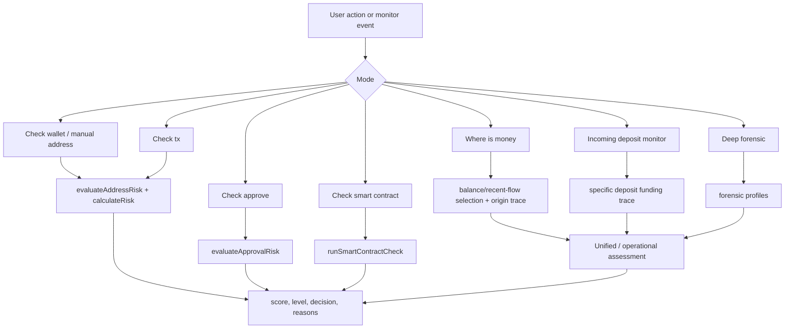

# Risk Scoring Logic Map

Date: 2026-06-16
Status: Draft for user review

## Goal

Make the current scoring system readable as one map:

- which modes exist;
- what each mode checks;
- which rules increase or decrease score;
- what is hard proof versus policy/context risk;
- what timing windows and limits matter;
- what the bot and admin panel should show in common situations.

This document describes the current implementation. It does not propose new scoring code.

## Source Files

| Area | Main files |
|---|---|
| Base scoring | `src/risk/riskEngine.ts`, `src/risk/riskPolicy.ts`, `src/risk/evaluation.ts` |
| Unified score | `src/risk/unifiedWalletRisk.ts`, `src/risk/unifiedIncomingDepositRisk.ts` |
| Wallet/manual checks | `src/check/manualCheck.ts`, `src/wallet/metrics.ts` |
| Smart-contract check | `src/check/smartContractCheck.ts` |
| Approval guard | `src/approvals/approvalRisk.ts`, `src/approvals/sessionContext.ts` |
| Approval-drain observation | `src/approvals/drainObservation.ts`, `src/approvals/approvalStateMachine.ts` |
| Where is money | `src/check/whereIsMoneyCheck.ts`, `src/forensics/balanceFormingTransfers.ts`, `src/forensics/recentFlowProvenanceSelection.ts`, `src/forensics/moneyOriginTrace.ts`, `src/forensics/moneyOriginPolicy.ts`, `src/forensics/moneyOriginOperationalAssessment.ts` |
| Deep forensic | `src/check/deepForensicCheck.ts`, `src/forensics/*` |
| Provenance/source policy | `src/forensics/provenanceScoring.ts` |
| Incoming deposit | `src/forensics/incomingDepositJob.ts`, `src/forensics/incomingDepositCashflow.ts` |
| Cross-chain | `src/forensics/crossChainEvidence.ts`, `src/forensics/crossChainStage2Triggers.ts`, `src/forensics/provenanceTracingConfig.ts` |
| Monitor/runtime | `src/monitor/monitorWorker.ts`, `src/config.ts` |

## Vocabulary

| Term | Meaning |
|---|---|
| `score` | Numeric risk score from 0 to 100. |
| `level` | Display band: `LOW`, `MEDIUM`, `HIGH`, `CRITICAL` in most fast reports. |
| `decision` | Operational result: usually `ACCEPTABLE`, `REVIEW`, or `DECLINE`. Incoming/unified user output prefers `ACCEPTABLE` or `DECLINE`. |
| `proofLevel` | Why the system believes the score: exact proof, exchange-policy decline, context, or insufficient coverage. |
| hard proof | Direct deterministic evidence: USDT blacklist, exact scam/stolen/phishing label, exact approval-drain provenance, sanctioned service. |
| source-policy risk | Exchange policy boundary such as HTX/Huobi, WhiteBIT, bridge/router/DEX, cross-chain boundary, unknown contract. It can decline, but it is not scam proof. |
| context risk | Behavior, service-boundary, counterparty snapshot, unknown origin, LLM suspicion. It may raise score but is capped below hard proof. |
| dampener | Trusted/false-positive label, clean CEX funding, regular operational behavior, known service route. Dampeners cannot erase hard proof. |

## Top-Level Flow



## Mode Map

| Mode | User question | Main output | Score basis | Important display rule |
|---|---|---|---|---|
| Wallet check | "Is this wallet risky?" | fast report and wallet safety | labels, USDT blacklist, graph/behavior/AML signals | Good for direct wallet risk, not enough to accept a specific deposit. |
| Check tx | "Who sent this USDT tx and is sender risky?" | sender risk report | official USDT transfer sender -> fast address risk | Tx context is preserved as `observedTransactionHash`. |
| Check approve | "Is this token approval dangerous?" | approval guard report | token, allowance, spender labels, spender type, session context | Always alerts owner; service routes dampen but do not hide the approval. |
| Smart contract | "Is this spender/contract suspicious?" | contract decision | provider risk, verification, service evidence, active approvals, LLM classifier | Standalone contract check does not prove exact drain. |
| Where is money | "What formed this balance or recent outgoing flow?" | provenance decision | selected inbound transfers, upstream source paths, operational assessment | Explains exchange decision; source-policy is separate from hard proof. |
| Incoming deposit | "Can we accept this exact incoming deposit?" | deposit score/decision | sender fast risk, deposit funding candidates, where-is-money, unified incoming score | Uses the deposit tx, not the sender's current balance. |
| Deep forensic | "What kind of wallet is this?" | profile set and deep risk context | inbound provenance, approval-drain, counterparties, service/boundary, behavior, role | Best for admin/research; feeds unified scoring. |
| Cross-chain Stage 2 | "Should we chase this bridge/cross-chain boundary deeper?" | triggered/skipped stage and cross-chain layer score | boundary amount, share, high-risk cheap evidence, terminal boundary | Low/medium boundary can stay manual-review only. |

## Score Bands

### Base Fast Risk Bands

Used by `calculateRisk` and most fast reports:

| Score | Level |
|---:|---|
| 85-100 | `CRITICAL` |
| 60-84 | `HIGH` |
| 30-59 | `MEDIUM` |
| 0-29 | `LOW` |

### Smart-Contract Bands

`runSmartContractCheck` uses a slightly lower medium threshold:

| Score | Level |
|---:|---|
| 85-100 | `CRITICAL` |
| 60-84 | `HIGH` |
| 35-59 | `MEDIUM` |
| 0-34 | `LOW` |

### Where/Incoming Risk Bands

Operational and incoming reports use:

| Score | Band |
|---:|---|
| 85-100 | `CRITICAL` |
| 60-84 | `HIGH` |
| 45-59 | `MEDIUM` |
| 20-44 | `LOW-MEDIUM` |
| 0-19 | `LOW` |

## Evidence Classes

| Class | Examples | Can force decline? | Can be dampened? |
|---|---|---:|---:|
| Hard proof | USDT blacklist, scam/stolen/phishing label, exact approval drain, sanctioned service | Yes | No |
| Source policy | HTX/Huobi, WhiteBIT, bridge/router/DEX, cross-chain boundary, no-name liquidity | Yes, by share/score | Sometimes |
| Contract suspicion | unknown contract, LLM `drainer_like`, transferFrom-capable untagged contract | Usually review/high context | Yes |
| Behavior context | deposit-then-drain, transit, service exposure, historical transit | Can create high risk, capped without hard proof | Yes |
| Counterparty context | meaningful direct exposure to WhiteBIT/darknet/proximity markers | Can reach high context | Yes |
| Data quality | incomplete coverage, history exhausted, provider limits | Can raise caution, not proof | Yes |
| Clean source | allowlisted CEX funding, trusted/false-positive label, known service route | Lowers or explains risk | Not applicable |

## Base Risk Engine

### Internal Labels

| Label type | Labels | Score impact |
|---|---|---:|
| Critical | `scam`, `reported_scam`, `stolen_funds`, `phishing`, `mixer_like`, `risky_contract`, `whitebit`, `darknet_exchange` | 90 |
| High context | `darknet_exchange_proximity`, `approval_drain_proximity` | 80 |
| Mitigating | `trusted`, `false_positive` | -40 |
| Context only | `victim` | 0 |
| Other label | any other internal label | 35 |

If a critical internal label is present, mitigating labels are ignored for the final positive score. The report can still keep the context, but trusted/false-positive must not erase hard proof.

### External Signals

| Signal group | Examples | Cap |
|---|---|---:|
| Exact critical | `stablecoin_usdt_blacklisted`, `forensic_approval_drain_provenance` | 90 |
| High context | `forensic_counterparty_whitebit`, `forensic_counterparty_darknet_exchange`, `forensic_counterparty_fast_snapshot_context` | 80 or 60 depending policy class |
| Generic positive signal | other graph/behavior/AML signal | 50 |

### Policy Dimensions

`riskPolicy.ts` bounds every reason by class, then combines dimensions:

| Dimension | Contribution cap |
|---|---:|
| provenance | 40 |
| approval drain | 30 |
| behavior | 25 |
| service context | 20 |
| provider label | 20 |
| dampener | -40 |

Final score is the max of:

- bounded composite policy score;
- hard taint score;
- laundering pattern score.

This is why a wallet can become high risk from operational laundering patterns even without exact scam proof, but still should not be called "scam" unless hard proof exists.

## Unified Wallet Score

`calculateUnifiedWalletRisk` combines available layers:

| Layer | Default weight |
|---|---:|
| fast | 10% |
| deep | 60% |
| where-is-money | 30% |

Weights are normalized across available layers.

Important floors:

| Evidence | Floor |
|---|---:|
| active USDT blacklist | 95 |
| exact approval drain / exact self critical label | 90 |
| other hard evidence | 85 |
| where hard bad evidence | 85+ |
| source-policy decline | 70-84 |
| verified/known asset continuation | up to 84 |
| historical transit pattern | up to 84 |
| limited coverage with no evidence | 30 |

Important cap:

```text
If there is no hard evidence, final score is capped below CRITICAL at 84.
```

Decision:

| Condition | Final decision |
|---|---|
| hard evidence floor >= 85 | `DECLINE` |
| final score >= 60 | `DECLINE` |
| otherwise | `ACCEPTABLE` |

## Wallet Safety Report

`calculateWalletSafetyReport` is dashboard-oriented, not a full exchange-decision engine.

Signals:

| Condition | Score impact |
|---|---:|
| age < 30 days and 30d USDT volume > 50,000 | +20 |
| age < 7 days and 30d USDT volume > 10,000 | +20 |
| direct internal labels | through base risk engine |

Limitations shown in the report:

- active: internal labels, incoming monitor;
- limited: wallet activity, approvals/security;
- not connected: AML providers;
- planned: hop graph, behavior patterns, bridge tracing, case forensics.

Product rule: dashboard safety is a quick signal. Do not use it alone as the final answer for a concrete deposit.

## Manual Address And Tx Check

### Address

`checkAddress(address)`:

1. Load labels.
2. Load optional risk signals.
3. Call `evaluateAddressRisk`.
4. Return fast report.

### Transaction

`checkTransactionHash(txHash)`:

1. Fetch tx.
2. Parse official USDT transfer.
3. Extract sender.
4. Check sender with tx hash preserved as observed transaction.

Product rule: "Check tx" explains the sender of that tx. It does not automatically prove the origin of the funds unless the incoming/where flow is also run.

## Approval Guard

Policy: `2026-05-23-approval-guard-v3`.

### Allowance Rules

| Approval pattern | Base score |
|---|---:|
| spender has risky label: scam/stolen/phishing/risky_contract | 95 |
| trusted/false-positive spender | 0 |
| provider risk on spender | 90 |
| provider service tag + official USDT + unlimited or >= 10,000 USDT | 15 |
| internal service label bridge/exchange + official USDT + unlimited or >= 10,000 USDT | 35 |
| unknown drainer-like contract profile + official USDT + unlimited | 35 |
| unknown drainer-like contract profile + official USDT + large finite | 25 |
| named provider contract + official USDT + unlimited | 35 |
| named provider contract + official USDT + large finite | 25 |
| official USDT unlimited | 60 |
| official USDT unlimited to unknown EOA | 80 |
| official USDT finite >= 50,000 | 70 |
| official USDT finite >= 50,000 to unknown EOA | 80 |
| official USDT finite >= 10,000 | 30 |
| official USDT finite >= 10,000 to unknown EOA | 40 |
| small finite official USDT approval | 0 |

### Contract Intelligence Additions

| Condition | Score impact |
|---|---:|
| low metadata | +10 |
| transferFrom capable | +15 |
| owner-only pull pattern | +10 |

### Signed Transaction Timing

| Condition | Score impact |
|---|---:|
| delayed signed approval >= 6 hours | +10 |
| extended expiration >= 24 hours | +5 |

Trusted/service dampeners can suppress these timing additions when the route is clearly legitimate.

### Approval Session Context

Policy: `2026-05-23-approval-session-context-v1`.

Window:

```text
2 minutes before approval
10 minutes after approval
```

| Classification | Meaning | Score impact |
|---|---|---:|
| `known_swap_route` | approval is directly linked to a known route spender | -20 |
| `service_linked_helper` | approval is near service/adapter route transfer | -35 |
| `no_route_found` | no route evidence | 0 |
| `possible_collector_drain` | nearby transferFrom to non-service receiver | +35 |

Product rule: keep the approval visible even if a service route dampens score. The user still needs to know a permission exists.

## Approval-Drain Observation

`buildApprovalDrainObservation` detects actual drain-like usage after approval.

Required facts:

- official USDT transfer;
- successful transfer;
- `from` equals approval owner;
- transfer receiver is not spender;
- amount >= 1 USDT;
- method is exactly `transferFrom`;
- caller equals approved spender;
- transfer time is after approval time.

Scoring:

| Evidence | Score impact |
|---|---:|
| approval transferFrom observed | +25 |
| provider risky spender | +70 |
| spender service tag | -10 |
| EOA spender, large amount >= 10,000 | +60 |
| EOA spender, smaller amount | +45 |
| named unverified contract | +40 |
| named contract with no service tag | +30 |
| unknown contract | +45 |
| receiver service/pool/vault | -10 |
| receiver unknown/non-service, large | +20 |
| receiver unknown/non-service, smaller | +10 |
| large amount | +15 |

Score is capped at 95.

Product rule: exact approve + transferFrom + path is hard proof. Service route or bridge/swap context should move to guarded review/context unless the exact drain path remains proven.

## Approval State Machine

Approval-drain states must not downgrade strong evidence because a later incomplete observation appears.

Important states from tests:

| Scenario | Expected state behavior |
|---|---|
| approval-only unknown spender | below exact proof |
| known service route after transferFrom | guarded service route |
| matching path without service boundary | exact provenance |
| service guarded then incomplete later observation | keep guarded state |
| route linked then transferFrom observed | keep route-linked state if stronger |
| exact provenance then approval disappears | only approval disappearance can downgrade exact state |

## Smart-Contract Check

`runSmartContractCheck` evaluates the spender/contract itself.

### Score Rules

| Condition | Score |
|---|---:|
| known verified service | 10 |
| unknown baseline | 20 |
| provider risk | at least 90 |
| verified but no service evidence | at least 35 |
| weak unknown metadata | at least 35 |
| active unlimited USDT approval to spender | at least 45 |
| active risky related approvals | risk floor from approval level |
| active unlimited approval + transferFrom surface | at least 65 |

### LLM Effects

| LLM verdict | Condition | Effect |
|---|---|---|
| `legitimate_service` | confidence >= 0.8 and service evidence exists | cap score <= 20, or floor 45 if active unlimited approvals exist |
| `unknown_suspicious` | confidence >= 0.75 | floor 45-55 |
| `drainer_like` | confidence >= 0.85 | floor 65-75 |

Decision:

| Condition | Decision |
|---|---|
| provider risk or approval safety risk | `DECLINE` |
| known verified service and score <= 20 | `ACCEPTABLE` |
| score >= 35 | `REVIEW` |
| otherwise | `ACCEPTABLE` |

Product rule: standalone contract check can say "suspicious contract" or "review", but must not say exact drain unless approve + transferFrom proof exists.

## Where Is Money

`runWhereIsMoneyCheck` is the largest decision mode. It explains either:

- what formed the current wallet balance; or
- for low-balance/recent-flow cases, what likely funded the recent outgoing flow.

### Runtime Defaults

| Setting | Default |
|---|---:|
| max depth | 20 |
| beam width | 12 |
| max address fetches | 150 |
| max edges per address | 100 |
| recent fallback min transfer count | 150 |
| recent fallback limit | 150 |
| max approval candidates | 30 |
| max contract tx-info fetches | 30 |
| cross-chain provider calls | 200 |

### Balance-Forming Selection

If a requested amount is provided, select latest inbound transfers until that amount is covered.

If no requested amount is provided, use current USDT balance and select latest inbound transfers until the balance is covered.

Default minimum coverage ratio:

```text
95%
```

If balance is zero or unavailable, balance-forming mode returns no selected transfers.

### Low-Balance Recent-Flow Mode

Threshold:

```text
current balance < 1,000 USDT
```

Then the system looks for a significant outgoing anchor:

```text
latest outgoing >= 1,000 USDT
```

Funding candidates use:

```text
max(1,000 USDT, min(10,000 USDT, 5% of anchor amount))
```

If strong funding candidates cover at least 80% of the outgoing anchor, they are selected. Otherwise coverage is partial.

### Origin Trace

Defaults:

| Rule | Value |
|---|---:|
| minimum amount preservation | 70% |
| max time gap between hops | 365 days |
| bundle coverage threshold | 80% |
| max bundle funders | 3 |

Trace stops on meaningful boundaries:

| Boundary | Default result |
|---|---|
| critical risky label | `DECLINE`, high score |
| WhiteBIT | source-policy score by share |
| HTX/Huobi | source-policy score by share |
| allowlisted CEX | `ACCEPTABLE`, low score |
| unknown CEX | `REVIEW`, around 50 |
| unknown contract | `REVIEW` or policy context by share |
| bridge/router/DEX/swap adapter | source-policy review/decline by share |
| history exhausted | `REVIEW`, around 45 |
| no previous incoming | around 35 |
| incoming seen but continuity too weak | around 30 |

Allowlisted CEX identities include Binance, Bybit, OKX, Coinbase, Kraken, KuCoin, Gate, Bitget, MEXC, Bitstamp, and Crypto.com.

### Operational Assessment

`buildMoneyOriginOperationalAssessment` composes selected paths into a final where-is-money decision.

Hard evidence can force decline:

| Evidence | Score behavior |
|---|---|
| fast wallet risk >= 85 | hard evidence |
| exact approval-drain profile | usually 90-95 |
| origin path root risky label | usually 90 |
| sanctioned service/cross-chain hard proof | 95+ |

Context/policy branches:

| Branch | Outcome |
|---|---|
| strong source-policy decline | `DECLINE`, usually 60-84 |
| guarded service route | `DECLINE` or context around 70-75, not hard proof |
| LLM contract suspicion | 65-80, dampenable unless non-dampenable policy exists |
| clean CEX coverage >= 85% | `ACCEPTABLE`, provenance confidence at least 80 |
| minority source-policy + clean coverage >= 70% | usually `ACCEPTABLE` with warning |
| operational liquidity wallet, no hard proof | `ACCEPTABLE`, usually 25-40 |
| unresolved provenance with weak coverage | safe default `DECLINE`, often 45+ |

Product rule: Where-is-money is the main place to show "why": selected transfers, source paths, coverage, hard proof vs exchange policy.

## Source-Policy Scoring

`scoreSourceExposures` groups paths by source kind, applies share caps/floors, then adjusts for hops, time, amount continuity, repetition, data quality, age, and wallet role.

### Source Kinds

| Kind | Base severity |
|---|---:|
| sanctioned service | 98 |
| mixer | 92 |
| risky label | 90 |
| no-name token liquidity | 88 |
| HTX/Huobi | 80 |
| bridge/router/DEX | 65 |
| cross-chain boundary | 65 |
| WhiteBIT | 60 |
| unknown contract | 50 |
| unknown CEX | 45 |
| allowlisted CEX | 5 |

### Share Caps And Floors

| Source | Important thresholds |
|---|---|
| bridge/cross-chain | tiny share can cap at 10-30; >= 50% can reach 60+; majority can reach 70+ |
| unknown contract | < 5% caps near 15; >= 50% caps near 55 |
| unknown CEX | max around 50 |
| WhiteBIT | >= 50% floor 60 |
| HTX/Huobi | >= 50% floor 78; >= 80% floor 85 |
| mixer | floor 78, can reach 95 |
| sanctioned | floor 95, can reach 100 |
| no-name liquidity | floor 70, around 88 |

### Path Context Adjustments

| Feature | Adjustment |
|---|---:|
| direct/0-hop exposure | +14 |
| 1 hop | +12 |
| 2 hops | +8 |
| <= 5 hops | +2 |
| <= 12 hops | -6 |
| longer | -12 |
| <= 10 minutes | +12 |
| <= 1 hour | +10 |
| <= 6 hours | +7 |
| <= 24 hours | +4 |
| > 30 days | -12 |
| amount continuity >= 95% | +8 |
| amount continuity >= 90% | +6 |
| amount continuity >= 70% | +3 |
| amount continuity < 40% | -12 |
| repeated exposure >= 2 paths | +5 |
| repeated exposure >= 4 paths | +8 |
| low coverage/confidence | +3 to +15 |

Non-dampenable source-policy kinds include no-name token liquidity, mixer, and sanctioned service.

## Deep Forensic

Deep forensic builds profiles, not just one number.

### Default Search Settings

| Setting | Default |
|---|---:|
| max depth | 3 |
| max pages per address | 3 |
| page limit | 100 |
| display/result limit | 10 |
| max inbound senders | 15 |
| asset continuation limit | 100 |
| extended trigger volume | 100,000 USDT |

### Profile Types

| Profile | What it detects | Score behavior |
|---|---|---|
| inbound provenance | direct/two-hop risky source into wallet | direct risky labels higher than two-hop; service boundaries stop continuity |
| approval-drain provenance | approve -> transferFrom -> path to subject | exact hop 0 around 90; route-linked hop 1/2 around 80/70 |
| counterparty risk | meaningful exposure to risky counterparties | high-risk labels can score 80 if meaningful |
| counterparty fast snapshot | dominant direct counterparty fast risk | capped context, can reach high without exact taint |
| service exposure | fast exits to bridge/DEX/service | up to 100 as exposure score, then policy-capped |
| boundary exposure | direct/two-hop service boundary context | capped around 15 |
| address behavior | deposit-then-drain/transit behavior | behavior-only caps below hard proof |
| operational flow | terminal liquidity, pass-through flow | capped around 85 |
| historical transit | repeated pass-through to risky/service destinations | floor in unified score up to 84 |
| wallet role | victim, drainer, first receiver, mule, collector, treasury, service | exact roles can be hard/context depending source |
| asset continuation | USDT -> other token -> outgoing continuation | verified/known continuation can anchor high risk below critical |
| extended provenance | temporal beam search over local index | deeper paths capped by depth |
| stablecoin blacklist | exact TRON USDT blacklist state | hard floor 95 |

### Behavioral Scores

Deposit-then-drain:

| Feature | Score impact |
|---|---:|
| large incoming ratio >= 70% | +10 |
| inflow/outflow preservation >= 90% | +15 |
| inflow/outflow preservation >= 70% | +10 |
| outgoing within 1 hour | +10 |
| outgoing within 6 hours | +7 |
| outgoing within 24 hours | +5 |
| drain to service ratio >= 70% | +15 |
| drain to service ratio >= 40% | +10 |

Transit:

| Feature | Score impact |
|---|---:|
| incoming tx >= 5 and outgoing tx >= 5 | +10 |
| unique incoming/outgoing >= 3/3 | +10 |
| outgoing tx >= 3 and largest outgoing ratio >= 40% | +10 |
| top outgoing >= 10,000 USDT, tx >= 2, ratio >= 50% | +10 |
| inflow/outflow ratio >= 70% and total tx >= 8 | +10 |

Dampeners:

| Feature | Score impact |
|---|---:|
| known service/treasury-like | -25 |
| age >= 180 days and tx >= 1,000 | -20 |
| regular distributed activity | -15 |
| provider failures | -15 |

## Incoming Deposit

Incoming deposit analysis answers:

```text
Can we accept this exact incoming USDT deposit?
```

It must not rely on the sender's current balance, because the sender may be empty after sending the deposit.

### Pipeline

1. Build fast sender risk from labels and USDT blacklist.
2. Fetch sender edges in the job window and add the seed deposit edge.
3. Select deposit funding candidates from inbound transfers before the deposit.
4. If funding candidates exist, run where-is-money on the sender using those candidates.
5. If not, seed where-is-money from the deposit itself.
6. Build funding bundles for large intermediate transfers.
7. Apply unified incoming deposit risk.
8. Send user/admin alerts according to wallet alert mode.

### Funding Candidate Selection

The selector walks backwards before the deposit:

- outgoing transfers by the sender become "spent before deposit";
- inbound transfers to sender are usable only after subtracting prior spending;
- selected inbound amount cannot exceed the deposit amount.

Continuity labels:

| Coverage | Continuity |
|---:|---|
| >= 85% | strong |
| >= 50% | medium |
| < 50% | weak |

### Incoming Runtime Constants

| Setting | Value |
|---|---:|
| runtime transfer limit | 200 |
| large deposit threshold | 100,000 USDT |
| large intermediate transfer threshold | 500,000 USDT |
| large intermediate bundle lookback | 6 hours |
| large intermediate bundle min coverage | 95% |
| adaptive corridor max funders | 3 |
| adaptive corridor max depth | 20 |
| adaptive corridor beam width | 8 |
| adaptive corridor max address fetches | 80 |
| adaptive corridor max edges/address | 60 |
| adaptive corridor min preservation | 5% |
| recent fallback min/limit | 60 / 60 |
| contract tx-info min interval | 15,000 ms |
| slow stage threshold | 30,000 ms |

### Sender Role

Incoming deposit can classify sender as:

| Role | Meaning |
|---|---|
| `clean_cex_funded_wallet` | clean allowlisted CEX coverage >= 85% |
| `partial_cex_context_wallet` | some clean CEX context but below full coverage |
| `fresh_one_shot_wallet` | sender has almost no activity and zero balance after deposit |
| `operational_liquidity_wallet` | operational behavior without hard proof |
| risky/context role | inherited from deep/where profiles |

Product rule: show "deposit risk" first, then sender role/context. Do not make "sender balance is zero" sound risky by itself.

## Cross-Chain Stage 2

### Trigger Thresholds

| Trigger | Value |
|---|---:|
| medium boundary amount | 10,000 USDT |
| large boundary amount | 100,000 USDT |
| bridge episode amount | 100,000 USDT |
| bridge episode share | 25% |
| default bundle coverage threshold | 80% |
| drain episode window | 24 hours |

### Trigger Rules

| Situation | Result |
|---|---|
| manual deep mode | trigger |
| bridge outgoing >= 100,000 or bridge share >= 25% | trigger |
| no boundary candidates | skip |
| recent-flow large boundary | trigger |
| recent-flow medium boundary with direct high-risk cheap evidence | trigger |
| recent-flow medium without direct high-risk evidence | skip, manual deep available |
| small recent-flow boundary | skip, manual deep available |
| non-recent large single boundary | trigger |
| non-recent large split boundary with preserved group | trigger |
| non-recent large but not preserved | skip, manual deep available |
| non-recent medium with direct high-risk cheap evidence | trigger |
| non-recent low amount | skip, manual deep available |

### Cross-Chain Evidence Scores

| Terminal | Evidence class | Score behavior |
|---|---|---|
| sanctioned service | hard proof | 95+ |
| tornado/mixer | source-policy, non-dampenable | 78+ |
| no-name token liquidity | source-policy, non-dampenable | 70+ |
| bridge boundary | source-policy | share-capped, can reach 60+ |
| DEX/router boundary | source-policy | share-capped |
| unknown contract | context/source policy | around 50 max by share |
| data exhausted | data quality | around 45 |
| candidate only | weak context | around 20 |
| none | none | 0 |

## Monitor And Alerts

### Incoming Monitor

When an observed incoming transfer is claimed:

1. If incoming-deposit jobs are enabled, queue an `incoming_deposit_check` job.
2. Mark user alert as analyzing.
3. The job later sends the final incoming deposit alert.
4. If jobs are not available, fall back to fast sender risk.

### Alert Modes

| Wallet mode | Owner immediate alert |
|---|---|
| `realtime` | always |
| `risk_only` | only when level is not `LOW` |
| `digest` | only when level is not `LOW`; digest path also exists |

Customer-admin recipients:

| Recipient mode | Receives |
|---|---|
| `all` | all alerts |
| other | non-LOW alerts |

Service admins:

```text
Notify only HIGH or CRITICAL fast reports.
```

Incoming job delivery uses its own decision flow and can send risk-only/digest/realtime according to the queued wallet mode.

## Runtime Timing And Limits

| Config | Default |
|---|---:|
| `TRONSCAN_TIMEOUT_MS` | 10,000 |
| `TRONSCAN_RETRY_ATTEMPTS` | 3 |
| `TRONSCAN_RETRY_BASE_DELAY_MS` | 500 |
| `TRONSCAN_BACKFILL_LOOKBACK_MS` | 86,400,000 |
| `TRONSCAN_REQUEST_MIN_INTERVAL_MS` | 220 |
| `TRONSCAN_GLOBAL_REQUEST_MIN_INTERVAL_MS` | 280 |
| `TRONSCAN_TRANSFER_REQUEST_MIN_INTERVAL_MS` | 350 |
| `TRONSCAN_APPROVAL_REQUEST_MIN_INTERVAL_MS` | 300 |
| `TRONSCAN_CONTRACT_REQUEST_MIN_INTERVAL_MS` | 300 |
| `TRONSCAN_FULLNODE_REQUEST_MIN_INTERVAL_MS` | 300 |
| `TRONSCAN_ACCOUNT_GROUP_REQUEST_MIN_INTERVAL_MS` | 250 |
| `TRONGRID_REQUEST_MIN_INTERVAL_MS` | 250 |
| `FORENSIC_WHERE_POLL_INTERVAL_MS` | 2,000 |
| `FORENSIC_WHERE_JOBS_PER_POLL` | 3 |
| `FORENSIC_INCOMING_POLL_INTERVAL_MS` | 2,000 |
| `FORENSIC_INCOMING_JOBS_PER_POLL` | 3 |
| `FORENSIC_DEEP_POLL_INTERVAL_MS` | 60,000 |
| `FORENSIC_JOB_STALE_AFTER_MS` | 1,800,000 |
| `FORENSIC_JOB_MAX_RETRIES` | 2 |
| `LLM_TIMEOUT_MS` | 60,000 |
| `LLM_MAX_RETRIES` | 2 |
| `LLM_CACHE_TTL_MS` | 2,592,000,000 |
| `LLM_ENRICHMENT_RETRY_DELAY_MS` | 15,000 |
| `POLL_INTERVAL_MS` | 60,000 |
| `POLL_START_DELAY_MS` | 0 |
| `FORENSIC_WHERE_START_DELAY_MS` | 3,000 |
| `FORENSIC_INCOMING_START_DELAY_MS` | 6,000 |
| `FORENSIC_DEEP_START_DELAY_MS` | 12,000 |

## Common Patterns

| Pattern | How system treats it |
|---|---|
| Direct USDT blacklist | hard proof, 95, decline |
| Direct scam/stolen/phishing/risky label | hard proof, about 90, decline |
| Exact approval-drain path | hard proof, about 90+, decline |
| Approval only to unknown EOA | high approval risk, but not exact drain proof |
| Known swap/bridge approval route | approval remains visible, score is dampened |
| Service boundary only | context, capped low, not hard proof |
| Unknown contract in origin path | review/source-policy context by share |
| HTX/Huobi majority source | exchange-policy decline, not scam proof |
| WhiteBIT majority source | exchange-policy decline around 60, not necessarily hard proof |
| Bridge/router/DEX majority source | source-policy decline/context by share |
| Allowlisted CEX majority source | clean source, acceptable if coverage is strong |
| Low balance after outgoing | recent-flow mode; zero balance alone is not risk |
| Incomplete history | review/decline by safe default depending coverage and other risk |
| LLM drainer-like | suspicion context unless exact blockchain facts exist |
| Operational liquidity wallet | can dampen non-hard source/context risk |

## Example Outcomes

| Situation | Likely visible result | Why |
|---|---|---|
| Wallet is TRON USDT blacklisted | `DECLINE`, `CRITICAL`, score 95 | exact stablecoin restriction hard proof |
| Address has `scam` internal label | `DECLINE`, about 90 | exact internal critical label |
| Unlimited official USDT approve to unknown EOA | `HIGH`, about 80 | unlimited approval base 60 plus unknown EOA risk |
| Same approve, delayed signed tx >= 6h | can become `CRITICAL` | timing adds risk on top of high unknown approval |
| Unlimited approve to provider service tag | `LOW`, about 15 | service identity dampens the approval |
| Unlimited approve to internal bridge/exchange label | `MEDIUM`, about 35 | service-like but still meaningful approval |
| transferFrom after approval to non-service receiver | high/critical approval-drain observation | exact usage pattern after approval |
| Smart contract is known verified service | `ACCEPTABLE`, score around 10-20 | service evidence and verification |
| Smart contract unknown, verified but no service evidence | `REVIEW`, at least 35 | verification alone is not trust |
| Smart contract LLM says drainer-like, no exact drain proof | `REVIEW`/high suspicion around 65-75 | LLM is classifier, not proof |
| Where-is-money finds >= 85% clean Binance/OKX funding | `ACCEPTABLE`, low risk | clean CEX coverage is strong |
| Where-is-money finds >= 80% HTX/Huobi source | `DECLINE`, high score | source-policy floor around 85 |
| Where-is-money finds tiny bridge exposure | context/review, not auto-hard-proof | share cap keeps score low |
| Incoming deposit sender has zero balance after sending | not risk by itself | incoming mode traces the deposit funding, not current sender balance |
| Incoming deposit sender funded by clean CEX before deposit | `ACCEPTABLE` if coverage strong | exact deposit funding path is clean |
| Incoming deposit sender funded by unknown contract bundle | `REVIEW`/`DECLINE` depending share, contract context, LLM, coverage | unknown contract is policy/context unless hard proof appears |
| Cross-chain boundary 5,000 USDT | Stage 2 skipped, manual deep available | below medium automatic threshold |
| Cross-chain boundary 100,000 USDT | Stage 2 triggered | large boundary threshold |
| Service route around approve/transfer | guarded context, not auto-decline | anti-false-positive service guard |
| Coverage is limited and no evidence exists | score around 30, limited coverage | cannot look confidently clean |

## Bot And Admin Display Map

### Bot

The bot should keep the main buttons user-facing and operational:

- `Проверить кошелек` - fast/manual wallet risk and safety context.
- `Проверить USDT` - tx/deposit-oriented check when tx hash or deposit context is present.
- `Проверить approve` - approval guard and approval-drain context.
- `Кошельки` - monitored wallets and alert modes.
- `Сообщить о краже` - separate centered action.

Do not expose admin entry points in the bot. Admin stays web-only.

### Admin

Admin should show the full decision trail:

- mode and job kind;
- selected transfers;
- path graph;
- path timing and gaps;
- source exposure groups;
- hard proof versus source-policy/context;
- active floors/caps/dampeners;
- provider budgets and warnings;
- raw evidence and observations;
- final user-facing message preview.

### Wording Rules

| Internal condition | User/admin wording |
|---|---|
| hard proof | "Exact evidence found" / "direct proof" |
| source-policy decline | "Declined by exchange source policy" |
| service route guard | "Service route detected; not treated as exact drain proof" |
| limited coverage | "Coverage is limited; result is conservative" |
| clean CEX coverage | "Source coverage is clean and sufficient" |
| LLM suspicion | "Contract classifier suggests risk; no exact drain proof by itself" |

## Product Interpretation Rules

1. Never call policy context "scam proof".
2. Never let clean/operational dampeners erase hard proof.
3. Do not use sender current balance as incoming deposit risk.
4. Do not auto-decline a normal service route without exact bad evidence.
5. Show coverage beside score whenever provenance is involved.
6. Show selected amount/share, not only path labels.
7. Show whether the result came from hard floor, policy floor, weighted layer score, or dampened context.
8. For bot copy, keep the final line simple: accept, decline, or needs manual review in admin.

## Current Risk Map In One Table

| Score zone | Meaning | Typical causes | User-facing action |
|---:|---|---|---|
| 0-19 | clean/low | clean CEX, known verified service, no signals | acceptable |
| 20-44 | low-medium/context | weak unknowns, limited behavior, small boundary | usually acceptable with note |
| 45-59 | review zone | unknown contract, incomplete provenance, medium suspicion | manual review/admin details |
| 60-84 | high/source-policy | HTX/WhiteBIT/bridge majority, approval risk, transit pattern | usually decline, explain as policy/context if not hard proof |
| 85-100 | critical/hard or very strong policy | blacklist, scam label, exact approval drain, sanctioned, HTX high-share floor | decline |

## Open Product Questions

These are not blockers for the map, but they affect future UI wording:

1. Should bot show `REVIEW`, or should only admin show `REVIEW` while bot says "Нужна ручная проверка"?
2. Should "Проверить USDT" accept both tx hash and wallet address, or should wallet address always go to "Проверить кошелек"?
3. Should source-policy decline be shown as "Риск источника" instead of "грязные средства" to avoid overclaiming?
4. Should admin have a dedicated "Why score changed" panel listing active floors/caps/dampeners?

## Self-Review

- The map separates hard proof from source-policy/context risk.
- It covers all current user/admin modes found in the codebase.
- It includes score bands, thresholds, timing windows, runtime polling defaults, and examples.
- It avoids proposing new implementation changes.
- It keeps bot/admin display rules aligned with the current product decision that admin is web-only.
