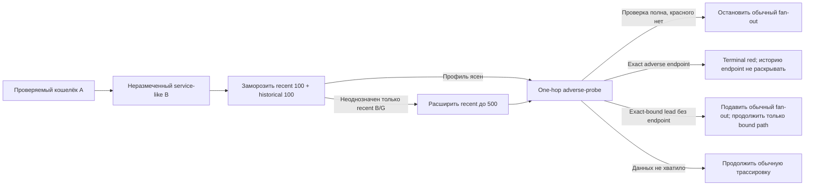

# Service Boundary Sampling Amendment Design

**Статус:** утверждённый дизайн после ручного corpus replay; не реализован,
не разрешает production boundary до frozen evidence, blind review и отдельного
Stage D решения

**Дата:** 2026-07-29

**Базовая версия:** `9e8ec47838af781d15efb82ef912c5d0c8adfa09`

## Результат

Уточнение для checked-subject режима и выбора cashflow-запросов находится в
`2026-07-30-subject-service-and-cashflow-query-amendment-design.md`. Этот
документ продолжает описывать только intermediate service boundary; он не
разрешает ограничивать историю checked subject.

Для каждого неразмеченного сервисоподобного промежуточного EOA проверяются два
непересекающихся окна ровно по две физические страницы TronScan:

```text
recent 100 physical rows + historical 100 physical rows
```

Дубликаты, invalid и collision rows не добираются сверх этих страниц. Если
после canonical validation/dedupe в любом окне осталось меньше `100` событий,
inferred boundary не разрешается. Canonical risk/poisoning event остаётся в
inventory и adverse-probe, но не получает положительных behavior points.

Если базовый профиль неоднозначен, расширяется только recent-окно — с двух до
десяти физических страниц, максимум до `500` rows. Historical-окно остаётся
двухстраничным. Поэтому cold sampling имеет следующие верхние границы:

| Ситуация | История | Current account context | Всего sampling calls до adverse-probe |
|---|---:|---:|---:|
| Точный уже подтверждённый сервис | 0 | 0–1 | 0–1 запрос |
| Неразмеченный кандидат | 4 страницы | 1 | 5 запросов |
| Неоднозначный recent-профиль | 12 страниц | 1 | 13 запросов |

Эта цена не включает exact adverse-проверки контрагентов и получение
`EOAAtAnchor` witness. Anchor-role authority должна уже существовать в frozen
snapshot/traversal evidence; если её нет, boundary запрещается либо стоимость
отдельного authority-запроса учитывается отдельно — current account call из
таблицы её не заменяет. Authoritative exhaustion и cache hit могут уменьшить
network calls, но canonical top-up запрещён. Ключи уменьшают wall time только в
пределах реально независимых provider-групп; они не уменьшают логический
request budget и не заменяют service boundary.

В ручном публичном probe без ключа baseline занял около `6s` последовательной
provider-работы, expanded sample оценён в `15–20s` в одной линии. При четырёх
действительно независимых группах ориентир составляет `2–3s` и `4–8s`
соответственно. Это calibration observation, не latency SLO: один provider
account, rate limit, cache misses и adverse calls могут не дать такого
ускорения.

### Человеческая схема

Здесь `B` — промежуточный адрес цепочки, а не Stage B roadmap:



«Проверить B на один шаг» не означает скачивать полную историю каждого его
соседа. Проверяются exact связи B с контрагентами, попавшими в frozen sample,
в обе стороны. Только завершённый probe разрешает не раскрывать тысячи
обычных neighbor histories.

## Что именно изменяется в старом дизайне

Документ дополняет и частично заменяет
`2026-07-26-unified-service-boundary-and-latency-design.md`.

Заменяются только:

- Stage C sampling и high-confidence contract;
- старые числовые A/S bins как authority решения;
- Stage C result, которому одного `wouldStop` уже недостаточно;
- Stage D probe budget `250 + 250 / 500 total`;
- правило «любой adverse означает полное раскрытие всех обычных соседей»;
- связанные C/D tests, corpus и performance acceptance.

Сохраняются без изменений:

- Stage A и Stage B;
- shadow-only характер Stage C;
- checked subject никогда не становится inferred boundary;
- event-time-valid exact labels и отдельные immutable policy versions;
- запрет считать неизвестный label доказательством безопасности;
- разделение service role и AML risk;
- fail-closed restart, artifact и completion semantics;
- отсутствие score dampening от одного service-like поведения.

Новый maximum sample — `500 recent + 100 historical = 600` физических rows,
или `12` history pages. Старое утверждение о `500` total больше не нормативно.

## Роль адреса и риск — разные вопросы

Поведенческая модель отвечает только на вопрос: «похоже ли, что этот
промежуточный адрес является автоматизированным payout/processing-сервисом?»

Она не отвечает на вопрос «безопасен ли адрес». Возможны одновременно:

- `role = inferred_service`;
- подтверждённая красная связь;
- остановка обычного fan-out;
- terminal red для exact adverse endpoint без раскрытия его истории;
- продолжение только exact-bound пути, когда доказан pattern/lead, но сам
  adverse endpoint ещё не установлен.

Точный known service не нуждается в поведенческом доказательстве роли. Его
terminal semantics по-прежнему определяет действующая versioned exact-boundary
policy. Например, HTX может одновременно быть точной сервисной границей и
красным product result; эти два факта нельзя схлопывать в «обычная CEX».

GasFree Account или другой contract не становится inferred EOA boundary по этой
policy. Его exact роль определяется structural evidence, а principal остаётся
обычным денежным движением.

## Детерминированные окна

### Anchor

Для intermediate node anchor равен точному route event, через который проверка
пришла в адрес. Sampling не видит события позже anchor.

Provider request использует `end_timestamp`, но high-confidence boundary требует
также точного chain-order cutoff. Если timestamp содержит несколько событий и
нельзя доказать, какие из них находятся до route event, результат incomplete.

### Recent baseline

Запрашиваются ровно две физические страницы по `50` rows:

```text
windowKind = recent
startTimestamp = 2018-06-25T00:00:00Z
endTimestamp = route anchor
pageOffsets = 0, 50
pageSize = 50
```

После validation и canonical dedupe сохраняются physical и canonical inventory.
Третья страница не используется для добора до 100 canonical events.

Если первая страница authoritative сообщает exhaustion и содержит меньше `50`
rows, второй HTTP request можно не делать: результат всё равно
`sample_insufficient`. Это уменьшает фактическое число calls, но не создаёт
третью страницу или synthetic rows.

### Historical baseline

Historical загружается сразу после freeze двухстраничного recent baseline.
Cutoff вычисляется одинаково для каждого адреса:

\[
H=\min(anchor-7d,\ recentBaselineStart-7d)
\]

Затем запрашиваются ровно две страницы:

```text
windowKind = historical
startTimestamp = 2018-06-25T00:00:00Z
endTimestamp = H
pageOffsets = 0, 50
pageSize = 50
```

Так окна не пересекаются и разделены минимум семью сутками. Произвольный
«интересный старый день» в production sampler не выбирается.

До решения о каком-либо расширении sampler замораживает hashes, canonical IDs и
cutoff обоих baseline-окон. Поэтому утверждённая последовательность всегда
одна: сначала `100 recent + 100 historical`, затем — только если совместный
результат неоднозначен — дополнительные recent pages. Расширение никогда не
пересчитывает historical cutoff и не заменяет historical sample.

### Решение о recent expansion

Recent расширяется только в узком случае, когда историческое окно уже
подтвердило устойчивый service-like режим, а recent baseline подтвердил
автоматизацию, но ему не хватило ровно одного структурного семейства — breadth
или geometry:

```text
ExpandRecent =
  BoundaryPageQualityRecent100 AND
  BoundaryPageQualityHistorical100 AND
  P_historical100 AND
  NOT P_recent100 AND
  C_recent100 AND
  (H_recent100 OR R_recent100 OR X_recent100) AND
  exactlyOneMissing(B_recent100, G_recent100)
```

Это mutually exclusive класс `recent_candidate_ambiguous`. Недостаток cadence,
hour-spread/repetition либо слабое historical окно расширением не лечится:
такой адрес получает `non_service_profile` или `insufficient_data` и продолжает
обычную трассировку.

Если `ExpandRecent=true`, добавляются только page offsets
`100, 150, …, 450`. Итого recent содержит до десяти физических страниц.
Frozen historical hashes, IDs и cutoff остаются прежними. Rows расширения,
совпавшие по canonical event ID с любым baseline-окном, исключаются из
структурных признаков и не добираются новыми страницами.

Expansion может уточнить только `B` и `G`. Temporal признаки recent baseline
не переписываются увеличенным окном:

```text
P_recent_final =
  C_recent100 AND
  (H_recent100 OR R_recent100 OR X_recent100) AND
  B_recent500 AND
  G_recent500
```

Без expansion `P_recent_final=P_recent100`. Такое правило не позволяет
длинному расширенному окну искусственно создать cadence или устойчивость,
которых не было в исходных 100 rows.

Expansion не ремонтирует:

- менее `100` canonical historical events;
- менее `100` canonical recent baseline events;
- provider/page incompleteness;
- temporal leakage;
- неразрешённую EOA/contract роль;
- конфликт exact label;
- провал обязательного adverse evidence.

После десяти recent pages неоднозначность означает `continue_full`, а не ещё
один скрытый budget.

### Физические и canonical rows

Physical budget считается до dedupe. Canonical count считается после:

- exact official-USDT validation;
- finality/success validation;
- canonical event dedupe;
- разделения exact GasFree settlement.

Canonical risk/poisoning rows сохраняются в sample и adverse inventory. Для
всех positive features `C/B/G/H/R` используется отдельный
`featureEligibleEventCount`, из которого exact poisoning, provider-risk rows и
технический GasFree fee исключены вместе с их counterparties; hard-red событие
не исчезает и не делает service role автоматически human-like.

Страница не добирается ради завершения timestamp group: fixed-row sample может
закончиться внутри группы с одинаковым timestamp, и это само по себе не делает
поведенческий sample неполным. Но событие с тем же timestamp, что и route
anchor, допускается в recent только при доказанном chain order до anchor;
иначе boundary запрещается из-за future leakage.

## Объяснимая поведенческая модель

Ни один отдельный признак не доказывает сервис. Для каждого окна сохраняется
сырой feature vector:

```text
canonicalEventCount
featureEligibleEventCount
incomingCount / outgoingCount
uniqueSenders / uniqueRecipients / uniqueCounterparties
counterpartyRatio
dominantCounterpartyShare
medianDominantDirectionGapSeconds
maxDominantDirectionEventsPerHour
activeUtcHourOfDayCount
dominantExactAmountCount / share
observedWindowDuration
accountAge
providerReportedActivityCounters
reportedActivityPerAccountDaySupporting
```

Account age и provider total counters — только supporting context: они могут
смешивать USDT с другими действиями и никогда не заменяют выбранные события.
Из них можно показать признак общей интенсивности относительно возраста
адреса, который пользователь отдельно отметил на `…W8SRL`, но в V2 он не
добавляет положительный vote: до calibration нельзя считать provider total
сопоставимым между всеми типами аккаунтов.

Начальный `service-behavior-research-v2` использует не вероятность, а
проверяемые семейства признаков. Для окна:

\[
P_w=C_w\land B_w\land G_w\land(H_w\lor R_w\lor X_w)
\]

где:

- `C` — cadence:
  `dominantDirectionCount >= 20 AND (medianGap <= 120s OR maxPerHour >= 15)`;
- `B` — breadth: минимум `25` уникальных контрагентов и отношение
  `counterparties / featureEligibleEvents >= 0.20`, при этом доля крупнейшего
  контрагента не выше `0.50`;
- `G` — geometry: fan-out/fan-in с долей доминирующего направления `>=0.70`
  и минимум `20` соответствующих контрагентов, либо many-to-many минимум с
  `10` senders и `10` recipients;
- `H` — hour spread: события встречаются минимум в `12` различных значениях
  часа суток UTC (`0..23`), а не просто в двенадцати последовательных
  календарных hour-buckets;
- `R` — repetition: одна exact raw amount в доминирующем направлении
  повторяется минимум `10` раз и составляет минимум `10%` этого направления.
- `X` — extreme machine throughput:
  `dominantDirectionCount >= 80`, доля доминирующего направления `>=0.80`,
  минимум `80` его уникальных контрагентов и дополнительно
  `medianDominantDirectionGapSeconds <=15` либо
  `maxDominantDirectionEventsPerHour >=80`.

Это начальная детерминированная replay-policy, а не производственная
калибровка и не процент уверенности. Она намеренно требует cadence, breadth и
geometry одновременно. `H/R` подтверждают растянутый либо повторяемый режим,
а `X` закрывает отдельный случай, когда очевидная машинная очередь успевает
обработать почти всё окно внутри одного UTC-часа. `X` классифицирует роль, а не
AML-риск.

Для shadow-классификации и для разрешения production boundary используются два
разных качества:

- `BehaviorQuality` означает, что имеется достаточно canonical events с
  однозначной identity/order и без temporal leakage, чтобы посчитать
  поведенческий vector;
- `BoundaryPageQuality` дополнительно требует exact physical page inventory,
  request hashes, frozen cutoff и один из источников `exact_cached_pages`,
  `frozen_provider_fixture` или `live_probe`.

`accepted_history_reconstruction` может пройти `BehaviorQuality`, но по
определению не проходит `BoundaryPageQuality`.

High service-like research classification:

\[
HighServiceBehavior=
BehaviorQuality_{recent}\land BehaviorQuality_{historical}
\land P_{recent\_final}\land P_{historical100}
\land\neg ExactRoleConflict
\]

Разрешение фактически остановить обычный fan-out требует более сильного
условия:

\[
BoundaryEligible=
HighServiceBehavior\land EOAAtAnchor
\land BoundaryPageQuality_{recent}\land BoundaryPageQuality_{historical}
\land AdverseProbeComplete
\]

Production policy может появиться только как новая immutable version после
полного corpus replay, двух blind reviews и adjudication. Она обязана сохранить
сам feature vector и monotonic tests; пороги нельзя менять внутри уже начатого
run.

`BoundaryPageQuality` требует ровно `100` canonical events в каждом
baseline-окне, exact anchor/order, полный page inventory, разрыв минимум семь
суток и однозначную роль intermediate EOA. Расширение recent не повышает
temporal confidence и не заменяет слабое historical-окно.

`EOA` здесь означает `EOAAtAnchor`, а не текущее поле account response.
Authority должна доказать отсутствие contract code на route anchor через
versioned frozen block/account witness либо точное событие создания/изменения
роли. Текущий TronScan label после anchor не применяется задним числом. Без
такого evidence результат `role_unresolved`, и boundary запрещён.

### Profile artifact v2

Старая design-only schema `service-behavior-profile-v1` с A/S и `wouldStop` не
была production policy и больше не нормативна. Новая immutable schema:

```text
version = service-behavior-profile-v2
schemaVersion
samplingPolicyVersion
behaviorPolicyVersion
snapshotHash
address
routeAnchorEventId / anchorOrder
eoaAtAnchorEvidenceRef
accountObservationRef = provider/schema/snapshot/fetchedAt/payloadHash
sampleSource
recentBaselineInventory / recentExpandedInventory
historicalInventory
physicalPageRequestHashes
canonicalHistoryHash
canonicalEventIds
canonicalEventCount / featureEligibleEventCount
rawFeaturesRecent / rawFeaturesHistorical
predicateFamiliesRecent / predicateFamiliesHistorical
expandRecent
behaviorQualityRecent / behaviorQualityHistorical
boundaryPageQualityRecent / boundaryPageQualityHistorical
behaviorClassification
estimatedWouldAction
wouldAction
boundaryEligible
boundaryBlockers
adverseProbeHash
continuationBranchIds
```

`sampleSource` принимает только
`accepted_history_reconstruction | exact_cached_pages | frozen_provider_fixture | live_probe`.

Для `accepted_history_reconstruction` массив physical page hashes пуст и
blocker `physical_page_inventory_unproven` обязателен; canonical history hash
хранится отдельно в sample inventory. Такой профиль сохраняет только
`estimatedWouldAction`; authoritative `wouldAction=null`, а
`boundaryEligible=false`. Отсутствие поля не маскируется.

`accountObservationRef` — immutable ссылка на текущее наблюдение account API.
Она помогает описать адрес, но не заменяет отдельный
`eoaAtAnchorEvidenceRef` и не доказывает роль задним числом.

Старые A/S можно сохранять только как явно versioned diagnostic для сравнения;
они не участвуют в `wouldAction` и не переименовываются в новую authority.

### Классы research replay

Классы вычисляются строго сверху вниз, поэтому predicates не пересекаются:

| Приоритет | Класс | Значение |
|---:|---|---|
| 1 | `insufficient_data` | Не проходит `BehaviorQuality`; для authoritative action отдельно проверяется `BoundaryPageQuality` |
| 2 | `role_conflict` | Exact role/contract/ownership evidence противоречит inferred EOA модели |
| 3 | `high_inferred_service` | Historical и итоговый recent проходят полный predicate |
| 4 | `recent_candidate_ambiguous` | Baseline удовлетворяет точному `ExpandRecent`, но дополнительные pages ещё не оценены |
| 5 | `non_service_profile` | Все остальные завершённые профили, включая неудачное расширение |

Для reconstruction отдельная детерминированная формула отличается только
уровнем доказательства качества:

```text
EstimatedExpandRecent =
  BehaviorQualityRecent100 AND
  BehaviorQualityHistorical100 AND
  P_historical100 AND
  NOT P_recent100 AND
  C_recent100 AND
  (H_recent100 OR R_recent100) AND
  exactlyOneMissing(B_recent100, G_recent100)
```

При `EstimatedExpandRecent=true` estimated recent использует до `500`
принятых canonical events, но frozen historical cutoff не меняется, а итоговый
predicate сохраняет baseline `C/H/R` и уточняет только `B/G`. Для
authoritative sampler `ExpandRecent` разрешён только при
`BoundaryPageQuality` обоих baseline-окон. Blind review и adjudication
принимают только exact page sources; reconstructed profiles в blind denominator
не входят.

Counterfactual Stage C action также имеет отдельную точную формулу:

```text
EstimatedBoundaryCandidate =
  role != subject AND
  HighServiceBehavior AND
  EOAAtAnchor

EstimatedAdverseComplete =
  every required matrix check for every reconstructed-sample event/counterparty
  has a frozen existing proven/not_found/not_applicable outcome

if NOT EstimatedBoundaryCandidate OR NOT EstimatedAdverseComplete:
  estimatedWouldAction = continue_full
else if ExactBoundContinuationPaths is empty:
  estimatedWouldAction = stop_ordinary
else:
  estimatedWouldAction = stop_ordinary_expand_adverse
```

`ExactBoundContinuationPaths` содержит только non-terminal leads. Exact
adverse endpoints остаются terminal red facts и не открывают свою историю.

Stage C не делает запросов, чтобы заполнить пропуски: отсутствующий existing
adverse outcome означает incomplete и поэтому `continue_full`. Даже
counterfactual `stop_*` остаётся только shadow observation; reconstruction не
получает `BoundaryPageQuality`, authoritative `wouldAction` или право менять
frontier.

Числа выводятся в Admin/research artifact вместе с причинами. Пользовательский
Telegram-текст не показывает внутренние `C/B/G/H/R`, API names или selector-ы.

## Что означает adverse-probe «на один шаг»

Проверяются все уникальные прямые контрагенты, реально присутствующие в
canonical `100 + 100` или `500 + 100`. Полная история каждого контрагента не
раскрывается автоматически.

Для связей в обе стороны проверяются:

- event-time-valid blacklist и sanctions/restricted-service evidence;
- exact HTX и другие product-policy service identities;
- известный drainer, collector или tracked dangerous address;
- точная подтверждённая drainer/approval/transferFrom/contract pattern;
- provider risk row и его authoritative status;
- materiality денежного пути и отдельный poisoning/dust context.

Проверка работает симметрично: важно и откуда сервис получил деньги, и куда он
их отправил. Hard adverse fact не исчезает из-за маленькой суммы. Materiality
управляет дорогим exploratory deepening, но не удаляет точный blacklist,
sanctions, tracked-dangerous или подтверждённый drainer-pattern.

Disposition каждого proven hard-red определяет frozen
`provenance-adverse-terminal-matrix-v1`, зафиксированная в chronological
cashflow design; автоматического continuation по самому red-факту нет:

| Authority | Disposition |
|---|---|
| Exact event-time blacklist, sanctions или restricted-service endpoint; exact HTX/restricted exchange; tracked drainer/collector; другой exact confirmed harmful endpoint | `terminal_red`: сохранить красный факт и не загружать историю endpoint |
| Approval/Verify/transferFrom, proxy или drainer pattern без exact endpoint identity, но с exact next address/event binding | `continue_exact_path`: продолжить только связанный путь |
| Exact terminal и отдельный вопрос о связи с selected amount | `cashflow_relevance_only`: проверить только уже известные intermediate events; историю adverse endpoint не открывать |
| Missing authority, event binding или exact continuation binding | `unresolved`; не выдавать ни terminal shortcut, ни произвольное продолжение |

Exact versioned poisoning/dust сохраняется как evidence, но не создаёт ложную
денежную ветку. Materiality меняет только приоритет; она не меняет disposition.

Одна exact confirmed Verify20-сцена с полным fingerprint и связанным USDT
movement является самостоятельным `proven` red signal. Method name без exact
selector/event/finality/movement binding им не является. Сама сцена без exact
identity вредоносного endpoint остаётся lead и разрешает только её exact-bound
continuation.

Внутренний evidence artifact может хранить exact selector/signature. Customer
copy не раскрывает название приватного паттерна и сообщает понятный факт о
выявленной drainer-схеме.

Текущий `directHardEvidence` можно переиспользовать на уровне lower-level
blacklist/restriction clients и bounded concurrency, но не как готовый gate. Он
ограничивает live address checks первыми `250` выбранными адресами, использует
свою materiality selection и не создаёт полный versioned receipt для
contract/approval, historical blacklist и каждого `not_found/unresolved`
outcome.

Exact blacklist lookup использует full-node/TronGrid path, поэтому четыре
TronScan key сами по себе его не ускоряют. Lower-level client и одинаковые
address/timeline результаты переиспользуются через cache; отдельный второй
blacklist client не создаётся.

Adverse-probe обязан обработать всех unique sample-counterparties bounded
batches: максимум до `200` physical candidates на baseline и до `600` на
expanded sample до дедупликации. Размер одного batch не становится semantic
limit; необработанный остаток означает `unresolved`.

Frozen completeness matrix обязательна для каждого counterparty/event:

- blacklist timeline, exact restricted/service identity, tracked-dangerous и
  provider-risk gate применяются ко всем sampled money events;
- transaction finality, selector, logs, approval/transferFrom и contract parser
  применяются только к exact triggered events;
- неприменимый triggered gate получает `not_applicable`, а не ложный
  authoritative `not_found`.

Сохраняется safety ceiling старого intermediate enrichment: максимум пять
triggered full-information requests на один service node. Шестой и последующий
trigger не отбрасываются — они дают `unresolved`, запрещают inferred boundary и
переводят action в `continue_full`. Новый больший budget возможен только через
отдельную provider-safety policy и canary.

Новый immutable `service-boundary-adverse-probe-v2` хранит для каждого check:

```text
adversePolicyVersion
completenessMatrixVersion
checkId
kind
subjectRole
counterpartyAddress
direction
boundEventIds
boundAmountRaw
eventTimestamp / eventOrder
applicabilityReason
authority
sourceRequestHash
outcome = proven | not_found | not_applicable | unresolved
continuationEventIds
```

`not_found` допустим только после завершённого authoritative запроса. Timeout,
unsupported response, missing historical coverage и исчерпанный обязательный
budget дают `unresolved`. Для `not_applicable` поле `sourceRequestHash=null`, а
`applicabilityReason` обязательно.

Агрегат probe дополнительно хранит `expectedCheckCount`,
`resolvedCheckCount` и `aggregateCompleteness`. `aggregateCompleteness=complete`
только если frozen completeness matrix содержит итог для каждого ожидаемого
check; отсутствие строки нельзя интерпретировать как `not_found`.

## Трёхвариантное решение вместо одного wouldStop

Один boolean больше не описывает утверждённую логику. Stage C reconstruction
сохраняет `estimatedWouldAction` (а при already-exact page source — отдельный
authoritative `wouldAction`); Stage D после отдельного rollout может выполнить
тот же enum:

| Action | Условие | Traversal |
|---|---|---|
| `continue_full` | Не service, insufficient/ambiguous либо обязательный probe incomplete | Продолжить обычный неразрешённый scope; exact terminal endpoints не открывать, exact-bound leads выполнять только по связанному пути |
| `stop_ordinary` | High service, probe complete, exact-bound non-terminal leads отсутствуют | Не раскрывать тысячи обычных соседей; exact terminal red facts при наличии сохранить |
| `stop_ordinary_expand_adverse` | High service, probe complete, есть exact-bound non-terminal leads | Обычный fan-out подавить, продолжить только exact bound paths |

Тотальная формула не позволяет ошибочно остановиться по одному behavior result:

```text
if role == subject OR NOT BoundaryEligible:
  action = continue_full
else if ExactBoundContinuationPaths is empty:
  action = stop_ordinary
else:
  action = stop_ordinary_expand_adverse
```

Здесь `BoundaryEligible` уже включает exact-page authority, `EOAAtAnchor` и
полный adverse-probe. Для `role = subject` action всегда `continue_full`. Его
собственные прямые связи и красные сигналы обязаны попасть в отчёт, даже если
сам адрес выглядит как Binance-подобный processing wallet.

При `stop_ordinary_expand_adverse` сервисная роль не отменяет риск. Artifact
сохраняет exact continuation address/event IDs только для non-terminal lead;
scheduler не может заменить их произвольными «похожими» соседями. Exact
terminal endpoint сохраняет красный факт, но не получает continuation IDs.

Денежная provenance-ветка и историческое исследование риска имеют разные
контракты.

`provenance` создаётся обычным versioned cashflow state только когда
`2026-07-29-chronological-proportional-balance-provenance-design.md` точным
ledger связывает уже известный intermediate event с selected amount. State
хранит ненулевой `allocatedAmountRaw`, exact event/order и входит в closure.
Если путь уже пришёл в exact adverse endpoint, cashflow может ответить только
о релевантности этих известных intermediate events: история endpoint не
загружается. Красный sample event, не относящийся к selected amount, не может
увеличить provenance coverage.

Только exact-bound non-terminal leads идут в отдельный bounded sidecar
`service-risk-investigation-v1`, а не в текущий `TraversalStateV1`:

```text
schemaVersion / riskInvestigationPolicyVersion
investigationId / parentServiceStateId
snapshotHash / snapshotBlock
parentAnchorEventId / parentAnchorOrder
boundRedEvidenceId / continuationEventIds
direction / address
nextAnchorEventId / nextAnchorOrder
depth / maxDepth / remainingRequestBudget
visitedEvidenceIds
providerRequestHashes / resultArtifactHashes
status = pending | complete | unresolved | budget_exhausted
terminalReason
resultEvidenceHash
countsTowardProvenanceClosure = false
```

Sidecar не имеет fictitious `allocatedAmountRaw`, не входит в денежный
denominator и не владеет завершением provenance job. Его evidence участвует в
risk result и объяснении отчёта. При `stop_ordinary_expand_adverse` он раскрывает
только exact-bound lead paths в пределах frozen policy budget. Exact terminal
endpoint sidecar не получает.

`investigationId` — content hash от schema/policy version, snapshot, parent
service state, exact red evidence, direction и next anchor. Этот ключ является
idempotency/restart identity: повторный scheduler не создаёт второй sidecar, а
продолжает тот же immutable attempt chain. Каждый hop обязан двигать exact
anchor назад для origin либо вперёд для destination и не может читать события
за своей временной границей. Request/result hashes и visited evidence входят в
restart artifact; один address сам по себе не является cycle key.

Завершение разделено явно:

```text
provenanceClosed = денежная ledger closure завершена
riskContextClosed = все обязательные sidecars имеют terminal status
reportReady = provenanceClosed AND riskContextClosed
```

`unresolved` и `budget_exhausted` являются terminal status sidecar-а, но не
превращаются в `not_found`: финальный risk result сохраняет уже доказанный red
fact и честно отмечает, что глубину контекста закончить не удалось. Report
builder присоединяет sidecar только по `resultEvidenceHash`; Telegram/Admin
finalization ждёт `reportReady`, хотя provenance denominator уже закрыт.

При `continue_full` отдельный sidecar для того же события не создаётся:
exact-bound lead становится priority hint внутри обычной трассировки, что
исключает двойное раскрытие одного пути. Если lead доказан, но другие
обязательные probe checks unresolved, ordinary fan-out не подавляется, итог
остаётся `continue_full`, а bound path обрабатывается первым. Exact terminal
endpoint остаётся terminal и в этом случае.

## Stage C и Stage D

### Stage C — только shadow

Stage C:

- не делает новых provider calls;
- строит `sampleSource=accepted_history_reconstruction` из уже принятой
  canonical history, но не утверждает, что восстановил route-anchor provider
  page boundaries или их hashes;
- reconstruction берёт первые `100` canonical events до anchor, затем первые
  `100` до frozen historical cutoff; при `estimatedExpandRecent` recent может
  быть расширен до первых `500`, но historical cutoff и sample не меняются;
  это отдельная shadow sampling policy, не physical request receipt;
- использует exact physical inventory только при уже существующем exact cache
  identity либо frozen provider fixture;
- без exact page source сохраняет только research `estimatedWouldAction`, но
  `wouldAction=null`, `boundaryEligible=false`; такой result не используется
  как Stage D page-cost proof, blind evidence или adjudication input;
- сохраняет profile, sample-source hashes и feature vector;
- не меняет frontier, terminals, score, Telegram, delivery или completion.

До кода проводится ручной read-only corpus replay существующими provider
запросами и worksheet; новый runner не пишется. Frozen exact provider fixtures
отдельно доказывают `2 + 2`/`10 + 2` physical semantics. Адреса, на которых
подбиралась модель, не входят в blind set.

### Stage D — отдельная disabled policy

Stage D получает отдельный implementation plan и новую immutable
`snapshot-closure-v3` policy только после Stage C, frozen blind set, двух
reviews и adjudication.

Cold probe использует тот же content-addressed page/request cache. Текущий
`provider-request-identity-v1` хранит block range и cursor, но не
timestamp bounds/window kind, хотя runtime передаёт `endTimestamp` в TronScan
fetch отдельно. Поэтому V1 нельзя переиспользовать для новых окон.

HTTP request identity новой версии включает полную фактическую семантику
запроса:

```text
version
chain / providerFamily / endpoint / apiSchemaVersion
address
tokenContract
snapshotBlockNumber / snapshotBlockHash
blockStart / blockEnd
windowKind = recent | historical
startTimestamp / endTimestamp
direction / order
pageOffset / pageSize
confirmationPolicy
```

Отдельная `service-boundary-probe-v2` task identity связывает
`snapshotHash`, address, route anchor event/order, sampling policy и behavior
policy. `service-behavior-profile-v2` связывает probe/page hashes, EOA-at-anchor
authority, feature bytes и action. Behavior version не мешает переиспользовать
байты одного и того же HTTP request.

Один address/anchor без exact window cutoff недостаточен: recent и historical
запросы нельзя случайно признать одинаковыми. Run ID не входит в canonical
provider request identity, но принятый artifact отдельно связывается с run.

## Calibration case …W8SRL

[Полный адрес в TronScan](https://tronscan.org/#/address/TPkv2PcELr6uq5vqdYJ3UwKnnhdV2W8SRL/transfers)

Это положительный calibration case, не blind case и не доказательство
конкретной организации. В ручном snapshot 2026-07-29 адрес был EOA без
публичного label, создан 2026-05-06; provider reported `40 497` total
operations, последний наблюдавшийся USDT transfer был 2026-07-24 16:06 UTC,
остаток около `1.09 USDT`.

Это current account observation, а не самостоятельное доказательство
`EOAAtAnchor`; production boundary всё равно требует frozen anchor authority.

Наблюдения зависят от определения gap, поэтому оба значения сохраняются явно:

| Sample | In / out | Контрагенты | Median gap | UTC-hours | Повтор `1496 USDT` |
|---|---:|---:|---:|---:|---:|
| recent 100 | 12 / 88 | 35 | 75s между всеми; 93s между outgoing | 16 | 21 outgoing |
| recent 500 | 89 / 411 | 82 | 33s между всеми; 30s между outgoing | 22 | 90 outgoing |
| ручное окно 19–20 июня, 100 | 5 / 95 | 35 | 15s между всеми | — | — |

Ручное June-окно подтвердило, что машинный режим не был одним случайным
всплеском. Но его cutoff нельзя вывести из anchor общим правилом без overfit,
поэтому оно остаётся calibration evidence, а не ожидаемым output sampler-а.

Для нормативной формулы `H=min(anchor-7d, recentBaselineStart-7d)` при anchor
`2026-07-24T16:06:51Z` historical cutoff равен
`2026-07-16T07:02:54Z`: baseline recent прошёл research predicate, поэтому
expansion не требовался; `recentBaselineStart=2026-07-23T07:02:54Z`. Две
страницы до cutoff дали отдельное окно 15 июля:

- `20` входящих и `80` исходящих;
- `36` контрагентов;
- median all/outgoing gap около `21s`;
- активность в `13` UTC-hours;
- `1496 USDT` повторено `14` раз.

То есть детерминированный sampler также видит устойчивую machine/service-like
роль и не зависит от специально выбранного June-периода.

В просмотренных `600` transfer rows были обычные USDT `transfer`,
`riskTransaction=false`; публичного dangerous label, текущего blacklist status
или blacklist timeline для самого адреса не обнаружено. Это означает только
«не найдено в проверенном sample/источниках»: transfer rows сами по себе не
доказывают отсутствие wrapper call или опасной связи за всю историю.

Адрес обязан пройти новый one-hop adverse-probe до production boundary. Его
локально наблюдавшийся путь `300 → 70/12/180/38` отдельно входит в cashflow
corpus: sampling role и происхождение выбранных `180` — разные задачи.

## Результат ручного replay 2026-07-29

Сводный evidence register находится в
`docs/superpowers/verification/2026-07-29-forensic-model-manual-corpus-replay.md`.

Первый replay не подтвердил исходную формулу
`C AND B AND G AND (H OR R)` без изменений. У самых быстрых processing-узлов
`100` событий помещаются в один час, а exact суммы не обязаны повторяться.
Поэтому `…98cdn`, `…aEGqTr` и даже optional behavior-profile точного
`Binance-Hot 10` давали false negative при одновременно сильных cadence,
breadth и geometry.

Добавленный baseline-признак `X` был пересчитан на всех `21` уникальных
CSV-кейсах. Он сработал ровно на трёх ожидаемых machine controls — `…98cdn`,
`…aEGqTr` и exact Binance `…qJJpBXh` — и ни на одном из остальных `18`.
Это calibration evidence, а не blind validation, но оно устраняет конкретный
подтверждённый false negative без снятия требований `C/B/G`.

Ключевые результаты:

| Case | Baseline result после `X` | Решение replay |
|---|---|---|
| `…W8SRL` | recent и historical проходят `C/B/G/H/R`; `X` не нужен | high behavior; authoritative action отсутствует |
| `…98cdn` | оба live-окна проходят через `X`; в окнах были provider-risk rows | high behavior; adverse/anchor authority incomplete |
| `…aEGqTr` | оба live-окна проходят через `X` | high behavior; adverse/anchor authority incomplete |
| `…qJJpBXh` | `X` проходит, но current exact tag равен `Binance-Hot 10` | exact service должен обходить inferred sampler |
| `…SH14eaf` | cadence `C=false` в обоих окнах | `non_service_profile`, продолжить traversal |
| `…D7NzP` | cadence `C=false`; кроме того, это checked subject | `continue_full`; subject никогда не boundary |
| `…VUSXVhd` | recent меньше `100`, historical пуст | `insufficient_data`, продолжить traversal |

Профессиональный `…8Pet`, treasury `…NGMf`, burst `…MWZv`, poisoning-heavy
`…fnme`, ordinary `…BSuW` и dense-history `…UZBM` также не стали high
service. GasFree cases `…MnxP` и `…ZAZD` имеют current contract role и не
могут пройти inferred-EOA boundary; их principal/fee семантика определяется
structural parser, а не behavioral score.

Ни один case корпуса не активировал ветку expansion `500 + 100`. Поэтому
`13`-call path остаётся утверждённым budget-контрактом, но до Stage D требует
отдельного frozen fixture, где historical проходит, а recent baseline не
хватает ровно одного из `B/G`.

Live-read `…W8SRL` занял около `5.8s` последовательной provider-работы на
четыре history pages и account call. Это подтверждает порядок цены, но не
обещает latency: ключи, account groups, cache и provider load меняют wall time.
У `…98cdn` прежний broad attempt достигал `8 884` pages; при будущем полном
boundary evidence fixed sampling потенциально подавляет примерно `8 880`
обычных page calls. Для `…aEGqTr` аналогичная верхняя оценка — около `355`.
Это avoided-work estimate, а не результат уже действующей оптимизации.

Сырые bytes live-ответов этого ручного прохода в repository не заморожены.
Хэши без исходных bytes и legacy page receipts другого request shape не
являются replay fixture. Поэтому сейчас у inferred cases допустим только
research profile с `estimatedWouldAction=continue_full`; production
`wouldAction` остаётся `null`.

## Corpus до кода

Calibration/replay набор обозначается по запоминаемой концовке:

- `…W8SRL`, `…98cdn`, `…aEGqTr` — unlabeled machine/service-like;
- `…qJJpBXh` — exact Binance control;
- `…SH14eaf` — пограничный service-like;
- `…D7NzP` — TQr graph-expansion case; subject никогда не boundary;
- `…VUSXVhd` — TXc small-latency/non-service control;
- `…5mmGJE` и связанные Verify/drainer paths — selective red expansion;
- `…MnxP`, `…ZAZD`, `…VSZ9`, `…UZBM` — GasFree/contract controls;
- обычные professional, treasury, burst и dust/poisoning-heavy wallets.

CSV остаётся одноразовым calibration evidence и не является runtime
dependency. `…W8SRL` и другие адреса, использованные для выбора predicate, не
могут быть единственным blind доказательством.

Первый ручной проход ограничен одним рабочим днём: он считает fixed samples и
one-hop evidence, но не запускает многодневное полное раскрытие каждого
контрагента. Для больших адресов фиксируется оценка avoided work.

Ручная replay-карта для каждого адреса показывает:

- baseline и expanded action;
- exact feature vector по каждому окну;
- physical/canonical counts и dedupe;
- one-hop adverse inventory;
- сколько обычных neighbor histories/pages было бы подавлено;
- какие exact adverse endpoints стали бы terminal и какие exact-bound leads
  продолжились бы;
- wall-time estimate при одной и четырёх реально независимых provider-группах.

Ни один replay не отправляет Telegram и не меняет production state.

## Минимальные проверки реализации

- Ровно offsets `0/50` для каждого baseline window; никаких canonical top-up.
- При duplicate rows canonical count `<100` и boundary запрещена.
- Historical cutoff воспроизводим из anchor и recent baseline start и отделён
  минимум на семь суток.
- Historical baseline запрашивается и замораживается до решения об expansion.
- `ExpandRecent` детерминирован; при expansion добавляются ровно offsets
  `100…450`, а historical hashes, IDs и cutoff не меняются.
- Expansion может дополнить только `B/G`; исходные `C/H/R` recent baseline
  остаются authority temporal-профиля.
- Пересечение expanded recent с frozen historical dedupe-ится без top-up.
- Window/request identity не коллидирует между recent и historical.
- Одинаковые address/offset/snapshot с разными `endTimestamp` дают разные
  request hashes.
- Future event после route anchor не попадает в профиль.
- Current EOA observation без anchor witness даёт `role_unresolved`.
- Account observation имеет собственный immutable reference и не заменяет
  `EOAAtAnchor`.
- `5/13` считает только history pages и supporting current-account call;
  отсутствие pre-existing `EOAAtAnchor` authority запрещает boundary и не
  маскируется внутри этой цены.
- Reconstruction может дать behavior classification и
  `estimatedWouldAction`, но никогда `boundaryEligible`/authoritative
  `wouldAction` и не входит в blind set.
- Reconstruction без полного existing adverse matrix детерминированно даёт
  `estimatedWouldAction=continue_full` и не вызывает новые provider calls.
- `…W8SRL` проходит calibration predicate на baseline deterministic windows.
- TQr/TXc и human controls не получают high inferred service.
- Subject всегда `continue_full`.
- Complete-clean probe даёт `stop_ordinary`.
- Complete probe с exact terminal red сохраняет red fact без endpoint history;
  `stop_ordinary_expand_adverse` разрешён только для exact-bound non-terminal
  lead с continuation address/event IDs.
- Любой behavior-high result без полного `BoundaryEligible` остаётся
  `continue_full`.
- Любой обязательный `unresolved` даёт `continue_full`.
- Proven red вместе с любым другим unresolved также даёт `continue_full` для
  неразрешённого scope, но exact terminal endpoint не переоткрывается.
- Малый hard-red edge не удаляется materiality filter.
- Более `250` unique counterparties либо завершаются несколькими bounded
  batches, либо необработанный остаток даёт `unresolved`; первые `250` не могут
  дать clean result.
- Risk-context sidecar не меняет provenance denominator/closure; cashflow
  relevance exact terminal использует только known intermediate events и
  сохраняет terminal allocation без endpoint-history child.
- При `continue_full` один exact-bound lead не создаёт одновременно обычную и
  sidecar ветку; используется только traversal priority. Exact terminal event
  не создаёт ни одну из них.
- Sidecar restart по content identity не создаёт duplicate investigation;
  `provenanceClosed` без terminal sidecars ещё не даёт `reportReady`.
- Timestamp ties у route anchor без exact order запрещают boundary.
- Разрез timestamp group на старом краю fixed page не вызывает top-up и сам по
  себе не меняет fixed-row behavior result.
- Stage C меняет только shadow artifact bytes; report/frontier/score/delivery
  совпадают побайтно.
- Stage D restart воспроизводит тот же action и не делает duplicate HTTP calls.

## Разбиение будущей реализации

После утверждения дизайна и этого ручного replay implementation plan делится на:

1. кодирование уже вручную принятых frozen fixtures и baseline measurements;
2. canonical fixed-page sampler и request identity v2;
3. pure behavior feature/predicate artifact;
4. one-hop adverse receipt и cache reuse;
5. Stage C shadow integration;
6. blind reviews и adjudication;
7. отдельный disabled-by-default Stage D plan с three-way traversal action;
8. replay, canary и только затем отдельное production решение.

## Уже подтверждённая основа

- Для каждой неразмеченной inferred boundary обязательны две физические
  страницы recent и две historical.
- Дубликаты не добираются; `<100` canonical в любом окне запрещает boundary.
- Historical cutoff детерминирован формулой с разрывом минимум семь дней.
- При неоднозначности recent расширяется до десяти страниц; historical остаётся
  двумя.
- Базовый cold upper bound — `5`, расширенный — `13` TronScan requests до
  adverse-probe; cache/exhaustion могут уменьшить network calls.
- Проверяется только один шаг вокруг sampled intermediate, в обе стороны.
- Complete clean service подавляет обычный fan-out; exact adverse endpoint
  остаётся terminal red, а только exact-bound non-terminal lead продолжает
  связанный путь.
- Incomplete evidence не разрешает inferred boundary.
- Checked subject никогда не останавливается на собственной inferred role.
- `…W8SRL` включён в calibration/replay corpus и исключён из blind set.

Точный `ExpandRecent`, исправленный feature predicate с `X`, `EOAAtAnchor`,
request/profile identity, five-trigger ceiling, typed red dispositions и adverse
artifact являются утверждённым design-контрактом. Это не rollout approval:
Stage C остаётся shadow-only, а Stage D требует frozen fixtures, blind review,
complete adverse evidence, replay и отдельного production решения.
